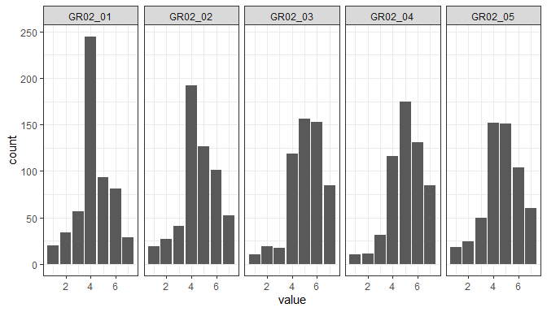
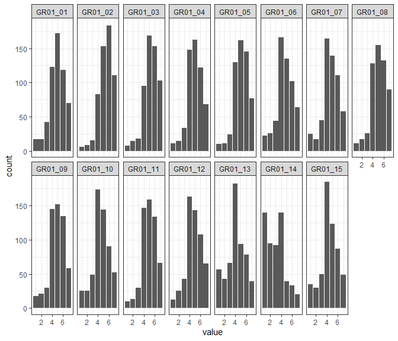
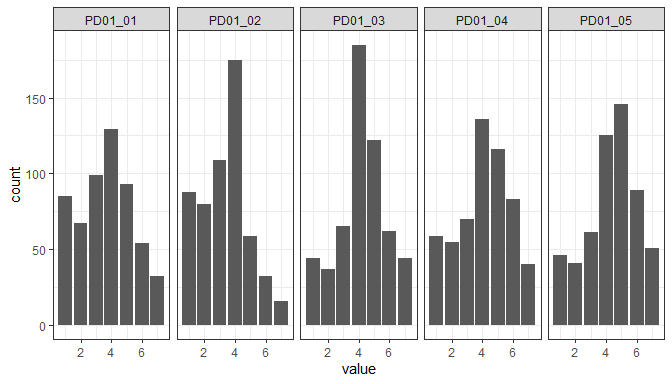
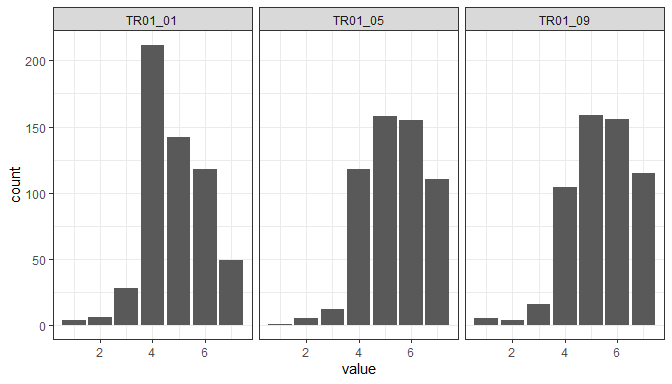
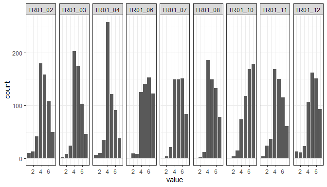
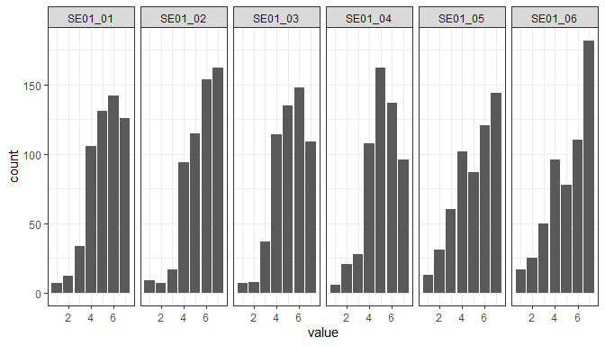
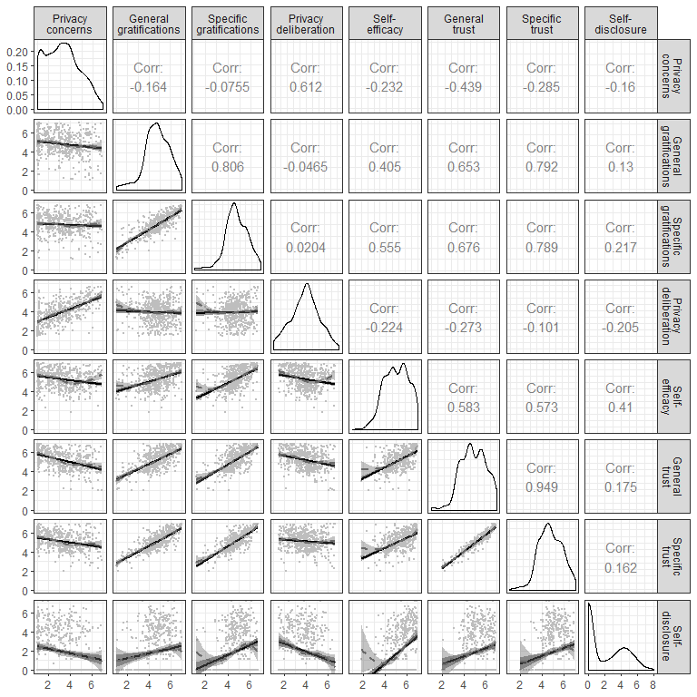
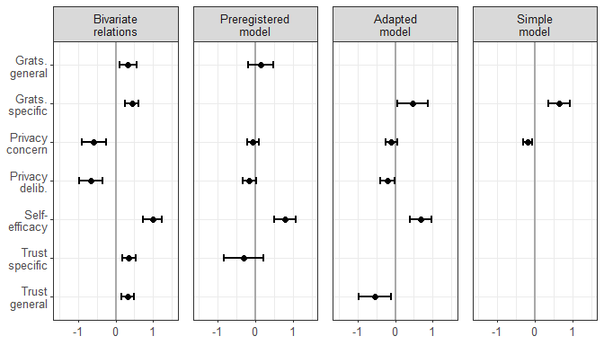
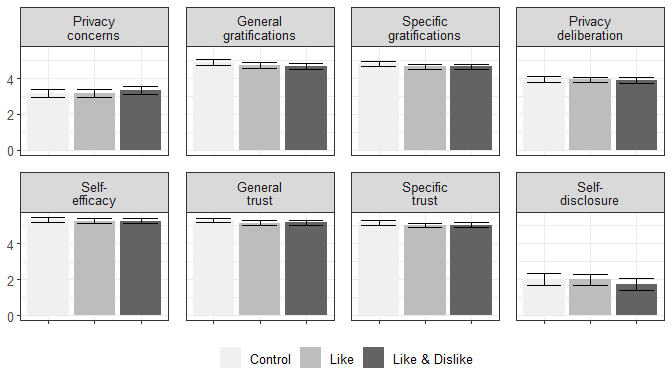

# Filter Participants


We first inspected the data manually for cases with obvious response patterns. The following cases show extreme response patterns (alongside fast response times), and were hence removed.

<div style="border: 1px solid #ddd; padding: 5px; overflow-x: scroll; width:100%; "><table class="table table-striped" style="margin-left: auto; margin-right: auto;">
 <thead>
  <tr>
   <th style="text-align:left;"> case_token </th>
   <th style="text-align:right;"> GR01_01 </th>
   <th style="text-align:right;"> GR01_02 </th>
   <th style="text-align:right;"> GR01_03 </th>
   <th style="text-align:right;"> GR01_04 </th>
   <th style="text-align:right;"> GR01_05 </th>
   <th style="text-align:right;"> GR01_06 </th>
   <th style="text-align:right;"> GR01_07 </th>
   <th style="text-align:right;"> GR01_08 </th>
   <th style="text-align:right;"> GR01_09 </th>
   <th style="text-align:right;"> GR01_10 </th>
   <th style="text-align:right;"> GR01_11 </th>
   <th style="text-align:right;"> GR01_12 </th>
   <th style="text-align:right;"> GR01_13 </th>
   <th style="text-align:right;"> GR01_14 </th>
   <th style="text-align:right;"> GR01_15 </th>
   <th style="text-align:right;"> GR02_01 </th>
   <th style="text-align:right;"> GR02_02 </th>
   <th style="text-align:right;"> GR02_03 </th>
   <th style="text-align:right;"> GR02_04 </th>
   <th style="text-align:right;"> GR02_05 </th>
   <th style="text-align:right;"> PC01_01 </th>
   <th style="text-align:right;"> PC01_02 </th>
   <th style="text-align:right;"> PC01_03 </th>
   <th style="text-align:right;"> PC01_04 </th>
   <th style="text-align:right;"> PC01_05 </th>
   <th style="text-align:right;"> PC01_06 </th>
   <th style="text-align:right;"> PC01_07 </th>
   <th style="text-align:right;"> TR01_01 </th>
   <th style="text-align:right;"> TR01_02 </th>
   <th style="text-align:right;"> TR01_03 </th>
   <th style="text-align:right;"> TR01_04 </th>
   <th style="text-align:right;"> TR01_05 </th>
   <th style="text-align:right;"> TR01_06 </th>
   <th style="text-align:right;"> TR01_07 </th>
   <th style="text-align:right;"> TR01_08 </th>
   <th style="text-align:right;"> TR01_09 </th>
   <th style="text-align:right;"> TR01_10 </th>
   <th style="text-align:right;"> TR01_11 </th>
   <th style="text-align:right;"> TR01_12 </th>
   <th style="text-align:right;"> PD01_01 </th>
   <th style="text-align:right;"> PD01_02 </th>
   <th style="text-align:right;"> PD01_03 </th>
   <th style="text-align:right;"> PD01_04 </th>
   <th style="text-align:right;"> PD01_05 </th>
   <th style="text-align:right;"> SE01_01 </th>
   <th style="text-align:right;"> SE01_02 </th>
   <th style="text-align:right;"> SE01_03 </th>
   <th style="text-align:right;"> SE01_04 </th>
   <th style="text-align:right;"> SE01_05 </th>
   <th style="text-align:right;"> SE01_06 </th>
   <th style="text-align:right;"> topics_entered </th>
   <th style="text-align:right;"> posts_read_count </th>
   <th style="text-align:right;"> time_read </th>
   <th style="text-align:right;"> topic_count </th>
   <th style="text-align:right;"> post_count </th>
   <th style="text-align:right;"> words </th>
   <th style="text-align:right;"> reactions </th>
   <th style="text-align:right;"> TIME_SUM_t1 </th>
   <th style="text-align:right;"> TIME_SUM_t2 </th>
  </tr>
 </thead>
<tbody>
  <tr>
   <td style="text-align:left;"> BN4MAOWZO7W2 </td>
   <td style="text-align:right;"> 7 </td>
   <td style="text-align:right;"> 7 </td>
   <td style="text-align:right;"> 7 </td>
   <td style="text-align:right;"> 7 </td>
   <td style="text-align:right;"> 7 </td>
   <td style="text-align:right;"> 7 </td>
   <td style="text-align:right;"> 7 </td>
   <td style="text-align:right;"> 7 </td>
   <td style="text-align:right;"> 7 </td>
   <td style="text-align:right;"> 7 </td>
   <td style="text-align:right;"> 7 </td>
   <td style="text-align:right;"> 7 </td>
   <td style="text-align:right;"> 7 </td>
   <td style="text-align:right;"> 7 </td>
   <td style="text-align:right;"> 7 </td>
   <td style="text-align:right;"> 7 </td>
   <td style="text-align:right;"> 7 </td>
   <td style="text-align:right;"> 7 </td>
   <td style="text-align:right;"> 7 </td>
   <td style="text-align:right;"> 7 </td>
   <td style="text-align:right;"> 7 </td>
   <td style="text-align:right;"> 7 </td>
   <td style="text-align:right;"> 1 </td>
   <td style="text-align:right;"> 7 </td>
   <td style="text-align:right;"> 7 </td>
   <td style="text-align:right;"> 7 </td>
   <td style="text-align:right;"> 7 </td>
   <td style="text-align:right;"> 4 </td>
   <td style="text-align:right;"> 1 </td>
   <td style="text-align:right;"> 7 </td>
   <td style="text-align:right;"> 1 </td>
   <td style="text-align:right;"> 4 </td>
   <td style="text-align:right;"> 1 </td>
   <td style="text-align:right;"> 1 </td>
   <td style="text-align:right;"> 1 </td>
   <td style="text-align:right;"> 7 </td>
   <td style="text-align:right;"> 7 </td>
   <td style="text-align:right;"> 4 </td>
   <td style="text-align:right;"> 7 </td>
   <td style="text-align:right;"> 7 </td>
   <td style="text-align:right;"> 7 </td>
   <td style="text-align:right;"> 7 </td>
   <td style="text-align:right;"> 7 </td>
   <td style="text-align:right;"> 7 </td>
   <td style="text-align:right;"> 1 </td>
   <td style="text-align:right;"> 1 </td>
   <td style="text-align:right;"> 1 </td>
   <td style="text-align:right;"> 1 </td>
   <td style="text-align:right;"> 7 </td>
   <td style="text-align:right;"> 1 </td>
   <td style="text-align:right;"> 6 </td>
   <td style="text-align:right;"> 27 </td>
   <td style="text-align:right;"> 211 </td>
   <td style="text-align:right;"> 0 </td>
   <td style="text-align:right;"> 1 </td>
   <td style="text-align:right;"> 2 </td>
   <td style="text-align:right;"> 0 </td>
   <td style="text-align:right;"> 37 </td>
   <td style="text-align:right;"> 246 </td>
  </tr>
  <tr>
   <td style="text-align:left;"> ANIEVLK9F2SW </td>
   <td style="text-align:right;"> 1 </td>
   <td style="text-align:right;"> 1 </td>
   <td style="text-align:right;"> 1 </td>
   <td style="text-align:right;"> 1 </td>
   <td style="text-align:right;"> 1 </td>
   <td style="text-align:right;"> 1 </td>
   <td style="text-align:right;"> 1 </td>
   <td style="text-align:right;"> 1 </td>
   <td style="text-align:right;"> 1 </td>
   <td style="text-align:right;"> 1 </td>
   <td style="text-align:right;"> 1 </td>
   <td style="text-align:right;"> 1 </td>
   <td style="text-align:right;"> 1 </td>
   <td style="text-align:right;"> 1 </td>
   <td style="text-align:right;"> 1 </td>
   <td style="text-align:right;"> 1 </td>
   <td style="text-align:right;"> 1 </td>
   <td style="text-align:right;"> 1 </td>
   <td style="text-align:right;"> 1 </td>
   <td style="text-align:right;"> 1 </td>
   <td style="text-align:right;"> 1 </td>
   <td style="text-align:right;"> 1 </td>
   <td style="text-align:right;"> 1 </td>
   <td style="text-align:right;"> 1 </td>
   <td style="text-align:right;"> 1 </td>
   <td style="text-align:right;"> 1 </td>
   <td style="text-align:right;"> 1 </td>
   <td style="text-align:right;"> 1 </td>
   <td style="text-align:right;"> 1 </td>
   <td style="text-align:right;"> 1 </td>
   <td style="text-align:right;"> 1 </td>
   <td style="text-align:right;"> 1 </td>
   <td style="text-align:right;"> 1 </td>
   <td style="text-align:right;"> 1 </td>
   <td style="text-align:right;"> 1 </td>
   <td style="text-align:right;"> 1 </td>
   <td style="text-align:right;"> 7 </td>
   <td style="text-align:right;"> 1 </td>
   <td style="text-align:right;"> 1 </td>
   <td style="text-align:right;"> 1 </td>
   <td style="text-align:right;"> 1 </td>
   <td style="text-align:right;"> 5 </td>
   <td style="text-align:right;"> 1 </td>
   <td style="text-align:right;"> 1 </td>
   <td style="text-align:right;"> 7 </td>
   <td style="text-align:right;"> 5 </td>
   <td style="text-align:right;"> 7 </td>
   <td style="text-align:right;"> 1 </td>
   <td style="text-align:right;"> 1 </td>
   <td style="text-align:right;"> 7 </td>
   <td style="text-align:right;"> 3 </td>
   <td style="text-align:right;"> 151 </td>
   <td style="text-align:right;"> 1518 </td>
   <td style="text-align:right;"> 0 </td>
   <td style="text-align:right;"> 2 </td>
   <td style="text-align:right;"> 73 </td>
   <td style="text-align:right;"> 0 </td>
   <td style="text-align:right;"> 66 </td>
   <td style="text-align:right;"> 469 </td>
  </tr>
</tbody>
</table></div>

# Measures
## Privacy concerns
### Items

Using the participation platform I had ...

 1. ... concerns about what happens to my data.
 2. ... concerns about disclosing information about myself.
 3. ... no concerns.
 4. ... concerns that others could discover my real identity (i.e. my last and first name).
 5. ... concerns that information about myself could fall into wrong hands.
 6. ... concerns that others could discover what my political views are.
 7. ... concerns about my privacy.

### Distributions

<!-- -->

### CFA


Model fit:


```
  chisq df pvalue   cfi   tli  rmsea   srmr omega alpha   ave
1  16.1 14  0.307 0.999 0.998 0.0164 0.0104 0.944 0.947 0.724
```

Factor loadings:


```
        pri_cn
PC01_01  0.931
PC01_02  0.901
PC01_03  0.547
PC01_04  0.890
PC01_05  0.908
PC01_06  0.795
PC01_07  0.928
```

Shows that PC01_03 doesn't load well. As it's an inverted item that's not surprising. Also from a theoretic perspective it's suboptional, because it doesn't explicitly focus on privacy, but just concerns in general. Will be deleted.

### CFA 2


Model fit:


```
  chisq df pvalue   cfi   tli  rmsea    srmr omega alpha   ave
1    11  9  0.273 0.998 0.997 0.0201 0.00963 0.959  0.96 0.799
```

Factor loadings:


```
        pri_cn
PC01_01  0.931
PC01_02  0.901
PC01_04  0.891
PC01_05  0.909
PC01_06  0.796
PC01_07  0.926
```

## Gratifications general
### Items

Using the participation platform ...
 
 1.	... had many benefits for me.
 2.	... has paid off for me.
 3.	... was worthwhile.
 4.	... was fun.
 5.	... has brought me further regarding content.

### Distributions

<!-- -->

### CFA


Model fit:


```
  chisq df   pvalue   cfi   tli rmsea   srmr omega alpha   ave
1    34  5 2.35e-06 0.976 0.951 0.102 0.0193 0.934 0.934 0.741
```

Factor loadings:


```
        grts_g
GR02_01  0.853
GR02_02  0.908
GR02_03  0.851
GR02_04  0.837
GR02_05  0.848
```

## Gratifications specific
### Items

Using the participation platform it has been possible for me ...

_Information_

 1.	... to learn things I would not otherwise have noticed.
 2.	... to hear the opinion of others.
 3.	... to learn how other people tick.

_Relevance_

 4.	... to react to a subject that is very dear to me.
 5.	... to react to a subject that is important to me.
 6.	... to react to a subject that I am affected by.

_Political participation_

 7.	... to engage politically.
 8.	... to discuss political issues.
 9.	... to pursue my political interest.

_Idealism_

 10. ... to try to improve society.
 11. ... to advocate to something meaningful.
 12. ... to serve a good purpose.

_Extrinsic benefits_

 13. ... to do the responsible persons a favor.
 14. ... to soothe my guilty consciences.
 15. ... to fulfil my civic duty.

### Distributions

<!-- -->

### CFA


Model fit:


```
  chisq df pvalue   cfi   tli  rmsea   srmr omega alpha   ave
1   270 85      0 0.941 0.928 0.0624 0.0527 0.933 0.946 0.586
```

Factor loadings:


```
        grts_n grts_r grts_p grts_d grts_x grts_s
GR01_01  0.688  0.000  0.000  0.000  0.000      0
GR01_02  0.819  0.000  0.000  0.000  0.000      0
GR01_03  0.851  0.000  0.000  0.000  0.000      0
GR01_04  0.000  0.891  0.000  0.000  0.000      0
GR01_05  0.000  0.852  0.000  0.000  0.000      0
GR01_06  0.000  0.704  0.000  0.000  0.000      0
GR01_07  0.000  0.000  0.826  0.000  0.000      0
GR01_08  0.000  0.000  0.811  0.000  0.000      0
GR01_09  0.000  0.000  0.816  0.000  0.000      0
GR01_10  0.000  0.000  0.000  0.796  0.000      0
GR01_11  0.000  0.000  0.000  0.882  0.000      0
GR01_12  0.000  0.000  0.000  0.762  0.000      0
GR01_13  0.000  0.000  0.000  0.000  0.519      0
GR01_14  0.000  0.000  0.000  0.000  0.513      0
GR01_15  0.000  0.000  0.000  0.000  0.848      0
```

## Privacy deliberation
### Items

Using the participation platform ...

 1. ... I have considered whether I could be disadvantaged by writing a comment.
 2. ... I have considered whether I could be advantaged by writing a comment.
 3. ... I have weighed up the advantages and disadvantages of writing a comment.
 4. ... I have thought about consequences of a possible comment.
 5. ... I have considered whether I should write a comment or not.

### Distributions

<!-- -->

### CFA


Model fit:


```
  chisq df  pvalue  cfi  tli  rmsea   srmr omega alpha   ave
1  15.6  5 0.00825 0.98 0.96 0.0614 0.0235 0.843 0.848 0.532
```

Factor loadings:


```
        pr_dlb
PD01_01  0.849
PD01_02  0.653
PD01_03  0.691
PD01_04  0.752
PD01_05  0.656
```

## Trust general
### Items

&nbsp;&nbsp;&nbsp;1. The other users seemed trustworthy.  
&nbsp;&nbsp;&nbsp;5. The operators of the participation platform seemed trustworthy.  
&nbsp;&nbsp;&nbsp;9. The website seemed trustworthy.  

### Distributions

<!-- -->

### CFA


Model fit:


```
  chisq df pvalue   cfi   tli  rmsea   srmr omega alpha   ave
1  2.07  1   0.15 0.998 0.993 0.0438 0.0125 0.864 0.873 0.701
```

Factor loadings:


```
        trust
TR01_01 0.660
TR01_05 0.923
TR01_09 0.898
```

Note that we constrained Items 5 and Item 9 to be equal. Explanation: First, they are theoretically related. Second, not constraining would yield to just-identified model, for which model fit cannot be interpreted meaningfully.

## Trust specific
### Items

_Community_

 2.	The comments of other users were useful.
 3.	The other users had good intentions.
 4.	I could rely on the statements of other users.

_Provider_

 6.	The operators of the participation platform have done a good job.
 7.	It was important to the operators that the users are satisfied with the participation platform.
 8.	I could rely on the statements of the operators of the participation platform.

_Information System_

 10.	The website worked well.
 11.	I had the impression that my data was necessary for the use of the website.
 12.	I found the website useful.

### Distributions

<!-- -->

### CFA


Model fit:


```
  chisq df   pvalue   cfi   tli  rmsea   srmr omega alpha   ave
1  89.1 24 2.02e-09 0.963 0.944 0.0697 0.0351 0.921  0.93 0.613
```

Factor loadings:


```
        trst_c trst_p trst_s trust
TR01_02  0.814  0.000  0.000     0
TR01_03  0.765  0.000  0.000     0
TR01_04  0.822  0.000  0.000     0
TR01_06  0.000  0.884  0.000     0
TR01_07  0.000  0.779  0.000     0
TR01_08  0.000  0.793  0.000     0
TR01_10  0.000  0.000  0.690     0
TR01_11  0.000  0.000  0.662     0
TR01_12  0.000  0.000  0.817     0
```

### CFA 2

Because there was Heywoodcase, we now also run a model in which the subdimensions `provider` and `system` are combined.


Model fit:


```
  chisq df   pvalue   cfi   tli  rmsea   srmr omega alpha  ave
1  99.5 26 1.57e-10 0.958 0.942 0.0711 0.0369 0.921 0.931 0.62
```

Factor loadings:


```
        trst_c trst_p trust
TR01_02  0.808  0.000     0
TR01_03  0.773  0.000     0
TR01_04  0.821  0.000     0
TR01_06  0.000  0.877     0
TR01_07  0.000  0.777     0
TR01_08  0.000  0.797     0
TR01_10  0.000  0.705     0
TR01_11  0.000  0.667     0
TR01_12  0.000  0.840     0
```
Warning disappears, results show adequate fit.

## Self-efficacy
### Items

 1. In principle, I felt able to write a comment.
 2. I felt technically competent enough to write a comment.
 3. In terms of the topic, I felt competent enough to express my opinion.
 4. I found it easy to express my opinion regarding the topic.
 5. I found it complicated to write a comment.
 6. I was overburdened to write a comment.

### Distributions

<!-- -->

### CFA


Model fit:


```
  chisq df   pvalue  cfi   tli rmsea   srmr omega alpha  ave
1  96.1  9 1.11e-16 0.86 0.766 0.132 0.0671 0.854 0.851 0.49
```

Factor loadings:


```
        slf_ff
SE01_01  0.842
SE01_02  0.689
SE01_03  0.764
SE01_04  0.801
SE01_05  0.528
SE01_06  0.633
```

Shows significant misfit. We will delete inverted items, while allowing covariations between Items 1 and 2 (tech-oriented) and Items 3 and 4 (topic-oriented). 

### CFA 2


Model fit:


```
  chisq df pvalue   cfi   tli  rmsea   srmr omega alpha   ave
1  3.23  1 0.0721 0.993 0.957 0.0633 0.0136 0.862 0.833 0.592
```

Factor loadings:


```
        slf_f_
SE01_01  0.828
SE01_02  0.675
SE01_03  0.779
SE01_04  0.787
```

Adapted version shows better and adequate fit.

## Baseline model

In what follows, please find the results of all variables combined in one model. This model will be used to extract factor scores.


```
lavaan 0.6-5 ended normally after 179 iterations

  Estimator                                         ML
  Optimization method                           NLMINB
  Number of free parameters                        180
  Number of equality constraints                     1
  Row rank of the constraints matrix                 1
                                                      
  Number of observations                           559
  Number of missing patterns                         3
                                                      
Model Test User Model:
                                                      
  Test statistic                              3218.019
  Degrees of freedom                              1045
  P-value (Chi-square)                           0.000

Model Test Baseline Model:

  Test statistic                             22542.322
  Degrees of freedom                              1128
  P-value                                        0.000

User Model versus Baseline Model:

  Comparative Fit Index (CFI)                    0.899
  Tucker-Lewis Index (TLI)                       0.890

Loglikelihood and Information Criteria:

  Loglikelihood user model (H0)             -37696.764
  Loglikelihood unrestricted model (H1)     -36087.755
                                                      
  Akaike (AIC)                               75751.528
  Bayesian (BIC)                             76525.909
  Sample-size adjusted Bayesian (BIC)        75957.676

Root Mean Square Error of Approximation:

  RMSEA                                          0.061
  90 Percent confidence interval - lower         0.059
  90 Percent confidence interval - upper         0.063
  P-value RMSEA <= 0.05                          0.000

Standardized Root Mean Square Residual:

  SRMR                                           0.064

Parameter Estimates:

  Information                                 Observed
  Observed information based on                Hessian
  Standard errors                             Standard

Latent Variables:
                     Estimate  Std.Err  z-value  P(>|z|)   Std.lv  Std.all
  pri_con =~                                                              
    PC01_01             1.000                               1.602    0.929
    PC01_02             0.994    0.027   36.768    0.000    1.592    0.901
    PC01_04             0.977    0.027   35.599    0.000    1.565    0.892
    PC01_05             1.002    0.026   38.008    0.000    1.605    0.910
    PC01_06             0.855    0.032   26.997    0.000    1.369    0.798
    PC01_07             0.996    0.025   40.260    0.000    1.595    0.925
  grats_gen =~                                                            
    GR02_01             1.000                               1.130    0.842
    GR02_02             1.119    0.040   28.007    0.000    1.265    0.893
    GR02_03             1.030    0.040   25.980    0.000    1.163    0.869
    GR02_04             0.989    0.039   25.058    0.000    1.117    0.850
    GR02_05             1.071    0.042   25.319    0.000    1.210    0.845
  grats_inf =~                                                            
    GR01_01             1.000                               0.978    0.696
    GR01_02             1.017    0.062   16.519    0.000    0.996    0.816
    GR01_03             1.113    0.066   16.803    0.000    1.089    0.847
  grats_rel =~                                                            
    GR01_04             1.000                               1.175    0.891
    GR01_05             0.943    0.034   27.541    0.000    1.108    0.857
    GR01_06             0.878    0.046   19.094    0.000    1.032    0.698
  grats_par =~                                                            
    GR01_07             1.000                               1.192    0.819
    GR01_08             0.938    0.042   22.084    0.000    1.119    0.816
    GR01_09             0.961    0.043   22.315    0.000    1.146    0.819
  grats_ide =~                                                            
    GR01_10             1.000                               1.149    0.791
    GR01_11             0.999    0.043   23.254    0.000    1.148    0.884
    GR01_12             0.927    0.048   19.459    0.000    1.065    0.764
  grats_ext =~                                                            
    GR01_13             1.000                               0.851    0.519
    GR01_14             1.003    0.108    9.320    0.000    0.853    0.510
    GR01_15             1.526    0.144   10.607    0.000    1.299    0.851
  grats_spec =~                                                           
    grats_inf           1.000                               0.843    0.843
    grats_rel           1.314    0.089   14.747    0.000    0.922    0.922
    grats_par           1.378    0.097   14.187    0.000    0.953    0.953
    grats_ide           1.306    0.095   13.804    0.000    0.938    0.938
    grats_ext           0.806    0.088    9.172    0.000    0.781    0.781
  pri_delib =~                                                            
    PD01_01             1.000                               1.493    0.865
    PD01_02             0.677    0.041   16.550    0.000    1.010    0.658
    PD01_03             0.705    0.043   16.328    0.000    1.052    0.676
    PD01_04             0.849    0.044   19.136    0.000    1.267    0.743
    PD01_05             0.718    0.045   15.896    0.000    1.072    0.648
  trust_gen =~                                                            
    TR01_01             1.000                               0.824    0.715
    TR01_05             1.236    0.063   19.682    0.000    1.019    0.886
    TR01_09             1.330    0.066   20.023    0.000    1.097    0.908
  trust_community =~                                                      
    TR01_02             1.000                               1.020    0.805
    TR01_03             0.828    0.044   18.964    0.000    0.844    0.768
    TR01_04             0.939    0.045   21.036    0.000    0.957    0.830
  trust_provider =~                                                       
    TR01_06             1.000                               1.036    0.863
    TR01_07             0.861    0.038   22.577    0.000    0.892    0.770
    TR01_08             0.862    0.036   24.083    0.000    0.893    0.805
    TR01_10             0.802    0.040   19.830    0.000    0.831    0.706
    TR01_11             0.826    0.046   17.809    0.000    0.856    0.660
    TR01_12             1.105    0.041   26.805    0.000    1.145    0.852
  trust_spec =~                                                           
    trust_communty      1.000                               0.855    0.855
    trust_provider      1.157    0.062   18.792    0.000    0.974    0.974
  self_eff =~                                                             
    SE01_01             1.000                               1.135    0.821
    SE01_02             0.808    0.046   17.388    0.000    0.917    0.679
    SE01_03             0.923    0.048   19.086    0.000    1.047    0.781
    SE01_04             0.942    0.047   19.960    0.000    1.069    0.792
  self_dis_lg =~                                                          
    self_dis_log        1.000                               2.283    1.000

Covariances:
                   Estimate  Std.Err  z-value  P(>|z|)   Std.lv  Std.all
 .SE01_01 ~~                                                            
   .SE01_02    (x)    0.115    0.029    3.994    0.000    0.115    0.148
 .SE01_03 ~~                                                            
   .SE01_04    (x)    0.115    0.029    3.994    0.000    0.115    0.167
  pri_con ~~                                                            
    slf_ds_lg (a1)   -0.574    0.160   -3.595    0.000   -0.157   -0.157
  grats_gen ~~                                                          
    slf_ds_lg (b1)    0.326    0.114    2.862    0.004    0.127    0.127
  pri_delib ~~                                                          
    slf_ds_lg (c1)   -0.655    0.158   -4.151    0.000   -0.192   -0.192
  self_eff ~~                                                           
    slf_ds_lg (d1)    0.984    0.130    7.593    0.000    0.380    0.380
  trust_spec ~~                                                         
    slf_ds_lg (e1)    0.346    0.091    3.786    0.000    0.174    0.174
  trust_gen ~~                                                          
    slf_ds_lg (f1)    0.318    0.086    3.717    0.000    0.169    0.169
  grats_spec ~~                                                         
    slf_ds_lg (g1)    0.433    0.089    4.888    0.000    0.230    0.230
  pri_con ~~                                                            
    grats_gen        -0.284    0.082   -3.461    0.001   -0.157   -0.157
    grats_spc        -0.109    0.060   -1.823    0.068   -0.083   -0.083
    pri_delib         1.355    0.131   10.327    0.000    0.567    0.567
    trust_gen        -0.555    0.069   -8.090    0.000   -0.420   -0.420
    trust_spc        -0.410    0.068   -6.006    0.000   -0.294   -0.294
    self_eff         -0.384    0.088   -4.352    0.000   -0.211   -0.211
  grats_gen ~~                                                          
    grats_spc         0.734    0.071   10.355    0.000    0.787    0.787
    pri_delib        -0.073    0.080   -0.910    0.363   -0.043   -0.043
    trust_gen         0.570    0.057    9.967    0.000    0.612    0.612
    trust_spc         0.761    0.068   11.193    0.000    0.773    0.773
    self_eff          0.464    0.066    6.999    0.000    0.362    0.362
  grats_spec ~~                                                         
    pri_delib         0.011    0.059    0.195    0.845    0.009    0.009
    trust_gen         0.448    0.050    9.022    0.000    0.659    0.659
    trust_spc         0.570    0.059    9.631    0.000    0.793    0.793
    self_eff          0.496    0.059    8.428    0.000    0.530    0.530
  pri_delib ~~                                                          
    trust_gen        -0.311    0.063   -4.948    0.000   -0.253   -0.253
    trust_spc        -0.132    0.064   -2.051    0.040   -0.101   -0.101
    self_eff         -0.334    0.087   -3.862    0.000   -0.197   -0.197
  trust_gen ~~                                                          
    trust_spc         0.686    0.062   11.136    0.000    0.955    0.955
    self_eff          0.493    0.056    8.859    0.000    0.527    0.527
  trust_spec ~~                                                         
    self_eff          0.538    0.059    9.058    0.000    0.544    0.544

Intercepts:
                   Estimate  Std.Err  z-value  P(>|z|)   Std.lv  Std.all
   .PC01_01           3.293    0.073   45.160    0.000    3.293    1.910
   .PC01_02           3.327    0.075   44.525    0.000    3.327    1.883
   .PC01_04           3.222    0.074   43.395    0.000    3.222    1.835
   .PC01_05           3.263    0.075   43.748    0.000    3.263    1.850
   .PC01_06           3.004    0.073   41.410    0.000    3.004    1.751
   .PC01_07           3.224    0.073   44.188    0.000    3.224    1.869
   .GR02_01           4.281    0.057   75.413    0.000    4.281    3.190
   .GR02_02           4.596    0.060   76.742    0.000    4.596    3.246
   .GR02_03           5.131    0.057   90.627    0.000    5.131    3.833
   .GR02_04           5.089    0.056   91.559    0.000    5.089    3.873
   .GR02_05           4.692    0.061   77.446    0.000    4.692    3.276
   .GR01_01           4.878    0.059   82.009    0.000    4.878    3.469
   .GR01_02           5.436    0.052  105.390    0.000    5.436    4.458
   .GR01_03           5.283    0.054   97.076    0.000    5.283    4.106
   .GR01_04           4.925    0.056   88.264    0.000    4.925    3.733
   .GR01_05           5.086    0.055   93.032    0.000    5.086    3.935
   .GR01_06           4.660    0.063   74.538    0.000    4.660    3.153
   .GR01_07           4.682    0.062   76.077    0.000    4.682    3.218
   .GR01_08           5.066    0.058   87.374    0.000    5.066    3.696
   .GR01_09           4.841    0.059   81.781    0.000    4.841    3.459
   .GR01_10           4.547    0.061   74.048    0.000    4.547    3.132
   .GR01_11           4.964    0.055   90.449    0.000    4.964    3.826
   .GR01_12           4.760    0.059   80.678    0.000    4.760    3.412
   .GR01_13           4.079    0.069   58.780    0.000    4.079    2.486
   .GR01_14           3.039    0.071   42.918    0.000    3.039    1.815
   .GR01_15           4.410    0.065   68.283    0.000    4.410    2.888
   .PD01_01           3.658    0.073   50.136    0.000    3.658    2.121
   .PD01_02           3.352    0.065   51.628    0.000    3.352    2.184
   .PD01_03           4.191    0.066   63.662    0.000    4.191    2.693
   .PD01_04           4.081    0.072   56.578    0.000    4.081    2.393
   .PD01_05           4.351    0.070   62.149    0.000    4.351    2.629
   .TR01_01           4.846    0.049   99.398    0.000    4.846    4.204
   .TR01_05           5.383    0.049  110.607    0.000    5.383    4.678
   .TR01_09           5.390    0.051  105.541    0.000    5.390    4.464
   .TR01_02           4.764    0.054   88.923    0.000    4.764    3.761
   .TR01_03           4.844    0.046  104.195    0.000    4.844    4.407
   .TR01_04           4.615    0.049   94.568    0.000    4.615    4.000
   .TR01_06           5.403    0.051  106.478    0.000    5.403    4.504
   .TR01_07           5.200    0.049  106.180    0.000    5.200    4.491
   .TR01_08           5.129    0.047  109.404    0.000    5.129    4.627
   .TR01_10           5.725    0.050  114.939    0.000    5.725    4.864
   .TR01_11           4.834    0.055   88.152    0.000    4.834    3.728
   .TR01_12           5.179    0.057   91.088    0.000    5.179    3.853
   .SE01_01           5.277    0.058   90.267    0.000    5.277    3.820
   .SE01_02           5.523    0.057   96.683    0.000    5.523    4.092
   .SE01_03           5.224    0.057   92.022    0.000    5.224    3.895
   .SE01_04           5.138    0.057   89.901    0.000    5.138    3.805
   .self_dis_log      1.921    0.097   19.901    0.000    1.921    0.842
    pri_con           0.000                               0.000    0.000
    grats_gen         0.000                               0.000    0.000
   .grats_inf         0.000                               0.000    0.000
   .grats_rel         0.000                               0.000    0.000
   .grats_par         0.000                               0.000    0.000
   .grats_ide         0.000                               0.000    0.000
   .grats_ext         0.000                               0.000    0.000
    grats_spec        0.000                               0.000    0.000
    pri_delib         0.000                               0.000    0.000
    trust_gen         0.000                               0.000    0.000
   .trust_communty    0.000                               0.000    0.000
   .trust_provider    0.000                               0.000    0.000
    trust_spec        0.000                               0.000    0.000
    self_eff          0.000                               0.000    0.000
    self_dis_lg       0.000                               0.000    0.000

Variances:
                   Estimate  Std.Err  z-value  P(>|z|)   Std.lv  Std.all
   .PC01_01           0.406    0.032   12.788    0.000    0.406    0.137
   .PC01_02           0.587    0.042   14.012    0.000    0.587    0.188
   .PC01_04           0.631    0.044   14.286    0.000    0.631    0.205
   .PC01_05           0.534    0.039   13.742    0.000    0.534    0.172
   .PC01_06           1.066    0.068   15.606    0.000    1.066    0.362
   .PC01_07           0.430    0.033   13.040    0.000    0.430    0.145
   .GR02_01           0.525    0.038   13.966    0.000    0.525    0.291
   .GR02_02           0.406    0.033   12.351    0.000    0.406    0.202
   .GR02_03           0.438    0.033   13.190    0.000    0.438    0.244
   .GR02_04           0.479    0.035   13.831    0.000    0.479    0.277
   .GR02_05           0.587    0.042   14.027    0.000    0.587    0.286
   .GR01_01           1.021    0.072   14.107    0.000    1.021    0.516
   .GR01_02           0.496    0.042   11.730    0.000    0.496    0.334
   .GR01_03           0.469    0.045   10.370    0.000    0.469    0.283
   .GR01_04           0.360    0.034   10.466    0.000    0.360    0.207
   .GR01_05           0.443    0.036   12.234    0.000    0.443    0.265
   .GR01_06           1.120    0.074   15.178    0.000    1.120    0.513
   .GR01_07           0.695    0.052   13.413    0.000    0.695    0.328
   .GR01_08           0.628    0.047   13.434    0.000    0.628    0.334
   .GR01_09           0.646    0.049   13.306    0.000    0.646    0.330
   .GR01_10           0.788    0.056   14.000    0.000    0.788    0.374
   .GR01_11           0.367    0.034   10.633    0.000    0.367    0.218
   .GR01_12           0.811    0.056   14.455    0.000    0.811    0.417
   .GR01_13           1.967    0.131   14.977    0.000    1.967    0.731
   .GR01_14           2.075    0.138   15.091    0.000    2.075    0.740
   .GR01_15           0.645    0.097    6.651    0.000    0.645    0.277
   .PD01_01           0.748    0.082    9.159    0.000    0.748    0.251
   .PD01_02           1.336    0.090   14.857    0.000    1.336    0.567
   .PD01_03           1.315    0.092   14.319    0.000    1.315    0.543
   .PD01_04           1.302    0.096   13.628    0.000    1.302    0.448
   .PD01_05           1.589    0.107   14.853    0.000    1.589    0.580
   .TR01_01           0.649    0.044   14.901    0.000    0.649    0.488
   .TR01_05           0.286    0.024   11.824    0.000    0.286    0.216
   .TR01_09           0.255    0.025   10.299    0.000    0.255    0.175
   .TR01_02           0.564    0.045   12.522    0.000    0.564    0.352
   .TR01_03           0.496    0.037   13.456    0.000    0.496    0.410
   .TR01_04           0.415    0.036   11.550    0.000    0.415    0.312
   .TR01_06           0.366    0.027   13.476    0.000    0.366    0.255
   .TR01_07           0.546    0.036   15.269    0.000    0.546    0.407
   .TR01_08           0.431    0.029   14.854    0.000    0.431    0.351
   .TR01_10           0.695    0.044   15.687    0.000    0.695    0.502
   .TR01_11           0.949    0.059   15.971    0.000    0.949    0.564
   .TR01_12           0.496    0.035   14.032    0.000    0.496    0.275
   .SE01_01           0.621    0.053   11.724    0.000    0.621    0.325
   .SE01_02           0.981    0.067   14.743    0.000    0.981    0.538
   .SE01_03           0.702    0.056   12.578    0.000    0.702    0.390
   .SE01_04           0.681    0.054   12.726    0.000    0.681    0.373
   .self_dis_log      0.000                               0.000    0.000
    pri_con           2.567    0.177   14.475    0.000    1.000    1.000
    grats_gen         1.277    0.105   12.144    0.000    1.000    1.000
   .grats_inf         0.277    0.038    7.349    0.000    0.290    0.290
   .grats_rel         0.206    0.033    6.225    0.000    0.149    0.149
   .grats_par         0.129    0.031    4.110    0.000    0.091    0.091
   .grats_ide         0.159    0.031    5.128    0.000    0.121    0.121
   .grats_ext         0.282    0.054    5.182    0.000    0.390    0.390
    grats_spec        0.680    0.092    7.416    0.000    1.000    1.000
    pri_delib         2.228    0.185   12.019    0.000    1.000    1.000
    trust_gen         0.680    0.072    9.426    0.000    1.000    1.000
   .trust_communty    0.281    0.036    7.846    0.000    0.270    0.270
   .trust_provider    0.056    0.022    2.593    0.010    0.052    0.052
    trust_spec        0.760    0.082    9.226    0.000    1.000    1.000
    self_eff          1.287    0.116   11.134    0.000    1.000    1.000
    self_dis_lg       5.211    0.312   16.718    0.000    1.000    1.000
```

# Descriptive analyses

We first report the factor validity of all variables combined.


```
                           m    sd  chisq df   pvalue   cfi   tli  rmsea    srmr omega alpha   ave
Privacy concerns        3.21 1.514  11.04  9 2.73e-01 0.998 0.997 0.0201 0.00963 0.959 0.960 0.799
General gratifications  4.76 1.219  34.03  5 2.35e-06 0.976 0.951 0.1019 0.01930 0.934 0.934 0.741
Specific gratifications 4.71 1.019 269.77 85 0.00e+00 0.941 0.928 0.0624 0.05266 0.933 0.946 0.586
Privacy deliberation    3.93 1.285  15.55  5 8.25e-03 0.980 0.960 0.0614 0.02350 0.843 0.848 0.532
Self-efficacy           5.25 1.118   3.23  1 7.21e-02 0.993 0.957 0.0633 0.01360 0.862 0.833 0.592
General trust           5.21 1.039   2.07  1 1.50e-01 0.998 0.993 0.0438 0.01250 0.864 0.873 0.701
Specific trust          5.08 0.942  99.48 26 1.57e-10 0.958 0.942 0.0711 0.03694 0.921 0.931 0.620
```

In what follows, we report zero-order correlations, distributions, and scatterplots of the variables' factor scores.

<!-- -->

# Power analyses


We first estimate the sample size necessary to find small effects in 95% of all cases.


```

     approximate correlation power calculation (arctangh transformation) 

              n = 1077
              r = 0.1
      sig.level = 0.05
          power = 0.95
    alternative = greater
```

We then compute the power we have achieved with our finale sample size to detect small effects.


```

     approximate correlation power calculation (arctangh transformation) 

              n = 559
              r = 0.1
      sig.level = 0.05
          power = 0.765
    alternative = greater
```

We finally compute what effect size we are likely to find in 95% of all cases given our final sample size.


```

     approximate correlation power calculation (arctangh transformation) 

              n = 559
              r = 0.138
      sig.level = 0.05
          power = 0.95
    alternative = greater
```

# Assumptions
## Multivariate normal distribution


```
             Test        Statistic p value Result
1 Mardia Skewness 16419.9039541698       0     NO
2 Mardia Kurtosis 83.1186126223766       0     NO
3             MVN             <NA>    <NA>     NO
```

Shows that multivariate normal distribution is violated. We hence use maximum likelihood estimation with robust standard errors and a Satorra-Bentler scaled test statistic.

## Influential cases

In what follows we test for influential cases in baseline model, to detect potentially corrupt data (e.g., people who provided response patterns). Specifically, we compute Cook's distance.


The following ten cases have a particularly strong influence on the baseline model.


Let's inspect these cases.


These data do not reveal potential cases of response patterns. Indeed, answer times suggest that respondents were diligent.

# Results
## Privacy calculus
### Model "Peregistered"


```
lavaan 0.6-5 ended normally after 323 iterations

  Estimator                                         ML
  Optimization method                           NLMINB
  Number of free parameters                        198
  Number of equality constraints                     1
  Row rank of the constraints matrix                 1
                                                      
                                                  Used       Total
  Number of observations                           558         559
  Number of missing patterns                         3            
                                                                  
Model Test User Model:
                                              Standard      Robust
  Test Statistic                              1244.969     953.447
  Degrees of freedom                               388         388
  P-value (Chi-square)                           0.000       0.000
  Scaling correction factor                                  1.306
    for the Yuan-Bentler correction (Mplus variant) 

Model Test Baseline Model:

  Test statistic                             13322.891    9995.405
  Degrees of freedom                               525         525
  P-value                                        0.000       0.000
  Scaling correction factor                                  1.333

User Model versus Baseline Model:

  Comparative Fit Index (CFI)                    0.933       0.940
  Tucker-Lewis Index (TLI)                       0.909       0.919
                                                                  
  Robust Comparative Fit Index (CFI)                         0.942
  Robust Tucker-Lewis Index (TLI)                            0.921

Loglikelihood and Information Criteria:

  Loglikelihood user model (H0)             -23851.439  -23851.439
  Scaling correction factor                                  1.260
      for the MLR correction                                      
  Loglikelihood unrestricted model (H1)     -23228.954  -23228.954
  Scaling correction factor                                  1.293
      for the MLR correction                                      
                                                                  
  Akaike (AIC)                               48096.877   48096.877
  Bayesian (BIC)                             48948.776   48948.776
  Sample-size adjusted Bayesian (BIC)        48323.404   48323.404

Root Mean Square Error of Approximation:

  RMSEA                                          0.063       0.051
  90 Percent confidence interval - lower         0.059       0.048
  90 Percent confidence interval - upper         0.067       0.055
  P-value RMSEA <= 0.05                          0.000       0.301
                                                                  
  Robust RMSEA                                               0.058
  90 Percent confidence interval - lower                     0.054
  90 Percent confidence interval - upper                     0.063

Standardized Root Mean Square Residual:

  SRMR                                           0.049       0.049

Parameter Estimates:

  Information                                      Observed
  Observed information based on                     Hessian
  Standard errors                        Robust.huber.white

Latent Variables:
                     Estimate  Std.Err  z-value  P(>|z|)   Std.lv  Std.all
  pri_con =~                                                              
    PC01_01             1.000                               1.595    0.926
    PC01_02             0.990    0.027   36.223    0.000    1.579    0.894
    PC01_04             0.972    0.027   35.677    0.000    1.550    0.884
    PC01_05             1.002    0.024   42.437    0.000    1.599    0.907
    PC01_06             0.854    0.038   22.681    0.000    1.363    0.795
    PC01_07             0.994    0.023   43.799    0.000    1.586    0.920
  grats_gen =~                                                            
    GR02_01             1.000                               1.133    0.844
    GR02_02             1.118    0.033   33.646    0.000    1.267    0.894
    GR02_03             1.019    0.047   21.479    0.000    1.155    0.863
    GR02_04             0.983    0.048   20.415    0.000    1.115    0.848
    GR02_05             1.072    0.040   27.031    0.000    1.215    0.847
  pri_delib =~                                                            
    PD01_01             1.000                               1.473    0.853
    PD01_02             0.670    0.048   13.874    0.000    0.987    0.643
    PD01_03             0.709    0.055   12.918    0.000    1.044    0.670
    PD01_04             0.842    0.047   17.852    0.000    1.241    0.727
    PD01_05             0.717    0.050   14.327    0.000    1.056    0.638
  self_eff =~                                                             
    SE01_01             1.000                               1.115    0.808
    SE01_02             0.811    0.057   14.207    0.000    0.904    0.670
    SE01_03             0.933    0.046   20.148    0.000    1.039    0.776
    SE01_04             0.954    0.043   22.155    0.000    1.063    0.789
  trust_community =~                                                      
    TR01_02             1.000                               1.024    0.808
    TR01_03             0.820    0.052   15.878    0.000    0.839    0.763
    TR01_04             0.917    0.046   19.760    0.000    0.939    0.814
  trust_provider =~                                                       
    TR01_06             1.000                               1.046    0.871
    TR01_07             0.855    0.039   21.941    0.000    0.894    0.773
    TR01_08             0.834    0.040   21.090    0.000    0.872    0.788
    TR01_10             0.788    0.038   20.840    0.000    0.824    0.700
    TR01_11             0.821    0.052   15.891    0.000    0.859    0.662
    TR01_12             1.098    0.038   28.624    0.000    1.149    0.854
  trust_spec =~                                                           
    trust_communty      1.000                               0.877    0.877
    trust_provider      1.109    0.077   14.318    0.000    0.952    0.952

Regressions:
                   Estimate  Std.Err  z-value  P(>|z|)   Std.lv  Std.all
  self_dis_log ~                                                        
    pri_con   (a1)   -0.062    0.080   -0.781    0.435   -0.100   -0.044
    grats_gen (b1)    0.140    0.166    0.844    0.399    0.159    0.070
    pri_delib (c1)   -0.160    0.093   -1.724    0.085   -0.235   -0.103
    self_eff  (d1)    0.783    0.148    5.289    0.000    0.872    0.382
    trust_spc (e1)   -0.304    0.270   -1.129    0.259   -0.273   -0.120
    male             -0.022    0.197   -0.109    0.913   -0.022   -0.005
    age               0.003    0.006    0.570    0.569    0.003    0.024
    edu               0.212    0.116    1.836    0.066    0.212    0.078
  GR02_01 ~                                                             
    male             -0.127    0.116   -1.096    0.273   -0.127   -0.047
    age               0.000    0.004    0.091    0.927    0.000    0.004
    edu               0.005    0.068    0.074    0.941    0.005    0.003
  GR02_02 ~                                                             
    male             -0.067    0.120   -0.559    0.576   -0.067   -0.024
    age               0.006    0.004    1.542    0.123    0.006    0.068
    edu              -0.080    0.071   -1.127    0.260   -0.080   -0.047
  GR02_03 ~                                                             
    male             -0.025    0.116   -0.220    0.826   -0.025   -0.009
    age               0.001    0.004    0.310    0.756    0.001    0.014
    edu              -0.083    0.067   -1.237    0.216   -0.083   -0.052
  GR02_04 ~                                                             
    male              0.028    0.113    0.250    0.803    0.028    0.011
    age               0.005    0.004    1.304    0.192    0.005    0.057
    edu              -0.072    0.067   -1.072    0.284   -0.072   -0.046
  GR02_05 ~                                                             
    male             -0.140    0.124   -1.136    0.256   -0.140   -0.049
    age              -0.004    0.004   -0.874    0.382   -0.004   -0.039
    edu               0.013    0.073    0.173    0.862    0.013    0.007
  PC01_01 ~                                                             
    male             -0.182    0.151   -1.206    0.228   -0.182   -0.053
    age              -0.004    0.005   -0.820    0.412   -0.004   -0.036
    edu               0.110    0.087    1.255    0.209    0.110    0.054
  PC01_02 ~                                                             
    male             -0.302    0.154   -1.967    0.049   -0.302   -0.085
    age              -0.008    0.005   -1.663    0.096   -0.008   -0.072
    edu               0.047    0.089    0.522    0.601    0.047    0.022
  PC01_04 ~                                                             
    male             -0.225    0.152   -1.476    0.140   -0.225   -0.064
    age              -0.010    0.005   -1.980    0.048   -0.010   -0.085
    edu               0.113    0.089    1.269    0.204    0.113    0.054
  PC01_05 ~                                                             
    male             -0.098    0.154   -0.636    0.524   -0.098   -0.028
    age              -0.006    0.005   -1.164    0.244   -0.006   -0.051
    edu               0.090    0.090    0.996    0.319    0.090    0.043
  PC01_06 ~                                                             
    male             -0.108    0.150   -0.722    0.470   -0.108   -0.032
    age              -0.005    0.005   -1.055    0.291   -0.005   -0.046
    edu               0.043    0.087    0.491    0.623    0.043    0.021
  PC01_07 ~                                                             
    male             -0.174    0.150   -1.160    0.246   -0.174   -0.050
    age              -0.006    0.005   -1.337    0.181   -0.006   -0.058
    edu               0.081    0.087    0.934    0.350    0.081    0.040
  TR01_02 ~                                                             
    male             -0.297    0.108   -2.744    0.006   -0.297   -0.117
    age              -0.004    0.004   -1.103    0.270   -0.004   -0.049
    edu               0.005    0.062    0.086    0.931    0.005    0.004
  TR01_03 ~                                                             
    male             -0.140    0.095   -1.480    0.139   -0.140   -0.064
    age              -0.002    0.003   -0.566    0.571   -0.002   -0.025
    edu               0.023    0.053    0.434    0.664    0.023    0.018
  TR01_04 ~                                                             
    male             -0.134    0.099   -1.362    0.173   -0.134   -0.058
    age              -0.004    0.003   -1.211    0.226   -0.004   -0.055
    edu              -0.003    0.060   -0.046    0.964   -0.003   -0.002
  TR01_06 ~                                                             
    male             -0.086    0.104   -0.831    0.406   -0.086   -0.036
    age               0.000    0.003    0.110    0.912    0.000    0.005
    edu              -0.051    0.058   -0.880    0.379   -0.051   -0.036
  TR01_07 ~                                                             
    male             -0.045    0.099   -0.450    0.653   -0.045   -0.019
    age               0.001    0.003    0.344    0.731    0.001    0.015
    edu               0.018    0.058    0.309    0.757    0.018    0.013
  TR01_08 ~                                                             
    male              0.046    0.095    0.480    0.631    0.046    0.021
    age              -0.004    0.003   -1.250    0.211   -0.004   -0.053
    edu               0.025    0.056    0.445    0.656    0.025    0.019
  TR01_10 ~                                                             
    male              0.091    0.100    0.913    0.361    0.091    0.039
    age              -0.004    0.003   -1.176    0.239   -0.004   -0.050
    edu              -0.055    0.058   -0.946    0.344   -0.055   -0.039
  TR01_11 ~                                                             
    male              0.027    0.112    0.245    0.806    0.027    0.011
    age               0.003    0.004    0.824    0.410    0.003    0.035
    edu              -0.093    0.065   -1.435    0.151   -0.093   -0.061
  TR01_12 ~                                                             
    male             -0.121    0.115   -1.045    0.296   -0.121   -0.045
    age              -0.002    0.004   -0.405    0.685   -0.002   -0.018
    edu              -0.146    0.068   -2.156    0.031   -0.146   -0.091
  PD01_01 ~                                                             
    male             -0.177    0.148   -1.197    0.231   -0.177   -0.051
    age              -0.015    0.005   -3.275    0.001   -0.015   -0.137
    edu              -0.026    0.085   -0.310    0.756   -0.026   -0.013
  PD01_02 ~                                                             
    male             -0.119    0.131   -0.906    0.365   -0.119   -0.039
    age              -0.014    0.004   -3.443    0.001   -0.014   -0.142
    edu               0.031    0.077    0.405    0.686    0.031    0.017
  PD01_03 ~                                                             
    male             -0.321    0.132   -2.425    0.015   -0.321   -0.103
    age              -0.004    0.004   -1.024    0.306   -0.004   -0.044
    edu               0.065    0.080    0.807    0.419    0.065    0.035
  PD01_04 ~                                                             
    male             -0.412    0.145   -2.847    0.004   -0.412   -0.121
    age              -0.009    0.005   -1.904    0.057   -0.009   -0.082
    edu               0.103    0.085    1.207    0.227    0.103    0.051
  PD01_05 ~                                                             
    male             -0.205    0.142   -1.439    0.150   -0.205   -0.062
    age              -0.012    0.004   -2.696    0.007   -0.012   -0.111
    edu              -0.002    0.084   -0.025    0.980   -0.002   -0.001
  SE01_01 ~                                                             
    male              0.119    0.118    1.012    0.312    0.119    0.043
    age               0.000    0.004    0.007    0.994    0.000    0.000
    edu               0.211    0.068    3.115    0.002    0.211    0.129
  SE01_02 ~                                                             
    male              0.059    0.112    0.527    0.598    0.059    0.022
    age              -0.013    0.004   -3.598    0.000   -0.013   -0.151
    edu               0.198    0.066    3.000    0.003    0.198    0.124
  SE01_03 ~                                                             
    male              0.194    0.114    1.698    0.090    0.194    0.072
    age               0.001    0.004    0.246    0.806    0.001    0.011
    edu               0.143    0.067    2.134    0.033    0.143    0.090
  SE01_04 ~                                                             
    male              0.053    0.115    0.462    0.644    0.053    0.020
    age               0.007    0.004    2.047    0.041    0.007    0.086
    edu               0.127    0.066    1.908    0.056    0.127    0.079

Covariances:
                   Estimate  Std.Err  z-value  P(>|z|)   Std.lv  Std.all
 .SE01_01 ~~                                                            
   .SE01_02    (x)    0.107    0.044    2.426    0.015    0.107    0.141
 .SE01_03 ~~                                                            
   .SE01_04    (x)    0.107    0.044    2.426    0.015    0.107    0.158
  pri_con ~~                                                            
    grats_gen        -0.283    0.096   -2.949    0.003   -0.156   -0.156
    pri_delib         1.323    0.131   10.120    0.000    0.563    0.563
    self_eff         -0.376    0.091   -4.131    0.000   -0.212   -0.212
    trust_spec       -0.416    0.074   -5.584    0.000   -0.290   -0.290
  grats_gen ~~                                                          
    pri_delib        -0.068    0.103   -0.659    0.510   -0.041   -0.041
    self_eff          0.470    0.067    7.042    0.000    0.372    0.372
    trust_spec        0.804    0.086    9.396    0.000    0.790    0.790
  pri_delib ~~                                                          
    self_eff         -0.325    0.094   -3.447    0.001   -0.198   -0.198
    trust_spec       -0.139    0.086   -1.624    0.104   -0.105   -0.105
  self_eff ~~                                                           
    trust_spec        0.555    0.060    9.235    0.000    0.554    0.554

Intercepts:
                   Estimate  Std.Err  z-value  P(>|z|)   Std.lv  Std.all
   .PC01_01           3.369    0.292   11.557    0.000    3.369    1.955
   .PC01_02           3.769    0.304   12.398    0.000    3.769    2.135
   .PC01_04           3.571    0.297   12.020    0.000    3.571    2.035
   .PC01_05           3.414    0.304   11.229    0.000    3.414    1.937
   .PC01_06           3.215    0.288   11.155    0.000    3.215    1.875
   .PC01_07           3.461    0.294   11.780    0.000    3.461    2.008
   .GR02_01           4.319    0.224   19.252    0.000    4.319    3.215
   .GR02_02           4.492    0.244   18.372    0.000    4.492    3.170
   .GR02_03           5.244    0.222   23.667    0.000    5.244    3.917
   .GR02_04           4.988    0.221   22.522    0.000    4.988    3.795
   .GR02_05           4.905    0.254   19.323    0.000    4.905    3.422
   .PD01_01           4.493    0.290   15.507    0.000    4.493    2.602
   .PD01_02           3.997    0.248   16.102    0.000    3.997    2.601
   .PD01_03           4.432    0.270   16.437    0.000    4.432    2.845
   .PD01_04           4.506    0.295   15.283    0.000    4.506    2.640
   .PD01_05           5.000    0.276   18.089    0.000    5.000    3.018
   .SE01_01           4.824    0.249   19.357    0.000    4.824    3.496
   .SE01_02           5.730    0.234   24.461    0.000    5.730    4.248
   .SE01_03           4.819    0.226   21.326    0.000    4.819    3.597
   .SE01_04           4.533    0.234   19.377    0.000    4.533    3.361
   .TR01_02           5.083    0.219   23.224    0.000    5.083    4.010
   .TR01_03           4.951    0.189   26.178    0.000    4.951    4.505
   .TR01_04           4.871    0.200   24.361    0.000    4.871    4.223
   .TR01_06           5.521    0.205   26.991    0.000    5.521    4.600
   .TR01_07           5.134    0.197   26.024    0.000    5.134    4.440
   .TR01_08           5.232    0.188   27.764    0.000    5.232    4.728
   .TR01_10           5.955    0.193   30.911    0.000    5.955    5.060
   .TR01_11           4.855    0.218   22.270    0.000    4.855    3.745
   .TR01_12           5.581    0.231   24.175    0.000    5.581    4.149
   .self_dis_log      1.376    0.375    3.673    0.000    1.376    0.602
    pri_con           0.000                               0.000    0.000
    grats_gen         0.000                               0.000    0.000
    pri_delib         0.000                               0.000    0.000
    self_eff          0.000                               0.000    0.000
   .trust_communty    0.000                               0.000    0.000
   .trust_provider    0.000                               0.000    0.000
    trust_spec        0.000                               0.000    0.000

Variances:
                   Estimate  Std.Err  z-value  P(>|z|)   Std.lv  Std.all
   .PC01_01           0.403    0.050    8.074    0.000    0.403    0.136
   .PC01_02           0.580    0.103    5.654    0.000    0.580    0.186
   .PC01_04           0.628    0.077    8.138    0.000    0.628    0.204
   .PC01_05           0.534    0.064    8.354    0.000    0.534    0.172
   .PC01_06           1.069    0.116    9.252    0.000    1.069    0.364
   .PC01_07           0.431    0.065    6.589    0.000    0.431    0.145
   .GR02_01           0.516    0.053    9.674    0.000    0.516    0.286
   .GR02_02           0.386    0.039    9.891    0.000    0.386    0.192
   .GR02_03           0.452    0.073    6.174    0.000    0.452    0.252
   .GR02_04           0.476    0.048    9.905    0.000    0.476    0.275
   .GR02_05           0.571    0.062    9.185    0.000    0.571    0.278
   .PD01_01           0.743    0.111    6.688    0.000    0.743    0.249
   .PD01_02           1.331    0.128   10.434    0.000    1.331    0.564
   .PD01_03           1.304    0.128   10.195    0.000    1.304    0.537
   .PD01_04           1.300    0.147    8.860    0.000    1.300    0.446
   .PD01_05           1.580    0.128   12.374    0.000    1.580    0.576
   .SE01_01           0.623    0.087    7.131    0.000    0.623    0.327
   .SE01_02           0.926    0.119    7.787    0.000    0.926    0.509
   .SE01_03           0.688    0.096    7.169    0.000    0.688    0.383
   .SE01_04           0.663    0.077    8.579    0.000    0.663    0.365
   .TR01_02           0.531    0.067    7.881    0.000    0.531    0.331
   .TR01_03           0.498    0.055    9.064    0.000    0.498    0.412
   .TR01_04           0.439    0.045    9.677    0.000    0.439    0.330
   .TR01_06           0.343    0.035    9.880    0.000    0.343    0.238
   .TR01_07           0.537    0.052   10.304    0.000    0.537    0.402
   .TR01_08           0.459    0.041   11.152    0.000    0.459    0.375
   .TR01_10           0.699    0.056   12.551    0.000    0.699    0.505
   .TR01_11           0.935    0.079   11.779    0.000    0.935    0.556
   .TR01_12           0.468    0.052    8.951    0.000    0.468    0.259
   .self_dis_log      4.365    0.210   20.740    0.000    4.365    0.837
    pri_con           2.545    0.144   17.629    0.000    1.000    1.000
    grats_gen         1.285    0.114   11.231    0.000    1.000    1.000
    pri_delib         2.171    0.158   13.773    0.000    1.000    1.000
    self_eff          1.242    0.113   10.962    0.000    1.000    1.000
   .trust_communty    0.242    0.044    5.485    0.000    0.231    0.231
   .trust_provider    0.101    0.043    2.374    0.018    0.093    0.093
    trust_spec        0.806    0.099    8.135    0.000    1.000    1.000
```

### Model "Adapted"

Building on the preregistered model, instead of general gratifications and specific trust, we now use specific gratifications and general trust.


```
lavaan 0.6-5 ended normally after 354 iterations

  Estimator                                         ML
  Optimization method                           NLMINB
  Number of free parameters                        225
  Number of equality constraints                     1
  Row rank of the constraints matrix                 1
                                                      
                                                  Used       Total
  Number of observations                           558         559
  Number of missing patterns                         2            
                                                                  
Model Test User Model:
                                              Standard      Robust
  Test Statistic                              1501.143    1138.746
  Degrees of freedom                               507         507
  P-value (Chi-square)                           0.000       0.000
  Scaling correction factor                                  1.318
    for the Yuan-Bentler correction (Mplus variant) 

Model Test Baseline Model:

  Test statistic                             14334.705   10703.287
  Degrees of freedom                               663         663
  P-value                                        0.000       0.000
  Scaling correction factor                                  1.339

User Model versus Baseline Model:

  Comparative Fit Index (CFI)                    0.927       0.937
  Tucker-Lewis Index (TLI)                       0.905       0.918
                                                                  
  Robust Comparative Fit Index (CFI)                         0.938
  Robust Tucker-Lewis Index (TLI)                            0.919

Loglikelihood and Information Criteria:

  Loglikelihood user model (H0)             -27996.285  -27996.285
  Scaling correction factor                                  1.267
      for the MLR correction                                      
  Loglikelihood unrestricted model (H1)     -27245.714  -27245.714
  Scaling correction factor                                  1.304
      for the MLR correction                                      
                                                                  
  Akaike (AIC)                               56440.570   56440.570
  Bayesian (BIC)                             57409.226   57409.226
  Sample-size adjusted Bayesian (BIC)        56698.144   56698.144

Root Mean Square Error of Approximation:

  RMSEA                                          0.059       0.047
  90 Percent confidence interval - lower         0.056       0.044
  90 Percent confidence interval - upper         0.063       0.050
  P-value RMSEA <= 0.05                          0.000       0.921
                                                                  
  Robust RMSEA                                               0.054
  90 Percent confidence interval - lower                     0.050
  90 Percent confidence interval - upper                     0.058

Standardized Root Mean Square Residual:

  SRMR                                           0.059       0.059

Parameter Estimates:

  Information                                      Observed
  Observed information based on                     Hessian
  Standard errors                        Robust.huber.white

Latent Variables:
                   Estimate  Std.Err  z-value  P(>|z|)   Std.lv  Std.all
  pri_con =~                                                            
    PC01_01           1.000                               1.595    0.926
    PC01_02           0.990    0.027   36.425    0.000    1.579    0.894
    PC01_04           0.972    0.027   35.939    0.000    1.550    0.883
    PC01_05           1.003    0.024   42.506    0.000    1.599    0.907
    PC01_06           0.855    0.038   22.775    0.000    1.364    0.796
    PC01_07           0.995    0.023   44.000    0.000    1.587    0.920
  grats_inf =~                                                          
    GR01_01           1.000                               0.952    0.677
    GR01_02           1.042    0.076   13.675    0.000    0.992    0.814
    GR01_03           1.142    0.078   14.572    0.000    1.088    0.846
  grats_rel =~                                                          
    GR01_04           1.000                               1.178    0.893
    GR01_05           0.939    0.038   24.902    0.000    1.106    0.855
    GR01_06           0.876    0.046   18.875    0.000    1.032    0.697
  grats_par =~                                                          
    GR01_07           1.000                               1.187    0.815
    GR01_08           0.941    0.039   23.835    0.000    1.117    0.814
    GR01_09           0.963    0.038   25.234    0.000    1.142    0.816
  grats_ide =~                                                          
    GR01_10           1.000                               1.142    0.786
    GR01_11           1.007    0.042   24.159    0.000    1.150    0.886
    GR01_12           0.928    0.041   22.498    0.000    1.060    0.759
  grats_ext =~                                                          
    GR01_13           1.000                               0.831    0.506
    GR01_14           1.020    0.103    9.924    0.000    0.848    0.506
    GR01_15           1.559    0.187    8.349    0.000    1.296    0.848
  grats_spec =~                                                         
    grats_inf         1.000                               0.844    0.844
    grats_rel         1.354    0.108   12.492    0.000    0.924    0.924
    grats_par         1.428    0.119   11.966    0.000    0.967    0.967
    grats_ide         1.317    0.109   12.034    0.000    0.927    0.927
    grats_ext         0.800    0.106    7.516    0.000    0.774    0.774
  pri_delib =~                                                          
    PD01_01           1.000                               1.482    0.858
    PD01_02           0.668    0.048   13.846    0.000    0.990    0.644
    PD01_03           0.699    0.054   12.839    0.000    1.035    0.664
    PD01_04           0.838    0.047   17.842    0.000    1.241    0.727
    PD01_05           0.707    0.050   14.189    0.000    1.047    0.632
  self_eff =~                                                           
    SE01_01           1.000                               1.118    0.810
    SE01_02           0.808    0.058   14.040    0.000    0.904    0.670
    SE01_03           0.926    0.045   20.413    0.000    1.035    0.773
    SE01_04           0.954    0.043   22.096    0.000    1.066    0.791
  trust_gen =~                                                          
    TR01_01           1.000                               0.769    0.667
    TR01_05           1.326    0.070   18.936    0.000    1.020    0.887
    TR01_09           1.453    0.081   18.033    0.000    1.117    0.926

Regressions:
                   Estimate  Std.Err  z-value  P(>|z|)   Std.lv  Std.all
  self_dis_log ~                                                        
    pri_con   (a1)   -0.106    0.080   -1.320    0.187   -0.169   -0.074
    grats_spc (b1)    0.462    0.205    2.255    0.024    0.371    0.162
    pri_delib (c1)   -0.204    0.094   -2.174    0.030   -0.303   -0.133
    self_eff  (d1)    0.683    0.143    4.776    0.000    0.764    0.334
    trust_gen (e1)   -0.531    0.218   -2.439    0.015   -0.409   -0.179
    male             -0.022    0.197   -0.109    0.913   -0.022   -0.005
    age               0.003    0.006    0.569    0.569    0.003    0.024
    edu               0.212    0.116    1.836    0.066    0.212    0.078
  GR01_01 ~                                                             
    male             -0.342    0.121   -2.833    0.005   -0.342   -0.122
    age              -0.005    0.004   -1.333    0.182   -0.005   -0.059
    edu               0.000    0.072    0.006    0.995    0.000    0.000
  GR01_02 ~                                                             
    male             -0.142    0.103   -1.378    0.168   -0.142   -0.058
    age              -0.007    0.003   -2.107    0.035   -0.007   -0.088
    edu              -0.037    0.060   -0.617    0.537   -0.037   -0.026
  GR01_03 ~                                                             
    male             -0.186    0.109   -1.713    0.087   -0.186   -0.073
    age              -0.006    0.004   -1.704    0.088   -0.006   -0.075
    edu              -0.076    0.063   -1.204    0.228   -0.076   -0.050
  GR01_04 ~                                                             
    male             -0.004    0.113   -0.037    0.971   -0.004   -0.002
    age               0.001    0.004    0.262    0.793    0.001    0.011
    edu              -0.021    0.066   -0.320    0.749   -0.021   -0.013
  GR01_05 ~                                                             
    male             -0.069    0.112   -0.614    0.539   -0.069   -0.027
    age              -0.001    0.004   -0.198    0.843   -0.001   -0.009
    edu               0.025    0.064    0.387    0.699    0.025    0.016
  GR01_06 ~                                                             
    male              0.030    0.125    0.241    0.809    0.030    0.010
    age              -0.011    0.004   -2.567    0.010   -0.011   -0.111
    edu              -0.087    0.074   -1.176    0.240   -0.087   -0.050
  GR01_07 ~                                                             
    male              0.075    0.125    0.602    0.547    0.075    0.026
    age              -0.006    0.004   -1.391    0.164   -0.006   -0.060
    edu               0.004    0.072    0.057    0.955    0.004    0.002
  GR01_08 ~                                                             
    male              0.006    0.116    0.052    0.959    0.006    0.002
    age              -0.004    0.004   -1.121    0.262   -0.004   -0.051
    edu               0.113    0.068    1.675    0.094    0.113    0.070
  GR01_09 ~                                                             
    male              0.090    0.119    0.757    0.449    0.090    0.032
    age              -0.004    0.004   -0.952    0.341   -0.004   -0.041
    edu               0.115    0.069    1.666    0.096    0.115    0.069
  GR01_10 ~                                                             
    male             -0.019    0.125   -0.156    0.876   -0.019   -0.007
    age              -0.008    0.004   -1.993    0.046   -0.008   -0.089
    edu              -0.021    0.074   -0.278    0.781   -0.021   -0.012
  GR01_11 ~                                                             
    male             -0.083    0.111   -0.749    0.454   -0.083   -0.032
    age              -0.001    0.004   -0.313    0.755   -0.001   -0.014
    edu              -0.053    0.065   -0.822    0.411   -0.053   -0.034
  GR01_12 ~                                                             
    male             -0.218    0.120   -1.820    0.069   -0.218   -0.078
    age              -0.004    0.004   -1.010    0.313   -0.004   -0.043
    edu              -0.049    0.071   -0.686    0.493   -0.049   -0.029
  GR01_13 ~                                                             
    male             -0.181    0.138   -1.311    0.190   -0.181   -0.055
    age              -0.023    0.004   -5.515    0.000   -0.023   -0.219
    edu               0.078    0.081    0.959    0.338    0.078    0.040
  GR01_14 ~                                                             
    male             -0.303    0.145   -2.092    0.036   -0.303   -0.090
    age              -0.007    0.005   -1.540    0.124   -0.007   -0.065
    edu               0.030    0.084    0.361    0.718    0.030    0.015
  GR01_15 ~                                                             
    male              0.048    0.132    0.360    0.719    0.048    0.016
    age              -0.005    0.004   -1.214    0.225   -0.005   -0.053
    edu               0.024    0.078    0.300    0.764    0.024    0.013
  PC01_01 ~                                                             
    male             -0.182    0.151   -1.206    0.228   -0.182   -0.053
    age              -0.004    0.005   -0.819    0.413   -0.004   -0.036
    edu               0.110    0.087    1.255    0.209    0.110    0.054
  PC01_02 ~                                                             
    male             -0.302    0.154   -1.966    0.049   -0.302   -0.085
    age              -0.008    0.005   -1.663    0.096   -0.008   -0.072
    edu               0.047    0.089    0.523    0.601    0.047    0.022
  PC01_04 ~                                                             
    male             -0.225    0.152   -1.475    0.140   -0.225   -0.064
    age              -0.010    0.005   -1.979    0.048   -0.010   -0.085
    edu               0.113    0.089    1.269    0.204    0.113    0.054
  PC01_05 ~                                                             
    male             -0.098    0.154   -0.636    0.525   -0.098   -0.028
    age              -0.006    0.005   -1.164    0.244   -0.006   -0.051
    edu               0.090    0.090    0.997    0.319    0.090    0.043
  PC01_06 ~                                                             
    male             -0.108    0.150   -0.722    0.470   -0.108   -0.032
    age              -0.005    0.005   -1.055    0.291   -0.005   -0.046
    edu               0.043    0.087    0.491    0.623    0.043    0.021
  PC01_07 ~                                                             
    male             -0.174    0.150   -1.160    0.246   -0.174   -0.050
    age              -0.006    0.005   -1.337    0.181   -0.006   -0.058
    edu               0.081    0.087    0.934    0.350    0.081    0.040
  TR01_01 ~                                                             
    male             -0.156    0.099   -1.570    0.116   -0.156   -0.068
    age              -0.003    0.003   -0.813    0.416   -0.003   -0.038
    edu               0.026    0.060    0.433    0.665    0.026    0.019
  TR01_05 ~                                                             
    male              0.076    0.100    0.762    0.446    0.076    0.033
    age              -0.004    0.003   -1.216    0.224   -0.004   -0.053
    edu               0.088    0.059    1.490    0.136    0.088    0.064
  TR01_09 ~                                                             
    male              0.064    0.104    0.619    0.536    0.064    0.027
    age              -0.007    0.004   -1.939    0.053   -0.007   -0.088
    edu              -0.018    0.060   -0.295    0.768   -0.018   -0.012
  PD01_01 ~                                                             
    male             -0.177    0.148   -1.197    0.231   -0.177   -0.051
    age              -0.015    0.005   -3.275    0.001   -0.015   -0.137
    edu              -0.026    0.085   -0.310    0.757   -0.026   -0.013
  PD01_02 ~                                                             
    male             -0.119    0.131   -0.906    0.365   -0.119   -0.039
    age              -0.014    0.004   -3.442    0.001   -0.014   -0.142
    edu               0.031    0.077    0.405    0.685    0.031    0.017
  PD01_03 ~                                                             
    male             -0.321    0.132   -2.425    0.015   -0.321   -0.103
    age              -0.004    0.004   -1.023    0.306   -0.004   -0.044
    edu               0.065    0.080    0.808    0.419    0.065    0.035
  PD01_04 ~                                                             
    male             -0.412    0.145   -2.847    0.004   -0.412   -0.121
    age              -0.009    0.005   -1.904    0.057   -0.009   -0.082
    edu               0.103    0.085    1.208    0.227    0.103    0.051
  PD01_05 ~                                                             
    male             -0.205    0.142   -1.439    0.150   -0.205   -0.062
    age              -0.012    0.004   -2.696    0.007   -0.012   -0.111
    edu              -0.002    0.084   -0.025    0.980   -0.002   -0.001
  SE01_01 ~                                                             
    male              0.118    0.118    1.000    0.317    0.118    0.043
    age              -0.000    0.004   -0.003    0.998   -0.000   -0.000
    edu               0.210    0.068    3.092    0.002    0.210    0.128
  SE01_02 ~                                                             
    male              0.058    0.112    0.518    0.605    0.058    0.021
    age              -0.013    0.004   -3.607    0.000   -0.013   -0.152
    edu               0.197    0.066    2.983    0.003    0.197    0.123
  SE01_03 ~                                                             
    male              0.193    0.114    1.687    0.092    0.193    0.072
    age               0.001    0.004    0.236    0.813    0.001    0.010
    edu               0.142    0.067    2.114    0.035    0.142    0.089
  SE01_04 ~                                                             
    male              0.052    0.115    0.451    0.652    0.052    0.019
    age               0.007    0.004    2.036    0.042    0.007    0.085
    edu               0.125    0.066    1.887    0.059    0.125    0.078

Covariances:
                   Estimate  Std.Err  z-value  P(>|z|)   Std.lv  Std.all
 .SE01_01 ~~                                                            
   .SE01_02    (x)    0.108    0.044    2.451    0.014    0.108    0.143
 .SE01_03 ~~                                                            
   .SE01_04    (x)    0.108    0.044    2.451    0.014    0.108    0.160
  pri_con ~~                                                            
    grats_spec       -0.118    0.068   -1.722    0.085   -0.092   -0.092
    pri_delib         1.333    0.130   10.241    0.000    0.564    0.564
    self_eff         -0.380    0.091   -4.167    0.000   -0.213   -0.213
    trust_gen        -0.524    0.066   -7.966    0.000   -0.427   -0.427
  grats_spec ~~                                                         
    pri_delib        -0.005    0.073   -0.072    0.942   -0.004   -0.004
    self_eff          0.489    0.060    8.115    0.000    0.545    0.545
    trust_gen         0.403    0.058    6.891    0.000    0.652    0.652
  pri_delib ~~                                                          
    self_eff         -0.329    0.095   -3.462    0.001   -0.199   -0.199
    trust_gen        -0.315    0.073   -4.331    0.000   -0.276   -0.276
  self_eff ~~                                                           
    trust_gen         0.450    0.056    8.052    0.000    0.523    0.523

Intercepts:
                   Estimate  Std.Err  z-value  P(>|z|)   Std.lv  Std.all
   .PC01_01           3.369    0.292   11.556    0.000    3.369    1.955
   .PC01_02           3.769    0.304   12.398    0.000    3.769    2.135
   .PC01_04           3.571    0.297   12.020    0.000    3.571    2.035
   .PC01_05           3.414    0.304   11.228    0.000    3.414    1.937
   .PC01_06           3.215    0.288   11.154    0.000    3.215    1.875
   .PC01_07           3.461    0.294   11.779    0.000    3.461    2.008
   .GR01_01           5.296    0.247   21.425    0.000    5.296    3.763
   .GR01_02           5.895    0.205   28.694    0.000    5.895    4.835
   .GR01_03           5.800    0.221   26.272    0.000    5.800    4.511
   .GR01_04           4.923    0.211   23.378    0.000    4.923    3.730
   .GR01_05           5.109    0.217   23.539    0.000    5.109    3.952
   .GR01_06           5.297    0.252   21.013    0.000    5.297    3.581
   .GR01_07           4.896    0.236   20.768    0.000    4.896    3.363
   .GR01_08           5.062    0.238   21.233    0.000    5.062    3.691
   .GR01_09           4.755    0.237   20.071    0.000    4.755    3.395
   .GR01_10           4.977    0.255   19.492    0.000    4.977    3.425
   .GR01_11           5.158    0.227   22.706    0.000    5.158    3.974
   .GR01_12           5.136    0.233   22.001    0.000    5.136    3.679
   .GR01_13           5.091    0.259   19.644    0.000    5.091    3.101
   .GR01_14           3.454    0.281   12.310    0.000    3.454    2.061
   .GR01_15           4.582    0.266   17.224    0.000    4.582    2.998
   .PD01_01           4.493    0.290   15.507    0.000    4.493    2.602
   .PD01_02           3.997    0.248   16.101    0.000    3.997    2.601
   .PD01_03           4.432    0.270   16.437    0.000    4.432    2.845
   .PD01_04           4.506    0.295   15.282    0.000    4.506    2.640
   .PD01_05           5.000    0.276   18.089    0.000    5.000    3.018
   .SE01_01           4.828    0.249   19.360    0.000    4.828    3.497
   .SE01_02           5.734    0.234   24.468    0.000    5.734    4.249
   .SE01_03           4.822    0.226   21.326    0.000    4.822    3.598
   .SE01_04           4.537    0.234   19.380    0.000    4.537    3.363
   .TR01_01           5.001    0.210   23.817    0.000    5.001    4.339
   .TR01_05           5.361    0.200   26.772    0.000    5.361    4.664
   .TR01_09           5.704    0.213   26.795    0.000    5.704    4.727
   .self_dis_log      1.376    0.375    3.673    0.000    1.376    0.602
    pri_con           0.000                               0.000    0.000
   .grats_inf         0.000                               0.000    0.000
   .grats_rel         0.000                               0.000    0.000
   .grats_par         0.000                               0.000    0.000
   .grats_ide         0.000                               0.000    0.000
   .grats_ext         0.000                               0.000    0.000
    grats_spec        0.000                               0.000    0.000
    pri_delib         0.000                               0.000    0.000
    self_eff          0.000                               0.000    0.000
    trust_gen         0.000                               0.000    0.000

Variances:
                   Estimate  Std.Err  z-value  P(>|z|)   Std.lv  Std.all
   .PC01_01           0.404    0.050    8.120    0.000    0.404    0.136
   .PC01_02           0.582    0.102    5.685    0.000    0.582    0.187
   .PC01_04           0.629    0.077    8.154    0.000    0.629    0.204
   .PC01_05           0.532    0.064    8.325    0.000    0.532    0.171
   .PC01_06           1.067    0.115    9.253    0.000    1.067    0.363
   .PC01_07           0.430    0.066    6.558    0.000    0.430    0.145
   .GR01_01           1.034    0.107    9.647    0.000    1.034    0.522
   .GR01_02           0.484    0.066    7.348    0.000    0.484    0.325
   .GR01_03           0.445    0.067    6.650    0.000    0.445    0.269
   .GR01_04           0.353    0.043    8.165    0.000    0.353    0.203
   .GR01_05           0.447    0.056    7.965    0.000    0.447    0.268
   .GR01_06           1.094    0.109   10.078    0.000    1.094    0.500
   .GR01_07           0.703    0.072    9.829    0.000    0.703    0.332
   .GR01_08           0.619    0.068    9.053    0.000    0.619    0.329
   .GR01_09           0.640    0.071    9.069    0.000    0.640    0.327
   .GR01_10           0.790    0.071   11.102    0.000    0.790    0.374
   .GR01_11           0.357    0.054    6.566    0.000    0.357    0.212
   .GR01_12           0.806    0.076   10.574    0.000    0.806    0.414
   .GR01_13           1.854    0.149   12.435    0.000    1.854    0.688
   .GR01_14           2.050    0.124   16.509    0.000    2.050    0.730
   .GR01_15           0.647    0.116    5.604    0.000    0.647    0.277
   .PD01_01           0.718    0.108    6.633    0.000    0.718    0.241
   .PD01_02           1.327    0.128   10.374    0.000    1.327    0.562
   .PD01_03           1.322    0.129   10.277    0.000    1.322    0.544
   .PD01_04           1.300    0.146    8.891    0.000    1.300    0.446
   .PD01_05           1.600    0.129   12.378    0.000    1.600    0.583
   .SE01_01           0.619    0.087    7.133    0.000    0.619    0.325
   .SE01_02           0.929    0.119    7.821    0.000    0.929    0.510
   .SE01_03           0.697    0.094    7.381    0.000    0.697    0.388
   .SE01_04           0.658    0.077    8.513    0.000    0.658    0.362
   .TR01_01           0.729    0.060   12.107    0.000    0.729    0.548
   .TR01_05           0.271    0.032    8.574    0.000    0.271    0.205
   .TR01_09           0.196    0.037    5.342    0.000    0.196    0.135
   .self_dis_log      4.301    0.202   21.310    0.000    4.301    0.824
    pri_con           2.544    0.144   17.653    0.000    1.000    1.000
   .grats_inf         0.261    0.041    6.304    0.000    0.287    0.287
   .grats_rel         0.203    0.048    4.266    0.000    0.146    0.146
   .grats_par         0.090    0.049    1.829    0.067    0.064    0.064
   .grats_ide         0.184    0.046    3.979    0.000    0.141    0.141
   .grats_ext         0.277    0.070    3.967    0.000    0.401    0.401
    grats_spec        0.646    0.117    5.515    0.000    1.000    1.000
    pri_delib         2.195    0.157   14.006    0.000    1.000    1.000
    self_eff          1.249    0.113   11.070    0.000    1.000    1.000
    trust_gen         0.591    0.072    8.264    0.000    1.000    1.000
```

### Model "Simple"

We now use only variables, that is specific gratifications and privacy concerns.


```
lavaan 0.6-5 ended normally after 260 iterations

  Estimator                                         ML
  Optimization method                           NLMINB
  Number of free parameters                        139
                                                      
                                                  Used       Total
  Number of observations                           558         559
  Number of missing patterns                         1            
                                                                  
Model Test User Model:
                                              Standard      Robust
  Test Statistic                               712.530     491.293
  Degrees of freedom                               202         202
  P-value (Chi-square)                           0.000       0.000
  Scaling correction factor                                  1.450
    for the Yuan-Bentler correction (Mplus variant) 

Model Test Baseline Model:

  Test statistic                              9640.314    6718.543
  Degrees of freedom                               297         297
  P-value                                        0.000       0.000
  Scaling correction factor                                  1.435

User Model versus Baseline Model:

  Comparative Fit Index (CFI)                    0.945       0.955
  Tucker-Lewis Index (TLI)                       0.920       0.934
                                                                  
  Robust Comparative Fit Index (CFI)                         0.954
  Robust Tucker-Lewis Index (TLI)                            0.933

Loglikelihood and Information Criteria:

  Loglikelihood user model (H0)             -18144.589  -18144.589
  Scaling correction factor                                  1.263
      for the MLR correction                                      
  Loglikelihood unrestricted model (H1)     -17788.324  -17788.324
  Scaling correction factor                                  1.374
      for the MLR correction                                      
                                                                  
  Akaike (AIC)                               36567.177   36567.177
  Bayesian (BIC)                             37168.263   37168.263
  Sample-size adjusted Bayesian (BIC)        36727.011   36727.011

Root Mean Square Error of Approximation:

  RMSEA                                          0.067       0.051
  90 Percent confidence interval - lower         0.062       0.046
  90 Percent confidence interval - upper         0.073       0.055
  P-value RMSEA <= 0.05                          0.000       0.402
                                                                  
  Robust RMSEA                                               0.061
  90 Percent confidence interval - lower                     0.054
  90 Percent confidence interval - upper                     0.068

Standardized Root Mean Square Residual:

  SRMR                                           0.052       0.052

Parameter Estimates:

  Information                                      Observed
  Observed information based on                     Hessian
  Standard errors                        Robust.huber.white

Latent Variables:
                   Estimate  Std.Err  z-value  P(>|z|)   Std.lv  Std.all
  pri_con =~                                                            
    PC01_01           1.000                               1.598    0.928
    PC01_02           0.988    0.027   36.091    0.000    1.579    0.894
    PC01_04           0.968    0.027   35.589    0.000    1.548    0.882
    PC01_05           0.999    0.024   42.444    0.000    1.597    0.906
    PC01_06           0.851    0.038   22.598    0.000    1.360    0.793
    PC01_07           0.994    0.023   43.552    0.000    1.589    0.922
  grats_inf =~                                                          
    GR01_01           1.000                               0.951    0.675
    GR01_02           1.042    0.078   13.380    0.000    0.991    0.813
    GR01_03           1.147    0.081   14.163    0.000    1.090    0.848
  grats_rel =~                                                          
    GR01_04           1.000                               1.180    0.894
    GR01_05           0.933    0.038   24.850    0.000    1.101    0.852
    GR01_06           0.878    0.047   18.792    0.000    1.036    0.700
  grats_par =~                                                          
    GR01_07           1.000                               1.197    0.822
    GR01_08           0.927    0.040   23.137    0.000    1.110    0.809
    GR01_09           0.952    0.039   24.510    0.000    1.139    0.814
  grats_ide =~                                                          
    GR01_10           1.000                               1.150    0.791
    GR01_11           0.998    0.042   23.513    0.000    1.147    0.884
    GR01_12           0.919    0.042   22.025    0.000    1.057    0.757
  grats_ext =~                                                          
    GR01_13           1.000                               0.822    0.500
    GR01_14           1.030    0.105    9.859    0.000    0.847    0.505
    GR01_15           1.586    0.188    8.443    0.000    1.303    0.853
  grats_spec =~                                                         
    grats_inf         1.000                               0.827    0.827
    grats_rel         1.387    0.116   11.952    0.000    0.923    0.923
    grats_par         1.480    0.132   11.178    0.000    0.972    0.972
    grats_ide         1.359    0.121   11.251    0.000    0.929    0.929
    grats_ext         0.823    0.112    7.363    0.000    0.787    0.787

Regressions:
                   Estimate  Std.Err  z-value  P(>|z|)   Std.lv  Std.all
  self_dis_log ~                                                        
    pri_con   (a1)   -0.198    0.061   -3.258    0.001   -0.316   -0.138
    grats_spc (b1)    0.645    0.145    4.453    0.000    0.507    0.222
    male             -0.021    0.197   -0.109    0.913   -0.021   -0.005
    age               0.003    0.006    0.570    0.569    0.003    0.024
    edu               0.212    0.116    1.836    0.066    0.212    0.078
  GR01_01 ~                                                             
    male             -0.342    0.121   -2.833    0.005   -0.342   -0.122
    age              -0.005    0.004   -1.333    0.182   -0.005   -0.059
    edu               0.000    0.072    0.006    0.995    0.000    0.000
  GR01_02 ~                                                             
    male             -0.142    0.103   -1.378    0.168   -0.142   -0.058
    age              -0.007    0.003   -2.107    0.035   -0.007   -0.088
    edu              -0.037    0.060   -0.617    0.537   -0.037   -0.026
  GR01_03 ~                                                             
    male             -0.186    0.109   -1.713    0.087   -0.186   -0.073
    age              -0.006    0.004   -1.704    0.088   -0.006   -0.075
    edu              -0.076    0.063   -1.204    0.228   -0.076   -0.050
  GR01_04 ~                                                             
    male             -0.004    0.113   -0.037    0.971   -0.004   -0.002
    age               0.001    0.004    0.262    0.793    0.001    0.011
    edu              -0.021    0.066   -0.319    0.749   -0.021   -0.013
  GR01_05 ~                                                             
    male             -0.069    0.112   -0.613    0.540   -0.069   -0.027
    age              -0.001    0.004   -0.198    0.843   -0.001   -0.009
    edu               0.025    0.064    0.387    0.699    0.025    0.016
  GR01_06 ~                                                             
    male              0.030    0.125    0.242    0.809    0.030    0.010
    age              -0.011    0.004   -2.567    0.010   -0.011   -0.111
    edu              -0.087    0.074   -1.176    0.240   -0.087   -0.050
  GR01_07 ~                                                             
    male              0.075    0.125    0.603    0.547    0.075    0.026
    age              -0.006    0.004   -1.391    0.164   -0.006   -0.060
    edu               0.004    0.072    0.057    0.955    0.004    0.002
  GR01_08 ~                                                             
    male              0.006    0.116    0.052    0.959    0.006    0.002
    age              -0.004    0.004   -1.121    0.262   -0.004   -0.051
    edu               0.113    0.068    1.675    0.094    0.113    0.070
  GR01_09 ~                                                             
    male              0.090    0.119    0.757    0.449    0.090    0.032
    age              -0.004    0.004   -0.952    0.341   -0.004   -0.041
    edu               0.115    0.069    1.667    0.096    0.115    0.069
  GR01_10 ~                                                             
    male             -0.019    0.125   -0.155    0.877   -0.019   -0.007
    age              -0.008    0.004   -1.993    0.046   -0.008   -0.089
    edu              -0.021    0.074   -0.277    0.781   -0.021   -0.012
  GR01_11 ~                                                             
    male             -0.083    0.111   -0.748    0.454   -0.083   -0.032
    age              -0.001    0.004   -0.313    0.755   -0.001   -0.014
    edu              -0.053    0.065   -0.822    0.411   -0.053   -0.034
  GR01_12 ~                                                             
    male             -0.218    0.120   -1.820    0.069   -0.218   -0.078
    age              -0.004    0.004   -1.009    0.313   -0.004   -0.043
    edu              -0.049    0.071   -0.685    0.493   -0.049   -0.029
  GR01_13 ~                                                             
    male             -0.181    0.138   -1.310    0.190   -0.181   -0.055
    age              -0.023    0.004   -5.515    0.000   -0.023   -0.219
    edu               0.078    0.081    0.959    0.338    0.078    0.040
  GR01_14 ~                                                             
    male             -0.303    0.145   -2.091    0.036   -0.303   -0.090
    age              -0.007    0.005   -1.540    0.124   -0.007   -0.065
    edu               0.030    0.084    0.361    0.718    0.030    0.015
  GR01_15 ~                                                             
    male              0.048    0.132    0.360    0.719    0.048    0.016
    age              -0.005    0.004   -1.214    0.225   -0.005   -0.053
    edu               0.024    0.078    0.300    0.764    0.024    0.013
  PC01_01 ~                                                             
    male             -0.182    0.151   -1.206    0.228   -0.182   -0.053
    age              -0.004    0.005   -0.820    0.412   -0.004   -0.036
    edu               0.110    0.087    1.255    0.210    0.110    0.054
  PC01_02 ~                                                             
    male             -0.302    0.154   -1.967    0.049   -0.302   -0.085
    age              -0.008    0.005   -1.663    0.096   -0.008   -0.072
    edu               0.047    0.089    0.522    0.601    0.047    0.022
  PC01_04 ~                                                             
    male             -0.225    0.152   -1.476    0.140   -0.225   -0.064
    age              -0.010    0.005   -1.980    0.048   -0.010   -0.085
    edu               0.113    0.089    1.269    0.204    0.113    0.054
  PC01_05 ~                                                             
    male             -0.098    0.154   -0.636    0.524   -0.098   -0.028
    age              -0.006    0.005   -1.164    0.244   -0.006   -0.051
    edu               0.090    0.090    0.996    0.319    0.090    0.043
  PC01_06 ~                                                             
    male             -0.108    0.150   -0.722    0.470   -0.108   -0.032
    age              -0.005    0.005   -1.055    0.291   -0.005   -0.046
    edu               0.043    0.087    0.491    0.623    0.043    0.021
  PC01_07 ~                                                             
    male             -0.174    0.150   -1.160    0.246   -0.174   -0.050
    age              -0.006    0.005   -1.337    0.181   -0.006   -0.058
    edu               0.081    0.087    0.934    0.350    0.081    0.040

Covariances:
                   Estimate  Std.Err  z-value  P(>|z|)   Std.lv  Std.all
  pri_con ~~                                                            
    grats_spec       -0.115    0.067   -1.715    0.086   -0.092   -0.092

Intercepts:
                   Estimate  Std.Err  z-value  P(>|z|)   Std.lv  Std.all
   .PC01_01           3.369    0.292   11.557    0.000    3.369    1.955
   .PC01_02           3.769    0.304   12.398    0.000    3.769    2.135
   .PC01_04           3.571    0.297   12.020    0.000    3.571    2.035
   .PC01_05           3.414    0.304   11.229    0.000    3.414    1.937
   .PC01_06           3.215    0.288   11.155    0.000    3.215    1.875
   .PC01_07           3.461    0.294   11.780    0.000    3.461    2.008
   .GR01_01           5.296    0.247   21.424    0.000    5.296    3.763
   .GR01_02           5.895    0.205   28.694    0.000    5.895    4.835
   .GR01_03           5.800    0.221   26.272    0.000    5.800    4.511
   .GR01_04           4.923    0.211   23.378    0.000    4.923    3.730
   .GR01_05           5.109    0.217   23.539    0.000    5.109    3.952
   .GR01_06           5.297    0.252   21.013    0.000    5.297    3.581
   .GR01_07           4.896    0.236   20.768    0.000    4.896    3.363
   .GR01_08           5.062    0.238   21.233    0.000    5.062    3.691
   .GR01_09           4.754    0.237   20.070    0.000    4.754    3.395
   .GR01_10           4.977    0.255   19.492    0.000    4.977    3.425
   .GR01_11           5.158    0.227   22.705    0.000    5.158    3.974
   .GR01_12           5.136    0.233   22.001    0.000    5.136    3.679
   .GR01_13           5.091    0.259   19.644    0.000    5.091    3.101
   .GR01_14           3.454    0.281   12.310    0.000    3.454    2.061
   .GR01_15           4.582    0.266   17.224    0.000    4.582    2.998
   .self_dis_log      1.376    0.375    3.673    0.000    1.376    0.602
    pri_con           0.000                               0.000    0.000
   .grats_inf         0.000                               0.000    0.000
   .grats_rel         0.000                               0.000    0.000
   .grats_par         0.000                               0.000    0.000
   .grats_ide         0.000                               0.000    0.000
   .grats_ext         0.000                               0.000    0.000
    grats_spec        0.000                               0.000    0.000

Variances:
                   Estimate  Std.Err  z-value  P(>|z|)   Std.lv  Std.all
   .PC01_01           0.394    0.050    7.919    0.000    0.394    0.133
   .PC01_02           0.580    0.104    5.592    0.000    0.580    0.186
   .PC01_04           0.636    0.079    8.086    0.000    0.636    0.207
   .PC01_05           0.540    0.065    8.267    0.000    0.540    0.174
   .PC01_06           1.079    0.117    9.221    0.000    1.079    0.367
   .PC01_07           0.424    0.064    6.635    0.000    0.424    0.143
   .GR01_01           1.038    0.109    9.534    0.000    1.038    0.524
   .GR01_02           0.486    0.066    7.412    0.000    0.486    0.327
   .GR01_03           0.440    0.068    6.498    0.000    0.440    0.266
   .GR01_04           0.349    0.043    8.145    0.000    0.349    0.200
   .GR01_05           0.458    0.057    8.096    0.000    0.458    0.274
   .GR01_06           1.085    0.108   10.006    0.000    1.085    0.496
   .GR01_07           0.679    0.070    9.765    0.000    0.679    0.321
   .GR01_08           0.635    0.068    9.275    0.000    0.635    0.337
   .GR01_09           0.647    0.072    9.034    0.000    0.647    0.330
   .GR01_10           0.773    0.070   11.111    0.000    0.773    0.366
   .GR01_11           0.364    0.055    6.572    0.000    0.364    0.216
   .GR01_12           0.813    0.077   10.575    0.000    0.813    0.417
   .GR01_13           1.871    0.147   12.728    0.000    1.871    0.694
   .GR01_14           2.052    0.123   16.716    0.000    2.052    0.731
   .GR01_15           0.629    0.113    5.576    0.000    0.629    0.270
   .self_dis_log      4.798    0.202   23.739    0.000    4.798    0.920
    pri_con           2.554    0.144   17.722    0.000    1.000    1.000
   .grats_inf         0.286    0.045    6.423    0.000    0.317    0.317
   .grats_rel         0.205    0.049    4.144    0.000    0.147    0.147
   .grats_par         0.080    0.052    1.540    0.123    0.056    0.056
   .grats_ide         0.182    0.047    3.836    0.000    0.137    0.137
   .grats_ext         0.257    0.066    3.914    0.000    0.381    0.381
    grats_spec        0.617    0.118    5.223    0.000    1.000    1.000
```

### Comparison


```
                bic   aic
preregistered 48949 48097
adapted       57409 56441
simple        37168 36567
```

### Visualization

<!-- -->

## Effects of popularity cues
### Visualisation

The easiest way to assess the effect of the experimental manipulation on the variables is by visualizing their means. If 95% confidence intervals don't overlap, the variables differ significantly across the conditions. One can quickly see that there aren't any major effects.

<!-- -->

### Preregistered

In what follows, we also report explicit statistical tests of the differences between the conditions using contrasts. However, please note that several models did not converge. This is likely because the models remain complex, while the sample size significantly decreases (i.e., only 2/3 of prior models).

#### Like vs. Control


```
lavaan 0.6-5 did NOT end normally after 3268 iterations
** WARNING ** Estimates below are most likely unreliable

  Estimator                                         ML
  Optimization method                           NLMINB
  Number of free parameters                        194
  Number of equality constraints                     1
  Row rank of the constraints matrix                 1
                                                      
  Number of observations                           383
  Number of missing patterns                         2
                                                      
Model Test User Model:
                                                      
  Test statistic                                    NA
  Degrees of freedom                                NA

Parameter Estimates:

  Information                                      Observed
  Observed information based on                     Hessian
  Standard errors                        Robust.huber.white

Latent Variables:
                     Estimate  Std.Err  z-value  P(>|z|)   Std.lv  Std.all
  pri_con =~                                                              
    PC01_01             1.000                               1.582    0.928
    PC01_02             0.978       NA                      1.547    0.891
    PC01_04             0.959       NA                      1.517    0.883
    PC01_05             0.986       NA                      1.559    0.892
    PC01_06             0.789       NA                      1.247    0.752
    PC01_07             0.970       NA                      1.533    0.915
  grats_gen =~                                                            
    GR02_01             1.000                               1.126    0.847
    GR02_02             1.126       NA                      1.268    0.902
    GR02_03             1.036       NA                      1.167    0.880
    GR02_04             0.968       NA                      1.090    0.835
    GR02_05             1.079       NA                      1.215    0.849
  pri_delib =~                                                            
    PD01_01             1.000                               1.394    0.823
    PD01_02             0.653       NA                      0.911    0.597
    PD01_03             0.803       NA                      1.119    0.720
    PD01_04             0.857       NA                      1.195    0.700
    PD01_05             0.853       NA                      1.189    0.718
  self_eff =~                                                             
    SE01_01             1.000                               1.154    0.834
    SE01_02             0.742       NA                      0.857    0.638
    SE01_03             0.872       NA                      1.006    0.731
    SE01_04             0.940       NA                      1.084    0.804
  trust_community =~                                                      
    TR01_02             1.000                               1.000    0.780
    TR01_03             0.866       NA                      0.866    0.783
    TR01_04             0.909       NA                      0.909    0.807
  trust_provider =~                                                       
    TR01_06             1.000                               1.063    0.888
    TR01_07             0.844       NA                      0.897    0.789
    TR01_08             0.819       NA                      0.870    0.794
    TR01_10             0.756       NA                      0.803    0.695
    TR01_11             0.816       NA                      0.867    0.675
    TR01_12             1.064       NA                      1.131    0.841
  trust_spec =~                                                           
    trust_communty      1.000                               0.089    0.089
    trust_provider    111.825       NA                      9.319    9.319

Regressions:
                   Estimate  Std.Err  z-value  P(>|z|)   Std.lv  Std.all
  pri_con ~                                                             
    lik_ctrl          0.033       NA                      0.021    0.010
  grats_gen ~                                                           
    lik_ctrl         -0.169       NA                     -0.150   -0.075
  pri_delib ~                                                           
    lik_ctrl          0.010       NA                      0.007    0.004
  self_eff ~                                                            
    lik_ctrl         -0.089       NA                     -0.077   -0.039
  trust_spec ~                                                          
    lik_ctrl         -0.002       NA                     -0.021   -0.010
  self_dis_log ~                                                        
    pri_con    (a)   -0.040       NA                     -0.064   -0.028
    grats_gen  (b)   -0.015       NA                     -0.017   -0.007
    pri_delib  (c)   -0.125       NA                     -0.174   -0.076
    self_eff   (d)    0.649       NA                      0.749    0.328
    trust_spec (e)    0.236       NA                      0.021    0.009
    lik_ctrl   (f)    0.035       NA                      0.035    0.008
    male              0.076       NA                      0.076    0.017
    age               0.003       NA                      0.003    0.023
    edu               0.143       NA                      0.143    0.053
  GR02_01 ~                                                             
    male             -0.155       NA                     -0.155   -0.058
    age               0.003       NA                      0.003    0.035
    edu               0.012       NA                      0.012    0.008
  GR02_02 ~                                                             
    male             -0.124       NA                     -0.124   -0.044
    age               0.009       NA                      0.009    0.094
    edu              -0.063       NA                     -0.063   -0.038
  GR02_03 ~                                                             
    male              0.054       NA                      0.054    0.020
    age               0.006       NA                      0.006    0.065
    edu              -0.082       NA                     -0.082   -0.052
  GR02_04 ~                                                             
    male              0.074       NA                      0.074    0.028
    age               0.008       NA                      0.008    0.098
    edu              -0.092       NA                     -0.092   -0.059
  GR02_05 ~                                                             
    male             -0.160       NA                     -0.160   -0.056
    age              -0.003       NA                     -0.003   -0.035
    edu               0.014       NA                      0.014    0.008
  PC01_01 ~                                                             
    male             -0.322       NA                     -0.322   -0.095
    age              -0.002       NA                     -0.002   -0.014
    edu               0.119       NA                      0.119    0.059
  PC01_02 ~                                                             
    male             -0.421       NA                     -0.421   -0.121
    age              -0.008       NA                     -0.008   -0.071
    edu               0.115       NA                      0.115    0.055
  PC01_04 ~                                                             
    male             -0.233       NA                     -0.233   -0.068
    age              -0.006       NA                     -0.006   -0.057
    edu               0.097       NA                      0.097    0.047
  PC01_05 ~                                                             
    male             -0.186       NA                     -0.186   -0.053
    age              -0.003       NA                     -0.003   -0.024
    edu               0.139       NA                      0.139    0.067
  PC01_06 ~                                                             
    male             -0.225       NA                     -0.225   -0.068
    age              -0.004       NA                     -0.004   -0.039
    edu               0.068       NA                      0.068    0.034
  PC01_07 ~                                                             
    male             -0.313       NA                     -0.313   -0.093
    age              -0.006       NA                     -0.006   -0.057
    edu               0.104       NA                      0.104    0.052
  TR01_02 ~                                                             
    male             -0.341       NA                     -0.341   -0.133
    age              -0.002       NA                     -0.002   -0.027
    edu              -0.008       NA                     -0.008   -0.005
  TR01_03 ~                                                             
    male             -0.138       NA                     -0.138   -0.062
    age               0.000       NA                      0.000    0.001
    edu               0.005       NA                      0.005    0.003
  TR01_04 ~                                                             
    male             -0.128       NA                     -0.128   -0.057
    age              -0.003       NA                     -0.003   -0.038
    edu               0.005       NA                      0.005    0.003
  TR01_06 ~                                                             
    male             -0.080       NA                     -0.080   -0.033
    age               0.002       NA                      0.002    0.021
    edu              -0.051       NA                     -0.051   -0.036
  TR01_07 ~                                                             
    male              0.038       NA                      0.038    0.017
    age               0.001       NA                      0.001    0.008
    edu               0.014       NA                      0.014    0.010
  TR01_08 ~                                                             
    male              0.123       NA                      0.123    0.056
    age              -0.003       NA                     -0.003   -0.049
    edu               0.012       NA                      0.012    0.009
  TR01_10 ~                                                             
    male              0.130       NA                      0.130    0.056
    age              -0.003       NA                     -0.003   -0.042
    edu              -0.044       NA                     -0.044   -0.032
  TR01_11 ~                                                             
    male             -0.038       NA                     -0.038   -0.015
    age               0.009       NA                      0.009    0.104
    edu              -0.109       NA                     -0.109   -0.071
  TR01_12 ~                                                             
    male             -0.055       NA                     -0.055   -0.021
    age               0.001       NA                      0.001    0.015
    edu              -0.140       NA                     -0.140   -0.087
  PD01_01 ~                                                             
    male             -0.157       NA                     -0.157   -0.046
    age              -0.016       NA                     -0.016   -0.145
    edu              -0.074       NA                     -0.074   -0.037
  PD01_02 ~                                                             
    male             -0.162       NA                     -0.162   -0.053
    age              -0.015       NA                     -0.015   -0.157
    edu               0.005       NA                      0.005    0.003
  PD01_03 ~                                                             
    male             -0.454       NA                     -0.454   -0.146
    age               0.000       NA                      0.000    0.003
    edu               0.097       NA                      0.097    0.052
  PD01_04 ~                                                             
    male             -0.577       NA                     -0.577   -0.169
    age              -0.008       NA                     -0.008   -0.076
    edu               0.075       NA                      0.075    0.037
  PD01_05 ~                                                             
    male             -0.249       NA                     -0.249   -0.075
    age              -0.007       NA                     -0.007   -0.070
    edu               0.093       NA                      0.093    0.047
  SE01_01 ~                                                             
    male              0.182       NA                      0.182    0.066
    age               0.001       NA                      0.001    0.013
    edu               0.176       NA                      0.176    0.106
  SE01_02 ~                                                             
    male              0.173       NA                      0.173    0.064
    age              -0.009       NA                     -0.009   -0.108
    edu               0.148       NA                      0.148    0.093
  SE01_03 ~                                                             
    male              0.241       NA                      0.241    0.087
    age               0.003       NA                      0.003    0.038
    edu               0.133       NA                      0.133    0.081
  SE01_04 ~                                                             
    male              0.097       NA                      0.097    0.036
    age               0.008       NA                      0.008    0.090
    edu               0.132       NA                      0.132    0.082

Covariances:
                   Estimate  Std.Err  z-value  P(>|z|)   Std.lv  Std.all
 .SE01_01 ~~                                                            
   .SE01_02    (x)    0.113       NA                      0.113    0.151
 .SE01_03 ~~                                                            
   .SE01_04    (x)    0.113       NA                      0.113    0.157

Intercepts:
                   Estimate  Std.Err  z-value  P(>|z|)   Std.lv  Std.all
   .PC01_01           3.238       NA                      3.238    1.900
   .PC01_02           3.626       NA                      3.626    2.087
   .PC01_04           3.365       NA                      3.365    1.960
   .PC01_05           3.181       NA                      3.181    1.820
   .PC01_06           3.105       NA                      3.105    1.871
   .PC01_07           3.397       NA                      3.397    2.027
   .GR02_01           4.328       NA                      4.328    3.256
   .GR02_02           4.547       NA                      4.547    3.234
   .GR02_03           5.120       NA                      5.120    3.860
   .GR02_04           4.942       NA                      4.942    3.786
   .GR02_05           5.023       NA                      5.023    3.509
   .PD01_01           4.614       NA                      4.614    2.723
   .PD01_02           4.142       NA                      4.142    2.715
   .PD01_03           4.209       NA                      4.209    2.709
   .PD01_04           4.687       NA                      4.687    2.748
   .PD01_05           4.660       NA                      4.660    2.816
   .SE01_01           4.893       NA                      4.893    3.534
   .SE01_02           5.636       NA                      5.636    4.198
   .SE01_03           4.710       NA                      4.710    3.419
   .SE01_04           4.532       NA                      4.532    3.360
   .TR01_02           5.074       NA                      5.074    3.958
   .TR01_03           4.888       NA                      4.888    4.422
   .TR01_04           4.808       NA                      4.808    4.269
   .TR01_06           5.572       NA                      5.572    4.654
   .TR01_07           5.241       NA                      5.241    4.608
   .TR01_08           5.294       NA                      5.294    4.832
   .TR01_10           6.008       NA                      6.008    5.197
   .TR01_11           4.746       NA                      4.746    3.693
   .TR01_12           5.563       NA                      5.563    4.137
   .self_dis_log      1.551       NA                      1.551    0.679
   .pri_con           0.000                               0.000    0.000
   .grats_gen         0.000                               0.000    0.000
   .pri_delib         0.000                               0.000    0.000
   .self_eff          0.000                               0.000    0.000
   .trust_communty    0.000                               0.000    0.000
   .trust_provider    0.000                               0.000    0.000
   .trust_spec        0.000                               0.000    0.000

Variances:
                   Estimate  Std.Err  z-value  P(>|z|)   Std.lv  Std.all
   .PC01_01           0.370       NA                      0.370    0.127
   .PC01_02           0.552       NA                      0.552    0.183
   .PC01_04           0.615       NA                      0.615    0.209
   .PC01_05           0.601       NA                      0.601    0.197
   .PC01_06           1.176       NA                      1.176    0.427
   .PC01_07           0.415       NA                      0.415    0.148
   .GR02_01           0.492       NA                      0.492    0.278
   .GR02_02           0.347       NA                      0.347    0.175
   .GR02_03           0.384       NA                      0.384    0.218
   .GR02_04           0.490       NA                      0.490    0.288
   .GR02_05           0.561       NA                      0.561    0.274
   .PD01_01           0.856       NA                      0.856    0.298
   .PD01_02           1.430       NA                      1.430    0.615
   .PD01_03           1.107       NA                      1.107    0.459
   .PD01_04           1.372       NA                      1.372    0.472
   .PD01_05           1.287       NA                      1.287    0.470
   .SE01_01           0.553       NA                      0.553    0.288
   .SE01_02           1.021       NA                      1.021    0.567
   .SE01_03           0.853       NA                      0.853    0.450
   .SE01_04           0.615       NA                      0.615    0.338
   .TR01_02           0.612       NA                      0.612    0.372
   .TR01_03           0.468       NA                      0.468    0.383
   .TR01_04           0.436       NA                      0.436    0.343
   .TR01_06           0.299       NA                      0.299    0.209
   .TR01_07           0.489       NA                      0.489    0.378
   .TR01_08           0.437       NA                      0.437    0.364
   .TR01_10           0.685       NA                      0.685    0.512
   .TR01_11           0.870       NA                      0.870    0.527
   .TR01_12           0.513       NA                      0.513    0.284
   .self_dis_log      4.604       NA                      4.604    0.882
   .pri_con           2.501       NA                      1.000    1.000
   .grats_gen         1.260       NA                      0.994    0.994
   .pri_delib         1.944       NA                      1.000    1.000
   .self_eff          1.330       NA                      0.999    0.999
   .trust_communty    0.992       NA                      0.992    0.992
   .trust_provider  -96.962       NA                    -85.846  -85.846
   .trust_spec        0.008       NA                      1.000    1.000
```

Model did not converge. It's likely too complex given the reduced number of participants. The trust subdimension "provider" seems to cause trouble. Will hence be substituted with factor score.


```
lavaan 0.6-5 ended normally after 242 iterations

  Estimator                                         ML
  Optimization method                           NLMINB
  Number of free parameters                        140
  Number of equality constraints                     1
  Row rank of the constraints matrix                 1
                                                      
  Number of observations                           383
  Number of missing patterns                         1
                                                      
Model Test User Model:
                                              Standard      Robust
  Test Statistic                              1092.238     867.027
  Degrees of freedom                               224         224
  P-value (Chi-square)                           0.000       0.000
  Scaling correction factor                                  1.260
    for the Yuan-Bentler correction (Mplus variant) 

Model Test Baseline Model:

  Test statistic                              6736.212    5140.337
  Degrees of freedom                               319         319
  P-value                                        0.000       0.000
  Scaling correction factor                                  1.310

User Model versus Baseline Model:

  Comparative Fit Index (CFI)                    0.865       0.867
  Tucker-Lewis Index (TLI)                       0.807       0.810
                                                                  
  Robust Comparative Fit Index (CFI)                         0.872
  Robust Tucker-Lewis Index (TLI)                            0.817

Loglikelihood and Information Criteria:

  Loglikelihood user model (H0)             -12627.813  -12627.813
  Scaling correction factor                                  1.262
      for the MLR correction                                      
  Loglikelihood unrestricted model (H1)     -12081.694  -12081.694
  Scaling correction factor                                  1.264
      for the MLR correction                                      
                                                                  
  Akaike (AIC)                               25533.625   25533.625
  Bayesian (BIC)                             26082.402   26082.402
  Sample-size adjusted Bayesian (BIC)        25641.377   25641.377

Root Mean Square Error of Approximation:

  RMSEA                                          0.101       0.087
  90 Percent confidence interval - lower         0.095       0.081
  90 Percent confidence interval - upper         0.107       0.092
  P-value RMSEA <= 0.05                          0.000       0.000
                                                                  
  Robust RMSEA                                               0.097
  90 Percent confidence interval - lower                     0.090
  90 Percent confidence interval - upper                     0.104

Standardized Root Mean Square Residual:

  SRMR                                           0.159       0.159

Parameter Estimates:

  Information                                      Observed
  Observed information based on                     Hessian
  Standard errors                        Robust.huber.white

Latent Variables:
                   Estimate  Std.Err  z-value  P(>|z|)   Std.lv  Std.all
  pri_con =~                                                            
    PC01_01           1.000                               1.582    0.928
    PC01_02           0.978    0.030   32.326    0.000    1.547    0.891
    PC01_04           0.959    0.034   28.291    0.000    1.516    0.883
    PC01_05           0.986    0.031   32.104    0.000    1.559    0.892
    PC01_06           0.789    0.048   16.310    0.000    1.247    0.752
    PC01_07           0.970    0.026   37.753    0.000    1.533    0.915
  grats_gen =~                                                          
    GR02_01           1.000                               1.126    0.847
    GR02_02           1.126    0.042   26.983    0.000    1.268    0.902
    GR02_03           1.037    0.050   20.607    0.000    1.167    0.880
    GR02_04           0.969    0.058   16.783    0.000    1.090    0.835
    GR02_05           1.079    0.048   22.590    0.000    1.215    0.849
  pri_delib =~                                                          
    PD01_01           1.000                               1.395    0.823
    PD01_02           0.653    0.067    9.807    0.000    0.911    0.597
    PD01_03           0.802    0.076   10.547    0.000    1.119    0.720
    PD01_04           0.857    0.066   12.998    0.000    1.195    0.700
    PD01_05           0.852    0.061   13.949    0.000    1.188    0.718
  self_eff =~                                                           
    SE01_01           1.000                               1.154    0.833
    SE01_02           0.744    0.076    9.819    0.000    0.859    0.640
    SE01_03           0.873    0.066   13.294    0.000    1.007    0.731
    SE01_04           0.939    0.052   18.222    0.000    1.083    0.803
  trust_spec =~                                                         
    trust_spec_fs     1.000                               0.879    1.000

Regressions:
                   Estimate  Std.Err  z-value  P(>|z|)   Std.lv  Std.all
  pri_con ~                                                             
    lik_ctrl          0.033    0.165    0.200    0.842    0.021    0.010
  grats_gen ~                                                           
    lik_ctrl         -0.169    0.118   -1.426    0.154   -0.150   -0.075
  pri_delib ~                                                           
    lik_ctrl          0.010    0.155    0.064    0.949    0.007    0.004
  self_eff ~                                                            
    lik_ctrl         -0.089    0.129   -0.689    0.491   -0.077   -0.039
  trust_spec ~                                                          
    lik_ctrl         -0.145    0.090   -1.617    0.106   -0.165   -0.082
  self_dis_log ~                                                        
    pri_con    (a)   -0.069    0.086   -0.799    0.424   -0.109   -0.047
    grats_gen  (b)    0.008    0.156    0.052    0.959    0.009    0.004
    pri_delib  (c)   -0.106    0.105   -1.011    0.312   -0.148   -0.064
    self_eff   (d)    0.707    0.147    4.808    0.000    0.815    0.354
    trust_spec (e)    0.035    0.216    0.162    0.872    0.031    0.013
    lik_ctrl   (f)    0.050    0.224    0.222    0.824    0.050    0.011
    male              0.077    0.240    0.321    0.748    0.077    0.017
    age               0.003    0.008    0.458    0.647    0.003    0.023
    edu               0.144    0.143    1.003    0.316    0.144    0.052
  GR02_01 ~                                                             
    male             -0.155    0.138   -1.121    0.262   -0.155   -0.058
    age               0.003    0.004    0.685    0.493    0.003    0.035
    edu               0.012    0.081    0.154    0.878    0.012    0.008
  GR02_02 ~                                                             
    male             -0.123    0.144   -0.860    0.390   -0.123   -0.044
    age               0.009    0.005    1.769    0.077    0.009    0.094
    edu              -0.063    0.083   -0.762    0.446   -0.063   -0.038
  GR02_03 ~                                                             
    male              0.054    0.137    0.392    0.695    0.054    0.020
    age               0.006    0.005    1.218    0.223    0.006    0.065
    edu              -0.082    0.079   -1.044    0.297   -0.082   -0.052
  GR02_04 ~                                                             
    male              0.074    0.134    0.552    0.581    0.074    0.028
    age               0.008    0.004    1.848    0.065    0.008    0.098
    edu              -0.092    0.079   -1.160    0.246   -0.092   -0.059
  GR02_05 ~                                                             
    male             -0.160    0.148   -1.084    0.278   -0.160   -0.056
    age              -0.003    0.005   -0.655    0.512   -0.003   -0.035
    edu               0.014    0.087    0.156    0.876    0.014    0.008
  PC01_01 ~                                                             
    male             -0.322    0.179   -1.804    0.071   -0.322   -0.095
    age              -0.002    0.006   -0.257    0.797   -0.002   -0.014
    edu               0.119    0.105    1.137    0.255    0.119    0.059
  PC01_02 ~                                                             
    male             -0.421    0.183   -2.304    0.021   -0.421   -0.121
    age              -0.008    0.006   -1.349    0.177   -0.008   -0.071
    edu               0.115    0.107    1.067    0.286    0.115    0.055
  PC01_04 ~                                                             
    male             -0.233    0.180   -1.293    0.196   -0.233   -0.068
    age              -0.006    0.006   -1.107    0.268   -0.006   -0.057
    edu               0.097    0.106    0.919    0.358    0.097    0.047
  PC01_05 ~                                                             
    male             -0.186    0.184   -1.010    0.313   -0.186   -0.053
    age              -0.003    0.006   -0.449    0.653   -0.003   -0.024
    edu               0.139    0.109    1.278    0.201    0.139    0.067
  PC01_06 ~                                                             
    male             -0.225    0.175   -1.287    0.198   -0.225   -0.068
    age              -0.004    0.006   -0.733    0.463   -0.004   -0.039
    edu               0.068    0.102    0.670    0.503    0.068    0.034
  PC01_07 ~                                                             
    male             -0.313    0.175   -1.787    0.074   -0.313   -0.093
    age              -0.006    0.006   -1.082    0.279   -0.006   -0.057
    edu               0.104    0.103    1.011    0.312    0.104    0.052
  PD01_01 ~                                                             
    male             -0.157    0.175   -0.897    0.370   -0.157   -0.046
    age              -0.016    0.005   -2.905    0.004   -0.016   -0.145
    edu              -0.074    0.100   -0.736    0.462   -0.074   -0.037
  PD01_02 ~                                                             
    male             -0.162    0.157   -1.034    0.301   -0.162   -0.053
    age              -0.015    0.005   -3.279    0.001   -0.015   -0.157
    edu               0.005    0.093    0.051    0.959    0.005    0.003
  PD01_03 ~                                                             
    male             -0.454    0.158   -2.874    0.004   -0.454   -0.146
    age               0.000    0.005    0.067    0.947    0.000    0.003
    edu               0.097    0.097    0.990    0.322    0.097    0.052
  PD01_04 ~                                                             
    male             -0.577    0.174   -3.327    0.001   -0.577   -0.169
    age              -0.008    0.006   -1.496    0.135   -0.008   -0.076
    edu               0.075    0.103    0.730    0.465    0.075    0.037
  PD01_05 ~                                                             
    male             -0.249    0.170   -1.466    0.143   -0.249   -0.075
    age              -0.007    0.005   -1.393    0.164   -0.007   -0.070
    edu               0.093    0.101    0.915    0.360    0.093    0.047
  SE01_01 ~                                                             
    male              0.182    0.142    1.278    0.201    0.182    0.066
    age               0.001    0.005    0.246    0.806    0.001    0.013
    edu               0.176    0.083    2.127    0.033    0.176    0.106
  SE01_02 ~                                                             
    male              0.173    0.134    1.294    0.196    0.173    0.064
    age              -0.009    0.004   -2.155    0.031   -0.009   -0.108
    edu               0.148    0.079    1.868    0.062    0.148    0.093
  SE01_03 ~                                                             
    male              0.241    0.141    1.708    0.088    0.241    0.087
    age               0.003    0.005    0.729    0.466    0.003    0.038
    edu               0.133    0.083    1.608    0.108    0.133    0.081
  SE01_04 ~                                                             
    male              0.097    0.138    0.705    0.481    0.097    0.036
    age               0.008    0.004    1.889    0.059    0.008    0.090
    edu               0.132    0.081    1.641    0.101    0.132    0.082

Covariances:
                   Estimate  Std.Err  z-value  P(>|z|)   Std.lv  Std.all
 .SE01_01 ~~                                                            
   .SE01_02    (x)    0.112    0.057    1.969    0.049    0.112    0.149
 .SE01_03 ~~                                                            
   .SE01_04    (x)    0.112    0.057    1.969    0.049    0.112    0.155

Intercepts:
                   Estimate  Std.Err  z-value  P(>|z|)   Std.lv  Std.all
   .PC01_01           3.238    0.357    9.065    0.000    3.238    1.900
   .PC01_02           3.626    0.372    9.757    0.000    3.626    2.087
   .PC01_04           3.365    0.356    9.453    0.000    3.365    1.960
   .PC01_05           3.181    0.368    8.653    0.000    3.181    1.820
   .PC01_06           3.105    0.353    8.791    0.000    3.105    1.871
   .PC01_07           3.397    0.357    9.524    0.000    3.397    2.027
   .GR02_01           4.328    0.257   16.850    0.000    4.328    3.256
   .GR02_02           4.547    0.289   15.713    0.000    4.547    3.234
   .GR02_03           5.120    0.264   19.372    0.000    5.120    3.860
   .GR02_04           4.942    0.280   17.664    0.000    4.942    3.786
   .GR02_05           5.023    0.306   16.425    0.000    5.023    3.509
   .PD01_01           4.614    0.359   12.846    0.000    4.614    2.723
   .PD01_02           4.142    0.304   13.606    0.000    4.142    2.715
   .PD01_03           4.209    0.340   12.368    0.000    4.209    2.709
   .PD01_04           4.687    0.372   12.611    0.000    4.687    2.748
   .PD01_05           4.661    0.355   13.133    0.000    4.661    2.816
   .SE01_01           4.894    0.314   15.607    0.000    4.894    3.534
   .SE01_02           5.636    0.294   19.155    0.000    5.636    4.198
   .SE01_03           4.710    0.289   16.286    0.000    4.710    3.419
   .SE01_04           4.532    0.284   15.941    0.000    4.532    3.360
   .trust_spec_fs     5.165    0.064   80.953    0.000    5.165    5.878
   .self_dis_log      1.547    0.481    3.219    0.001    1.547    0.672
   .pri_con           0.000                               0.000    0.000
   .grats_gen         0.000                               0.000    0.000
   .pri_delib         0.000                               0.000    0.000
   .self_eff          0.000                               0.000    0.000
   .trust_spec        0.000                               0.000    0.000

Variances:
                   Estimate  Std.Err  z-value  P(>|z|)   Std.lv  Std.all
   .PC01_01           0.370    0.052    7.143    0.000    0.370    0.127
   .PC01_02           0.552    0.118    4.677    0.000    0.552    0.183
   .PC01_04           0.615    0.096    6.439    0.000    0.615    0.209
   .PC01_05           0.601    0.084    7.160    0.000    0.601    0.197
   .PC01_06           1.176    0.149    7.867    0.000    1.176    0.427
   .PC01_07           0.415    0.080    5.155    0.000    0.415    0.148
   .GR02_01           0.492    0.070    7.016    0.000    0.492    0.279
   .GR02_02           0.347    0.044    7.874    0.000    0.347    0.175
   .GR02_03           0.384    0.054    7.097    0.000    0.384    0.218
   .GR02_04           0.490    0.059    8.317    0.000    0.490    0.287
   .GR02_05           0.562    0.080    7.034    0.000    0.562    0.274
   .PD01_01           0.854    0.162    5.261    0.000    0.854    0.297
   .PD01_02           1.430    0.159    8.976    0.000    1.430    0.614
   .PD01_03           1.108    0.165    6.719    0.000    1.108    0.459
   .PD01_04           1.372    0.185    7.423    0.000    1.372    0.472
   .PD01_05           1.289    0.135    9.551    0.000    1.289    0.471
   .SE01_01           0.554    0.111    4.971    0.000    0.554    0.289
   .SE01_02           1.018    0.151    6.758    0.000    1.018    0.565
   .SE01_03           0.851    0.145    5.869    0.000    0.851    0.448
   .SE01_04           0.617    0.091    6.793    0.000    0.617    0.339
   .trust_spec_fs     0.000                               0.000    0.000
   .self_dis_log      4.577    0.254   18.044    0.000    4.577    0.864
   .pri_con           2.501    0.164   15.282    0.000    1.000    1.000
   .grats_gen         1.260    0.136    9.293    0.000    0.994    0.994
   .pri_delib         1.945    0.202    9.609    0.000    1.000    1.000
   .self_eff          1.330    0.135    9.835    0.000    0.999    0.999
   .trust_spec        0.767    0.056   13.675    0.000    0.993    0.993
```

#### Like & Dislike vs. Control


```
lavaan 0.6-5 did NOT end normally after 2423 iterations
** WARNING ** Estimates below are most likely unreliable

  Estimator                                         ML
  Optimization method                           NLMINB
  Number of free parameters                        194
  Number of equality constraints                     1
  Row rank of the constraints matrix                 1
                                                      
                                                  Used       Total
  Number of observations                           364         365
  Number of missing patterns                         3            
                                                                  
Model Test User Model:
                                                      
  Test statistic                                    NA
  Degrees of freedom                                NA

Parameter Estimates:

  Information                                      Observed
  Observed information based on                     Hessian
  Standard errors                        Robust.huber.white

Latent Variables:
                     Estimate  Std.Err  z-value  P(>|z|)   Std.lv  Std.all
  pri_con =~                                                              
    PC01_01             1.000                               1.589    0.924
    PC01_02             0.972       NA                      1.543    0.876
    PC01_04             0.971       NA                      1.543    0.872
    PC01_05             0.989       NA                      1.571    0.904
    PC01_06             0.875       NA                      1.390    0.799
    PC01_07             1.001       NA                      1.589    0.909
  grats_gen =~                                                            
    GR02_01             1.000                               1.121    0.851
    GR02_02             1.116       NA                      1.251    0.894
    GR02_03             0.990       NA                      1.109    0.835
    GR02_04             0.993       NA                      1.113    0.844
    GR02_05             1.047       NA                      1.174    0.831
  pri_delib =~                                                            
    PD01_01             1.000                               1.451    0.842
    PD01_02             0.693       NA                      1.005    0.649
    PD01_03             0.749       NA                      1.086    0.690
    PD01_04             0.941       NA                      1.365    0.792
    PD01_05             0.724       NA                      1.051    0.633
  self_eff =~                                                             
    SE01_01             1.000                               1.119    0.819
    SE01_02             0.812       NA                      0.908    0.687
    SE01_03             0.942       NA                      1.054    0.795
    SE01_04             0.946       NA                      1.058    0.781
  trust_community =~                                                      
    TR01_02             1.000                               1.061    0.841
    TR01_03             0.762       NA                      0.809    0.736
    TR01_04             0.930       NA                      0.987    0.825
  trust_provider =~                                                       
    TR01_06             1.000                               1.028    0.871
    TR01_07             0.862       NA                      0.886    0.767
    TR01_08             0.873       NA                      0.897    0.803
    TR01_10             0.867       NA                      0.891    0.749
    TR01_11             0.816       NA                      0.839    0.638
    TR01_12             1.075       NA                      1.105    0.829
  trust_spec =~                                                           
    trust_communty      1.000                               0.106    0.106
    trust_provider     71.491       NA                      7.823    7.823

Regressions:
                   Estimate  Std.Err  z-value  P(>|z|)   Std.lv  Std.all
  pri_con ~                                                             
    likds_ctrl        0.189       NA                      0.119    0.059
  grats_gen ~                                                           
    likds_ctrl       -0.213       NA                     -0.190   -0.095
  pri_delib ~                                                           
    likds_ctrl       -0.085       NA                     -0.059   -0.029
  self_eff ~                                                            
    likds_ctrl       -0.082       NA                     -0.073   -0.037
  trust_spec ~                                                          
    likds_ctrl       -0.002       NA                     -0.018   -0.009
  self_dis_log ~                                                        
    pri_con    (a)    0.017       NA                      0.028    0.012
    grats_gen  (b)   -0.100       NA                     -0.112   -0.049
    pri_delib  (c)   -0.258       NA                     -0.374   -0.164
    self_eff   (d)    0.780       NA                      0.873    0.383
    trust_spec (e)    0.185       NA                      0.021    0.009
    likds_ctrl (f)   -0.242       NA                     -0.242   -0.053
    male              0.086       NA                      0.086    0.019
    age               0.007       NA                      0.007    0.045
    edu               0.231       NA                      0.231    0.084
  GR02_01 ~                                                             
    male              0.041       NA                      0.041    0.016
    age              -0.001       NA                     -0.001   -0.010
    edu              -0.032       NA                     -0.032   -0.020
  GR02_02 ~                                                             
    male              0.103       NA                      0.103    0.037
    age               0.005       NA                      0.005    0.055
    edu              -0.142       NA                     -0.142   -0.084
  GR02_03 ~                                                             
    male              0.097       NA                      0.097    0.036
    age              -0.003       NA                     -0.003   -0.034
    edu              -0.116       NA                     -0.116   -0.072
  GR02_04 ~                                                             
    male              0.134       NA                      0.134    0.051
    age               0.003       NA                      0.003    0.033
    edu              -0.046       NA                     -0.046   -0.029
  GR02_05 ~                                                             
    male             -0.048       NA                     -0.048   -0.017
    age              -0.006       NA                     -0.006   -0.069
    edu              -0.022       NA                     -0.022   -0.013
  PC01_01 ~                                                             
    male             -0.228       NA                     -0.228   -0.066
    age              -0.005       NA                     -0.005   -0.041
    edu               0.171       NA                      0.171    0.083
  PC01_02 ~                                                             
    male             -0.308       NA                     -0.308   -0.087
    age              -0.006       NA                     -0.006   -0.050
    edu               0.041       NA                      0.041    0.019
  PC01_04 ~                                                             
    male             -0.382       NA                     -0.382   -0.108
    age              -0.009       NA                     -0.009   -0.079
    edu               0.214       NA                      0.214    0.100
  PC01_05 ~                                                             
    male             -0.178       NA                     -0.178   -0.051
    age              -0.005       NA                     -0.005   -0.045
    edu               0.093       NA                      0.093    0.044
  PC01_06 ~                                                             
    male             -0.069       NA                     -0.069   -0.020
    age              -0.003       NA                     -0.003   -0.030
    edu               0.032       NA                      0.032    0.015
  PC01_07 ~                                                             
    male             -0.204       NA                     -0.204   -0.058
    age              -0.005       NA                     -0.005   -0.047
    edu               0.079       NA                      0.079    0.038
  TR01_02 ~                                                             
    male             -0.163       NA                     -0.163   -0.064
    age              -0.001       NA                     -0.001   -0.015
    edu              -0.032       NA                     -0.032   -0.021
  TR01_03 ~                                                             
    male             -0.123       NA                     -0.123   -0.056
    age              -0.003       NA                     -0.003   -0.038
    edu               0.023       NA                      0.023    0.017
  TR01_04 ~                                                             
    male             -0.117       NA                     -0.117   -0.049
    age              -0.005       NA                     -0.005   -0.069
    edu              -0.015       NA                     -0.015   -0.011
  TR01_06 ~                                                             
    male              0.028       NA                      0.028    0.012
    age              -0.002       NA                     -0.002   -0.025
    edu              -0.088       NA                     -0.088   -0.062
  TR01_07 ~                                                             
    male              0.022       NA                      0.022    0.009
    age               0.002       NA                      0.002    0.027
    edu               0.005       NA                      0.005    0.004
  TR01_08 ~                                                             
    male              0.092       NA                      0.092    0.041
    age              -0.004       NA                     -0.004   -0.052
    edu               0.001       NA                      0.001    0.000
  TR01_10 ~                                                             
    male              0.108       NA                      0.108    0.045
    age              -0.005       NA                     -0.005   -0.072
    edu              -0.074       NA                     -0.074   -0.052
  TR01_11 ~                                                             
    male              0.080       NA                      0.080    0.031
    age               0.000       NA                      0.000    0.003
    edu              -0.089       NA                     -0.089   -0.056
  TR01_12 ~                                                             
    male             -0.057       NA                     -0.057   -0.021
    age              -0.004       NA                     -0.004   -0.048
    edu              -0.220       NA                     -0.220   -0.137
  PD01_01 ~                                                             
    male             -0.103       NA                     -0.103   -0.030
    age              -0.011       NA                     -0.011   -0.096
    edu               0.095       NA                      0.095    0.046
  PD01_02 ~                                                             
    male             -0.106       NA                     -0.106   -0.034
    age              -0.012       NA                     -0.012   -0.115
    edu               0.165       NA                      0.165    0.088
  PD01_03 ~                                                             
    male             -0.192       NA                     -0.192   -0.061
    age              -0.005       NA                     -0.005   -0.051
    edu               0.104       NA                      0.104    0.055
  PD01_04 ~                                                             
    male             -0.329       NA                     -0.329   -0.095
    age              -0.008       NA                     -0.008   -0.076
    edu               0.186       NA                      0.186    0.089
  PD01_05 ~                                                             
    male             -0.107       NA                     -0.107   -0.032
    age              -0.015       NA                     -0.015   -0.144
    edu               0.051       NA                      0.051    0.025
  SE01_01 ~                                                             
    male              0.193       NA                      0.193    0.071
    age              -0.002       NA                     -0.002   -0.018
    edu               0.140       NA                      0.140    0.085
  SE01_02 ~                                                             
    male              0.176       NA                      0.176    0.066
    age              -0.014       NA                     -0.014   -0.159
    edu               0.141       NA                      0.141    0.088
  SE01_03 ~                                                             
    male              0.156       NA                      0.156    0.059
    age              -0.002       NA                     -0.002   -0.019
    edu               0.071       NA                      0.071    0.044
  SE01_04 ~                                                             
    male              0.052       NA                      0.052    0.019
    age               0.007       NA                      0.007    0.079
    edu               0.042       NA                      0.042    0.025

Covariances:
                   Estimate  Std.Err  z-value  P(>|z|)   Std.lv  Std.all
 .SE01_01 ~~                                                            
   .SE01_02    (x)    0.132       NA                      0.132    0.187
 .SE01_03 ~~                                                            
   .SE01_04    (x)    0.132       NA                      0.132    0.198

Intercepts:
                   Estimate  Std.Err  z-value  P(>|z|)   Std.lv  Std.all
   .PC01_01           3.217       NA                      3.217    1.872
   .PC01_02           3.616       NA                      3.616    2.053
   .PC01_04           3.371       NA                      3.371    1.905
   .PC01_05           3.335       NA                      3.335    1.919
   .PC01_06           3.113       NA                      3.113    1.790
   .PC01_07           3.355       NA                      3.355    1.919
   .GR02_01           4.459       NA                      4.459    3.386
   .GR02_02           4.713       NA                      4.713    3.369
   .GR02_03           5.566       NA                      5.566    4.189
   .GR02_04           5.116       NA                      5.116    3.880
   .GR02_05           5.188       NA                      5.188    3.675
   .PD01_01           4.082       NA                      4.082    2.369
   .PD01_02           3.621       NA                      3.621    2.338
   .PD01_03           4.337       NA                      4.337    2.754
   .PD01_04           4.317       NA                      4.317    2.503
   .PD01_05           5.023       NA                      5.023    3.026
   .SE01_01           5.049       NA                      5.049    3.697
   .SE01_02           5.869       NA                      5.869    4.441
   .SE01_03           5.147       NA                      5.147    3.883
   .SE01_04           4.742       NA                      4.742    3.501
   .TR01_02           4.988       NA                      4.988    3.953
   .TR01_03           4.985       NA                      4.985    4.534
   .TR01_04           4.939       NA                      4.939    4.130
   .TR01_06           5.776       NA                      5.776    4.894
   .TR01_07           5.206       NA                      5.206    4.507
   .TR01_08           5.335       NA                      5.335    4.775
   .TR01_10           6.115       NA                      6.115    5.143
   .TR01_11           5.009       NA                      5.009    3.810
   .TR01_12           5.928       NA                      5.928    4.444
   .self_dis_log      1.235       NA                      1.235    0.542
   .pri_con           0.000                               0.000    0.000
   .grats_gen         0.000                               0.000    0.000
   .pri_delib         0.000                               0.000    0.000
   .self_eff          0.000                               0.000    0.000
   .trust_communty    0.000                               0.000    0.000
   .trust_provider    0.000                               0.000    0.000
   .trust_spec        0.000                               0.000    0.000

Variances:
                   Estimate  Std.Err  z-value  P(>|z|)   Std.lv  Std.all
   .PC01_01           0.392       NA                      0.392    0.133
   .PC01_02           0.684       NA                      0.684    0.221
   .PC01_04           0.663       NA                      0.663    0.212
   .PC01_05           0.533       NA                      0.533    0.176
   .PC01_06           1.088       NA                      1.088    0.359
   .PC01_07           0.507       NA                      0.507    0.166
   .GR02_01           0.478       NA                      0.478    0.276
   .GR02_02           0.368       NA                      0.368    0.188
   .GR02_03           0.525       NA                      0.525    0.298
   .GR02_04           0.492       NA                      0.492    0.283
   .GR02_05           0.606       NA                      0.606    0.304
   .PD01_01           0.827       NA                      0.827    0.279
   .PD01_02           1.331       NA                      1.331    0.555
   .PD01_03           1.277       NA                      1.277    0.515
   .PD01_04           1.043       NA                      1.043    0.350
   .PD01_05           1.587       NA                      1.587    0.576
   .SE01_01           0.587       NA                      0.587    0.315
   .SE01_02           0.853       NA                      0.853    0.489
   .SE01_03           0.635       NA                      0.635    0.361
   .SE01_04           0.702       NA                      0.702    0.382
   .TR01_02           0.458       NA                      0.458    0.287
   .TR01_03           0.549       NA                      0.549    0.454
   .TR01_04           0.445       NA                      0.445    0.311
   .TR01_06           0.332       NA                      0.332    0.238
   .TR01_07           0.547       NA                      0.547    0.410
   .TR01_08           0.439       NA                      0.439    0.352
   .TR01_10           0.609       NA                      0.609    0.431
   .TR01_11           1.018       NA                      1.018    0.589
   .TR01_12           0.522       NA                      0.522    0.293
   .self_dis_log      4.203       NA                      4.203    0.810
   .pri_con           2.515       NA                      0.996    0.996
   .grats_gen         1.244       NA                      0.991    0.991
   .pri_delib         2.102       NA                      0.999    0.999
   .self_eff          1.249       NA                      0.999    0.999
   .trust_communty    1.113       NA                      0.989    0.989
   .trust_provider  -63.585       NA                    -60.198  -60.198
   .trust_spec        0.013       NA                      1.000    1.000
```

Again, does not converge; will use `Trust Specific` as factor score.


```
lavaan 0.6-5 ended normally after 222 iterations

  Estimator                                         ML
  Optimization method                           NLMINB
  Number of free parameters                        140
  Number of equality constraints                     1
  Row rank of the constraints matrix                 1
                                                      
                                                  Used       Total
  Number of observations                           364         365
  Number of missing patterns                         2            
                                                                  
Model Test User Model:
                                              Standard      Robust
  Test Statistic                              1167.612     939.457
  Degrees of freedom                               224         224
  P-value (Chi-square)                           0.000       0.000
  Scaling correction factor                                  1.243
    for the Yuan-Bentler correction (Mplus variant) 

Model Test Baseline Model:

  Test statistic                              6510.912    5019.306
  Degrees of freedom                               319         319
  P-value                                        0.000       0.000
  Scaling correction factor                                  1.297

User Model versus Baseline Model:

  Comparative Fit Index (CFI)                    0.848       0.848
  Tucker-Lewis Index (TLI)                       0.783       0.783
                                                                  
  Robust Comparative Fit Index (CFI)                         0.854
  Robust Tucker-Lewis Index (TLI)                            0.792

Loglikelihood and Information Criteria:

  Loglikelihood user model (H0)             -12050.156  -12050.156
  Scaling correction factor                                  1.255
      for the MLR correction                                      
  Loglikelihood unrestricted model (H1)     -11466.350  -11466.350
  Scaling correction factor                                  1.251
      for the MLR correction                                      
                                                                  
  Akaike (AIC)                               24378.312   24378.312
  Bayesian (BIC)                             24920.017   24920.017
  Sample-size adjusted Bayesian (BIC)        24479.029   24479.029

Root Mean Square Error of Approximation:

  RMSEA                                          0.108       0.094
  90 Percent confidence interval - lower         0.102       0.088
  90 Percent confidence interval - upper         0.114       0.099
  P-value RMSEA <= 0.05                          0.000       0.000
                                                                  
  Robust RMSEA                                               0.104
  90 Percent confidence interval - lower                     0.098
  90 Percent confidence interval - upper                     0.111

Standardized Root Mean Square Residual:

  SRMR                                           0.176       0.176

Parameter Estimates:

  Information                                      Observed
  Observed information based on                     Hessian
  Standard errors                        Robust.huber.white

Latent Variables:
                   Estimate  Std.Err  z-value  P(>|z|)   Std.lv  Std.all
  pri_con =~                                                            
    PC01_01           1.000                               1.589    0.925
    PC01_02           0.972    0.038   25.662    0.000    1.543    0.876
    PC01_04           0.971    0.034   28.826    0.000    1.543    0.872
    PC01_05           0.989    0.028   34.975    0.000    1.571    0.904
    PC01_06           0.875    0.047   18.634    0.000    1.390    0.799
    PC01_07           1.000    0.031   32.581    0.000    1.589    0.909
  grats_gen =~                                                          
    GR02_01           1.000                               1.120    0.850
    GR02_02           1.117    0.044   25.308    0.000    1.251    0.894
    GR02_03           0.991    0.060   16.626    0.000    1.110    0.835
    GR02_04           0.994    0.058   17.033    0.000    1.113    0.844
    GR02_05           1.047    0.051   20.619    0.000    1.173    0.831
  pri_delib =~                                                          
    PD01_01           1.000                               1.452    0.843
    PD01_02           0.693    0.061   11.270    0.000    1.006    0.650
    PD01_03           0.747    0.071   10.528    0.000    1.085    0.689
    PD01_04           0.940    0.052   18.006    0.000    1.365    0.791
    PD01_05           0.722    0.062   11.629    0.000    1.049    0.632
  self_eff =~                                                           
    SE01_01           1.000                               1.117    0.818
    SE01_02           0.814    0.072   11.378    0.000    0.910    0.688
    SE01_03           0.944    0.060   15.853    0.000    1.055    0.796
    SE01_04           0.946    0.051   18.558    0.000    1.057    0.781
  trust_spec =~                                                         
    trust_spec_fs     1.000                               0.890    1.000

Regressions:
                   Estimate  Std.Err  z-value  P(>|z|)   Std.lv  Std.all
  pri_con ~                                                             
    likds_ctrl        0.189    0.169    1.116    0.265    0.119    0.059
  grats_gen ~                                                           
    likds_ctrl       -0.213    0.123   -1.738    0.082   -0.190   -0.095
  pri_delib ~                                                           
    likds_ctrl       -0.085    0.168   -0.507    0.612   -0.058   -0.029
  self_eff ~                                                            
    likds_ctrl       -0.082    0.130   -0.630    0.529   -0.073   -0.037
  trust_spec ~                                                          
    likds_ctrl       -0.127    0.093   -1.357    0.175   -0.142   -0.071
  self_dis_log ~                                                        
    pri_con    (a)   -0.030    0.092   -0.324    0.746   -0.047   -0.020
    grats_gen  (b)    0.029    0.162    0.178    0.859    0.032    0.014
    pri_delib  (c)   -0.250    0.109   -2.280    0.023   -0.363   -0.157
    self_eff   (d)    0.868    0.140    6.194    0.000    0.970    0.421
    trust_spec (e)   -0.162    0.215   -0.755    0.450   -0.144   -0.063
    likds_ctrl (f)   -0.220    0.221   -0.996    0.319   -0.220   -0.048
    male              0.088    0.250    0.350    0.726    0.088    0.019
    age               0.006    0.008    0.768    0.443    0.006    0.041
    edu               0.225    0.151    1.491    0.136    0.225    0.081
  GR02_01 ~                                                             
    male              0.041    0.139    0.298    0.765    0.041    0.016
    age              -0.001    0.004   -0.187    0.852   -0.001   -0.010
    edu              -0.032    0.085   -0.383    0.702   -0.032   -0.020
  GR02_02 ~                                                             
    male              0.103    0.145    0.710    0.478    0.103    0.037
    age               0.005    0.005    1.041    0.298    0.005    0.055
    edu              -0.142    0.090   -1.586    0.113   -0.142   -0.084
  GR02_03 ~                                                             
    male              0.097    0.141    0.689    0.491    0.097    0.036
    age              -0.003    0.005   -0.630    0.529   -0.003   -0.034
    edu              -0.116    0.085   -1.368    0.171   -0.116   -0.072
  GR02_04 ~                                                             
    male              0.134    0.141    0.951    0.341    0.134    0.051
    age               0.003    0.005    0.613    0.540    0.003    0.033
    edu              -0.046    0.086   -0.532    0.595   -0.046   -0.029
  GR02_05 ~                                                             
    male             -0.048    0.150   -0.319    0.750   -0.048   -0.017
    age              -0.006    0.005   -1.272    0.203   -0.006   -0.069
    edu              -0.022    0.091   -0.242    0.809   -0.022   -0.013
  PC01_01 ~                                                             
    male             -0.228    0.185   -1.236    0.216   -0.228   -0.066
    age              -0.005    0.006   -0.761    0.447   -0.005   -0.041
    edu               0.171    0.109    1.577    0.115    0.171    0.083
  PC01_02 ~                                                             
    male             -0.308    0.188   -1.637    0.102   -0.308   -0.087
    age              -0.006    0.006   -0.972    0.331   -0.006   -0.050
    edu               0.041    0.111    0.365    0.715    0.041    0.019
  PC01_04 ~                                                             
    male             -0.382    0.188   -2.036    0.042   -0.382   -0.108
    age              -0.009    0.006   -1.499    0.134   -0.009   -0.079
    edu               0.214    0.112    1.918    0.055    0.214    0.100
  PC01_05 ~                                                             
    male             -0.178    0.187   -0.955    0.340   -0.178   -0.051
    age              -0.005    0.006   -0.842    0.400   -0.005   -0.045
    edu               0.093    0.111    0.842    0.400    0.093    0.044
  PC01_06 ~                                                             
    male             -0.069    0.187   -0.369    0.712   -0.069   -0.020
    age              -0.003    0.006   -0.571    0.568   -0.003   -0.030
    edu               0.032    0.111    0.290    0.772    0.032    0.015
  PC01_07 ~                                                             
    male             -0.204    0.187   -1.093    0.275   -0.204   -0.058
    age              -0.005    0.006   -0.875    0.382   -0.005   -0.047
    edu               0.079    0.110    0.721    0.471    0.079    0.038
  PD01_01 ~                                                             
    male             -0.103    0.184   -0.562    0.574   -0.103   -0.030
    age              -0.011    0.006   -1.846    0.065   -0.011   -0.096
    edu               0.095    0.108    0.881    0.379    0.095    0.046
  PD01_02 ~                                                             
    male             -0.106    0.166   -0.638    0.523   -0.106   -0.034
    age              -0.012    0.005   -2.212    0.027   -0.012   -0.115
    edu               0.165    0.100    1.660    0.097    0.165    0.088
  PD01_03 ~                                                             
    male             -0.192    0.169   -1.139    0.255   -0.192   -0.061
    age              -0.005    0.005   -0.956    0.339   -0.005   -0.051
    edu               0.104    0.103    1.011    0.312    0.104    0.055
  PD01_04 ~                                                             
    male             -0.329    0.181   -1.821    0.069   -0.329   -0.095
    age              -0.008    0.006   -1.415    0.157   -0.008   -0.076
    edu               0.186    0.108    1.723    0.085    0.186    0.089
  PD01_05 ~                                                             
    male             -0.107    0.178   -0.604    0.546   -0.107   -0.032
    age              -0.015    0.005   -2.801    0.005   -0.015   -0.144
    edu               0.051    0.106    0.476    0.634    0.051    0.025
  SE01_01 ~                                                             
    male              0.193    0.144    1.339    0.181    0.193    0.071
    age              -0.002    0.005   -0.323    0.747   -0.002   -0.018
    edu               0.140    0.086    1.624    0.104    0.140    0.085
  SE01_02 ~                                                             
    male              0.175    0.136    1.291    0.197    0.175    0.066
    age              -0.014    0.005   -2.975    0.003   -0.014   -0.159
    edu               0.141    0.082    1.706    0.088    0.141    0.088
  SE01_03 ~                                                             
    male              0.155    0.142    1.092    0.275    0.155    0.059
    age              -0.002    0.005   -0.335    0.738   -0.002   -0.019
    edu               0.071    0.086    0.828    0.408    0.071    0.044
  SE01_04 ~                                                             
    male              0.052    0.143    0.363    0.717    0.052    0.019
    age               0.007    0.005    1.479    0.139    0.007    0.079
    edu               0.041    0.084    0.492    0.623    0.041    0.025

Covariances:
                   Estimate  Std.Err  z-value  P(>|z|)   Std.lv  Std.all
 .SE01_01 ~~                                                            
   .SE01_02    (x)    0.132    0.059    2.247    0.025    0.132    0.186
 .SE01_03 ~~                                                            
   .SE01_04    (x)    0.132    0.059    2.247    0.025    0.132    0.197

Intercepts:
                   Estimate  Std.Err  z-value  P(>|z|)   Std.lv  Std.all
   .PC01_01           3.217    0.353    9.123    0.000    3.217    1.872
   .PC01_02           3.616    0.358   10.101    0.000    3.616    2.053
   .PC01_04           3.371    0.359    9.389    0.000    3.371    1.905
   .PC01_05           3.335    0.354    9.429    0.000    3.335    1.919
   .PC01_06           3.113    0.349    8.926    0.000    3.113    1.790
   .PC01_07           3.355    0.362    9.257    0.000    3.355    1.919
   .GR02_01           4.459    0.276   16.176    0.000    4.459    3.386
   .GR02_02           4.713    0.308   15.291    0.000    4.713    3.369
   .GR02_03           5.566    0.288   19.338    0.000    5.566    4.189
   .GR02_04           5.116    0.282   18.153    0.000    5.116    3.880
   .GR02_05           5.188    0.319   16.253    0.000    5.188    3.675
   .PD01_01           4.082    0.374   10.920    0.000    4.082    2.369
   .PD01_02           3.621    0.318   11.384    0.000    3.621    2.338
   .PD01_03           4.337    0.353   12.281    0.000    4.337    2.754
   .PD01_04           4.317    0.390   11.071    0.000    4.317    2.503
   .PD01_05           5.023    0.355   14.151    0.000    5.023    3.026
   .SE01_01           5.050    0.326   15.470    0.000    5.050    3.698
   .SE01_02           5.870    0.301   19.508    0.000    5.870    4.441
   .SE01_03           5.148    0.306   16.849    0.000    5.148    3.884
   .SE01_04           4.742    0.316   14.989    0.000    4.742    3.502
   .trust_spec_fs     5.165    0.064   80.953    0.000    5.165    5.801
   .self_dis_log      1.272    0.500    2.543    0.011    1.272    0.551
   .pri_con           0.000                               0.000    0.000
   .grats_gen         0.000                               0.000    0.000
   .pri_delib         0.000                               0.000    0.000
   .self_eff          0.000                               0.000    0.000
   .trust_spec        0.000                               0.000    0.000

Variances:
                   Estimate  Std.Err  z-value  P(>|z|)   Std.lv  Std.all
   .PC01_01           0.392    0.065    6.028    0.000    0.392    0.133
   .PC01_02           0.684    0.147    4.651    0.000    0.684    0.221
   .PC01_04           0.664    0.090    7.361    0.000    0.664    0.212
   .PC01_05           0.533    0.083    6.408    0.000    0.533    0.176
   .PC01_06           1.088    0.146    7.440    0.000    1.088    0.360
   .PC01_07           0.507    0.094    5.416    0.000    0.507    0.166
   .GR02_01           0.479    0.045   10.675    0.000    0.479    0.276
   .GR02_02           0.368    0.047    7.846    0.000    0.368    0.188
   .GR02_03           0.524    0.104    5.055    0.000    0.524    0.297
   .GR02_04           0.491    0.066    7.440    0.000    0.491    0.283
   .GR02_05           0.608    0.074    8.173    0.000    0.608    0.305
   .PD01_01           0.822    0.143    5.750    0.000    0.822    0.277
   .PD01_02           1.330    0.159    8.388    0.000    1.330    0.554
   .PD01_03           1.279    0.169    7.551    0.000    1.279    0.516
   .PD01_04           1.045    0.158    6.631    0.000    1.045    0.351
   .PD01_05           1.589    0.165    9.642    0.000    1.589    0.577
   .SE01_01           0.589    0.103    5.710    0.000    0.589    0.316
   .SE01_02           0.850    0.133    6.388    0.000    0.850    0.487
   .SE01_03           0.633    0.107    5.924    0.000    0.633    0.360
   .SE01_04           0.702    0.106    6.612    0.000    0.702    0.383
   .trust_spec_fs     0.000                               0.000    0.000
   .self_dis_log      4.161    0.250   16.618    0.000    4.161    0.782
   .pri_con           2.515    0.179   14.046    0.000    0.996    0.996
   .grats_gen         1.243    0.134    9.290    0.000    0.991    0.991
   .pri_delib         2.107    0.199   10.584    0.000    0.999    0.999
   .self_eff          1.247    0.141    8.819    0.000    0.999    0.999
   .trust_spec        0.789    0.057   13.885    0.000    0.995    0.995
```

#### Like & Dislike vs. Like


```
lavaan 0.6-5 ended normally after 328 iterations

  Estimator                                         ML
  Optimization method                           NLMINB
  Number of free parameters                        194
  Number of equality constraints                     1
  Row rank of the constraints matrix                 1
                                                      
                                                  Used       Total
  Number of observations                           369         370
  Number of missing patterns                         2            
                                                                  
Model Test User Model:
                                              Standard      Robust
  Test Statistic                              1437.083    1147.946
  Degrees of freedom                               422         422
  P-value (Chi-square)                           0.000       0.000
  Scaling correction factor                                  1.252
    for the Yuan-Bentler correction (Mplus variant) 

Model Test Baseline Model:

  Test statistic                              9164.061    7135.489
  Degrees of freedom                               555         555
  P-value                                        0.000       0.000
  Scaling correction factor                                  1.284

User Model versus Baseline Model:

  Comparative Fit Index (CFI)                    0.882       0.890
  Tucker-Lewis Index (TLI)                       0.845       0.855
                                                                  
  Robust Comparative Fit Index (CFI)                         0.892
  Robust Tucker-Lewis Index (TLI)                            0.859

Loglikelihood and Information Criteria:

  Loglikelihood user model (H0)             -15955.715  -15955.715
  Scaling correction factor                                  1.240
      for the MLR correction                                      
  Loglikelihood unrestricted model (H1)     -15237.173  -15237.173
  Scaling correction factor                                  1.250
      for the MLR correction                                      
                                                                  
  Akaike (AIC)                               32297.429   32297.429
  Bayesian (BIC)                             33052.213   33052.213
  Sample-size adjusted Bayesian (BIC)        32439.892   32439.892

Root Mean Square Error of Approximation:

  RMSEA                                          0.081       0.068
  90 Percent confidence interval - lower         0.076       0.064
  90 Percent confidence interval - upper         0.085       0.073
  P-value RMSEA <= 0.05                          0.000       0.000
                                                                  
  Robust RMSEA                                               0.076
  90 Percent confidence interval - lower                     0.071
  90 Percent confidence interval - upper                     0.082

Standardized Root Mean Square Residual:

  SRMR                                           0.188       0.188

Parameter Estimates:

  Information                                      Observed
  Observed information based on                     Hessian
  Standard errors                        Robust.huber.white

Latent Variables:
                     Estimate  Std.Err  z-value  P(>|z|)   Std.lv  Std.all
  pri_con =~                                                              
    PC01_01             1.000                               1.617    0.927
    PC01_02             1.015    0.033   31.065    0.000    1.641    0.913
    PC01_04             0.977    0.033   29.418    0.000    1.579    0.890
    PC01_05             1.024    0.027   37.578    0.000    1.655    0.919
    PC01_06             0.889    0.043   20.634    0.000    1.438    0.825
    PC01_07             1.014    0.028   36.510    0.000    1.640    0.939
  grats_gen =~                                                            
    GR02_01             1.000                               1.185    0.858
    GR02_02             1.118    0.037   29.970    0.000    1.325    0.920
    GR02_03             0.943    0.058   16.314    0.000    1.117    0.822
    GR02_04             0.913    0.054   16.883    0.000    1.082    0.820
    GR02_05             1.068    0.045   23.591    0.000    1.266    0.870
  pri_delib =~                                                            
    PD01_01             1.000                               1.474    0.837
    PD01_02             0.691    0.058   12.003    0.000    1.019    0.664
    PD01_03             0.676    0.067   10.110    0.000    0.997    0.645
    PD01_04             0.822    0.059   13.891    0.000    1.211    0.718
    PD01_05             0.654    0.067    9.820    0.000    0.964    0.582
  self_eff =~                                                             
    SE01_01             1.000                               1.100    0.792
    SE01_02             0.850    0.070   12.138    0.000    0.935    0.675
    SE01_03             0.937    0.064   14.582    0.000    1.031    0.788
    SE01_04             0.924    0.059   15.675    0.000    1.017    0.760
  trust_community =~                                                      
    TR01_02             1.000                               0.976    0.777
    TR01_03             0.887    0.071   12.466    0.000    0.866    0.793
    TR01_04             0.956    0.057   16.632    0.000    0.933    0.820
  trust_provider =~                                                       
    TR01_06             1.000                               1.055    0.865
    TR01_07             0.860    0.051   16.767    0.000    0.907    0.774
    TR01_08             0.834    0.052   16.108    0.000    0.880    0.794
    TR01_10             0.753    0.048   15.682    0.000    0.794    0.670
    TR01_11             0.837    0.062   13.398    0.000    0.883    0.684
    TR01_12             1.074    0.045   23.810    0.000    1.133    0.839
  trust_spec =~                                                           
    trust_communty      1.000                               1.253    1.253
    trust_provider      0.582    0.428    1.360    0.174    0.675    0.675

Regressions:
                   Estimate  Std.Err  z-value  P(>|z|)   Std.lv  Std.all
  pri_con ~                                                             
    likdis_lik        0.156    0.171    0.908    0.364    0.096    0.048
  grats_gen ~                                                           
    likdis_lik       -0.061    0.129   -0.471    0.637   -0.051   -0.026
  pri_delib ~                                                           
    likdis_lik       -0.104    0.169   -0.620    0.535   -0.071   -0.035
  self_eff ~                                                            
    likdis_lik        0.024    0.129    0.190    0.849    0.022    0.011
  trust_spec ~                                                          
    likdis_lik       -0.029    0.115   -0.254    0.799   -0.024   -0.012
  self_dis_log ~                                                        
    pri_con    (a)   -0.054    0.085   -0.641    0.522   -0.088   -0.040
    grats_gen  (b)    0.179    0.138    1.298    0.194    0.213    0.096
    pri_delib  (c)   -0.199    0.103   -1.945    0.052   -0.294   -0.133
    self_eff   (d)    0.567    0.148    3.819    0.000    0.624    0.282
    trust_spec (e)   -0.198    0.246   -0.807    0.419   -0.243   -0.110
    likdis_lik (f)   -0.281    0.219   -1.285    0.199   -0.281   -0.064
    male             -0.259    0.233   -1.111    0.267   -0.259   -0.059
    age              -0.001    0.007   -0.092    0.926   -0.001   -0.005
    edu               0.252    0.134    1.886    0.059    0.252    0.098
  GR02_01 ~                                                             
    male             -0.277    0.148   -1.874    0.061   -0.277   -0.100
    age              -0.001    0.005   -0.303    0.762   -0.001   -0.017
    edu               0.028    0.086    0.330    0.741    0.028    0.018
  GR02_02 ~                                                             
    male             -0.192    0.153   -1.257    0.209   -0.192   -0.067
    age               0.005    0.005    0.950    0.342    0.005    0.052
    edu              -0.044    0.087   -0.512    0.609   -0.044   -0.027
  GR02_03 ~                                                             
    male             -0.243    0.146   -1.668    0.095   -0.243   -0.089
    age               0.001    0.005    0.128    0.898    0.001    0.007
    edu              -0.050    0.081   -0.616    0.538   -0.050   -0.032
  GR02_04 ~                                                             
    male             -0.136    0.142   -0.961    0.337   -0.136   -0.052
    age               0.003    0.005    0.723    0.470    0.003    0.040
    edu              -0.075    0.082   -0.915    0.360   -0.075   -0.049
  GR02_05 ~                                                             
    male             -0.223    0.157   -1.422    0.155   -0.223   -0.077
    age              -0.001    0.005   -0.271    0.786   -0.001   -0.015
    edu               0.038    0.090    0.425    0.671    0.038    0.023
  PC01_01 ~                                                             
    male              0.026    0.189    0.140    0.889    0.026    0.008
    age              -0.005    0.006   -0.897    0.370   -0.005   -0.048
    edu               0.050    0.106    0.470    0.638    0.050    0.025
  PC01_02 ~                                                             
    male             -0.151    0.192   -0.784    0.433   -0.151   -0.042
    age              -0.010    0.006   -1.628    0.104   -0.010   -0.086
    edu              -0.008    0.108   -0.069    0.945   -0.008   -0.004
  PC01_04 ~                                                             
    male             -0.047    0.190   -0.249    0.803   -0.047   -0.013
    age              -0.013    0.006   -2.139    0.032   -0.013   -0.113
    edu               0.048    0.108    0.443    0.658    0.048    0.023
  PC01_05 ~                                                             
    male              0.089    0.193    0.462    0.644    0.089    0.025
    age              -0.009    0.006   -1.450    0.147   -0.009   -0.078
    edu               0.046    0.110    0.413    0.679    0.046    0.022
  PC01_06 ~                                                             
    male             -0.009    0.187   -0.049    0.961   -0.009   -0.003
    age              -0.007    0.006   -1.161    0.246   -0.007   -0.061
    edu               0.036    0.106    0.341    0.733    0.036    0.018
  PC01_07 ~                                                             
    male              0.018    0.188    0.098    0.922    0.018    0.005
    age              -0.007    0.006   -1.223    0.221   -0.007   -0.064
    edu               0.067    0.105    0.634    0.526    0.067    0.033
  TR01_02 ~                                                             
    male             -0.390    0.132   -2.960    0.003   -0.390   -0.155
    age              -0.008    0.004   -1.948    0.051   -0.008   -0.105
    edu               0.054    0.073    0.744    0.457    0.054    0.037
  TR01_03 ~                                                             
    male             -0.163    0.117   -1.394    0.163   -0.163   -0.075
    age              -0.003    0.004   -0.733    0.464   -0.003   -0.042
    edu               0.043    0.064    0.663    0.507    0.043    0.034
  TR01_04 ~                                                             
    male             -0.160    0.119   -1.346    0.178   -0.160   -0.070
    age              -0.004    0.004   -1.055    0.291   -0.004   -0.058
    edu               0.001    0.070    0.012    0.991    0.001    0.001
  TR01_06 ~                                                             
    male             -0.213    0.132   -1.617    0.106   -0.213   -0.087
    age               0.002    0.004    0.369    0.712    0.002    0.020
    edu              -0.016    0.071   -0.220    0.826   -0.016   -0.011
  TR01_07 ~                                                             
    male             -0.203    0.125   -1.619    0.105   -0.203   -0.087
    age               0.001    0.004    0.235    0.814    0.001    0.013
    edu               0.037    0.072    0.516    0.606    0.037    0.027
  TR01_08 ~                                                             
    male             -0.088    0.119   -0.735    0.463   -0.088   -0.040
    age              -0.004    0.004   -1.094    0.274   -0.004   -0.058
    edu               0.063    0.067    0.935    0.350    0.063    0.049
  TR01_10 ~                                                             
    male              0.027    0.125    0.214    0.831    0.027    0.011
    age              -0.003    0.004   -0.704    0.481   -0.003   -0.037
    edu              -0.049    0.071   -0.701    0.483   -0.049   -0.036
  TR01_11 ~                                                             
    male              0.034    0.139    0.244    0.807    0.034    0.013
    age              -0.000    0.004   -0.032    0.975   -0.000   -0.002
    edu              -0.082    0.080   -1.024    0.306   -0.082   -0.054
  TR01_12 ~                                                             
    male             -0.263    0.143   -1.844    0.065   -0.263   -0.097
    age              -0.002    0.005   -0.419    0.676   -0.002   -0.023
    edu              -0.081    0.080   -1.010    0.313   -0.081   -0.052
  PD01_01 ~                                                             
    male             -0.280    0.184   -1.517    0.129   -0.280   -0.079
    age              -0.019    0.006   -3.303    0.001   -0.019   -0.169
    edu              -0.093    0.103   -0.909    0.364   -0.093   -0.046
  PD01_02 ~                                                             
    male             -0.090    0.160   -0.565    0.572   -0.090   -0.029
    age              -0.015    0.005   -3.034    0.002   -0.015   -0.154
    edu              -0.072    0.092   -0.781    0.435   -0.072   -0.040
  PD01_03 ~                                                             
    male             -0.313    0.159   -1.969    0.049   -0.313   -0.101
    age              -0.009    0.005   -1.628    0.104   -0.009   -0.087
    edu              -0.007    0.095   -0.071    0.943   -0.007   -0.004
  PD01_04 ~                                                             
    male             -0.331    0.176   -1.880    0.060   -0.331   -0.098
    age              -0.010    0.006   -1.834    0.067   -0.010   -0.096
    edu               0.041    0.101    0.403    0.687    0.041    0.021
  PD01_05 ~                                                             
    male             -0.252    0.174   -1.448    0.148   -0.252   -0.076
    age              -0.013    0.005   -2.473    0.013   -0.013   -0.121
    edu              -0.148    0.102   -1.452    0.146   -0.148   -0.077
  SE01_01 ~                                                             
    male             -0.023    0.146   -0.159    0.874   -0.023   -0.008
    age               0.001    0.005    0.112    0.911    0.001    0.006
    edu               0.320    0.081    3.969    0.000    0.320    0.198
  SE01_02 ~                                                             
    male             -0.183    0.139   -1.313    0.189   -0.183   -0.066
    age              -0.016    0.004   -3.643    0.000   -0.016   -0.185
    edu               0.313    0.081    3.879    0.000    0.313    0.195
  SE01_03 ~                                                             
    male              0.184    0.137    1.349    0.177    0.184    0.070
    age               0.001    0.004    0.264    0.792    0.001    0.014
    edu               0.227    0.078    2.896    0.004    0.227    0.150
  SE01_04 ~                                                             
    male              0.009    0.140    0.065    0.948    0.009    0.003
    age               0.008    0.005    1.690    0.091    0.008    0.089
    edu               0.205    0.080    2.567    0.010    0.205    0.132

Covariances:
                   Estimate  Std.Err  z-value  P(>|z|)   Std.lv  Std.all
 .SE01_01 ~~                                                            
   .SE01_02    (x)    0.085    0.048    1.779    0.075    0.085    0.112
 .SE01_03 ~~                                                            
   .SE01_04    (x)    0.085    0.048    1.779    0.075    0.085    0.130

Intercepts:
                   Estimate  Std.Err  z-value  P(>|z|)   Std.lv  Std.all
   .PC01_01           3.414    0.367    9.311    0.000    3.414    1.956
   .PC01_02           3.823    0.389    9.825    0.000    3.823    2.127
   .PC01_04           3.729    0.378    9.863    0.000    3.729    2.100
   .PC01_05           3.491    0.398    8.778    0.000    3.491    1.938
   .PC01_06           3.212    0.356    9.031    0.000    3.212    1.843
   .PC01_07           3.396    0.367    9.249    0.000    3.396    1.945
   .GR02_01           4.412    0.310   14.244    0.000    4.412    3.194
   .GR02_02           4.492    0.324   13.874    0.000    4.492    3.118
   .GR02_03           5.278    0.287   18.390    0.000    5.278    3.884
   .GR02_04           5.125    0.277   18.495    0.000    5.125    3.884
   .GR02_05           4.759    0.328   14.515    0.000    4.759    3.272
   .PD01_01           4.870    0.369   13.206    0.000    4.870    2.764
   .PD01_02           4.291    0.314   13.678    0.000    4.291    2.796
   .PD01_03           4.821    0.330   14.592    0.000    4.821    3.120
   .PD01_04           4.620    0.354   13.035    0.000    4.620    2.739
   .PD01_05           5.374    0.332   16.208    0.000    5.374    3.248
   .SE01_01           4.599    0.319   14.429    0.000    4.599    3.310
   .SE01_02           5.729    0.299   19.182    0.000    5.729    4.135
   .SE01_03           4.653    0.275   16.912    0.000    4.653    3.557
   .SE01_04           4.390    0.296   14.848    0.000    4.390    3.282
   .TR01_02           5.210    0.272   19.128    0.000    5.210    4.145
   .TR01_03           5.001    0.243   20.601    0.000    5.001    4.579
   .TR01_04           4.890    0.248   19.709    0.000    4.890    4.296
   .TR01_06           5.393    0.247   21.794    0.000    5.393    4.421
   .TR01_07           5.102    0.241   21.200    0.000    5.102    4.350
   .TR01_08           5.219    0.233   22.427    0.000    5.219    4.713
   .TR01_10           5.896    0.233   25.309    0.000    5.896    4.975
   .TR01_11           4.963    0.271   18.343    0.000    4.963    3.843
   .TR01_12           5.454    0.287   19.016    0.000    5.454    4.036
   .self_dis_log      1.684    0.474    3.554    0.000    1.684    0.763
   .pri_con           0.000                               0.000    0.000
   .grats_gen         0.000                               0.000    0.000
   .pri_delib         0.000                               0.000    0.000
   .self_eff          0.000                               0.000    0.000
   .trust_communty    0.000                               0.000    0.000
   .trust_provider    0.000                               0.000    0.000
   .trust_spec        0.000                               0.000    0.000

Variances:
                   Estimate  Std.Err  z-value  P(>|z|)   Std.lv  Std.all
   .PC01_01           0.419    0.066    6.373    0.000    0.419    0.138
   .PC01_02           0.504    0.113    4.466    0.000    0.504    0.156
   .PC01_04           0.612    0.101    6.066    0.000    0.612    0.194
   .PC01_05           0.479    0.071    6.762    0.000    0.479    0.148
   .PC01_06           0.957    0.131    7.287    0.000    0.957    0.315
   .PC01_07           0.343    0.052    6.605    0.000    0.343    0.113
   .GR02_01           0.484    0.069    6.980    0.000    0.484    0.254
   .GR02_02           0.304    0.040    7.629    0.000    0.304    0.146
   .GR02_03           0.581    0.101    5.746    0.000    0.581    0.315
   .GR02_04           0.557    0.063    8.868    0.000    0.557    0.320
   .GR02_05           0.499    0.067    7.407    0.000    0.499    0.236
   .PD01_01           0.812    0.165    4.912    0.000    0.812    0.261
   .PD01_02           1.256    0.153    8.196    0.000    1.256    0.533
   .PD01_03           1.348    0.142    9.470    0.000    1.348    0.565
   .PD01_04           1.321    0.189    7.001    0.000    1.321    0.464
   .PD01_05           1.733    0.163   10.635    0.000    1.733    0.633
   .SE01_01           0.647    0.120    5.410    0.000    0.647    0.335
   .SE01_02           0.893    0.151    5.936    0.000    0.893    0.466
   .SE01_03           0.596    0.121    4.934    0.000    0.596    0.348
   .SE01_04           0.713    0.095    7.538    0.000    0.713    0.398
   .TR01_02           0.567    0.096    5.918    0.000    0.567    0.359
   .TR01_03           0.433    0.064    6.818    0.000    0.433    0.363
   .TR01_04           0.413    0.055    7.534    0.000    0.413    0.319
   .TR01_06           0.363    0.047    7.728    0.000    0.363    0.244
   .TR01_07           0.542    0.068    7.962    0.000    0.542    0.394
   .TR01_08           0.444    0.053    8.426    0.000    0.444    0.362
   .TR01_10           0.771    0.073   10.509    0.000    0.771    0.549
   .TR01_11           0.883    0.094    9.357    0.000    0.883    0.530
   .TR01_12           0.515    0.069    7.432    0.000    0.515    0.282
   .self_dis_log      4.216    0.245   17.200    0.000    4.216    0.864
   .pri_con           2.610    0.185   14.139    0.000    0.998    0.998
   .grats_gen         1.403    0.146    9.636    0.000    0.999    0.999
   .pri_delib         2.171    0.212   10.230    0.000    0.999    0.999
   .self_eff          1.210    0.142    8.497    0.000    1.000    1.000
   .trust_communty   -0.543    1.100   -0.494    0.621   -0.570   -0.570
   .trust_provider    0.606    0.382    1.586    0.113    0.544    0.544
   .trust_spec        1.496    1.110    1.348    0.178    1.000    1.000
```

This time, does converge, no need to change model.


