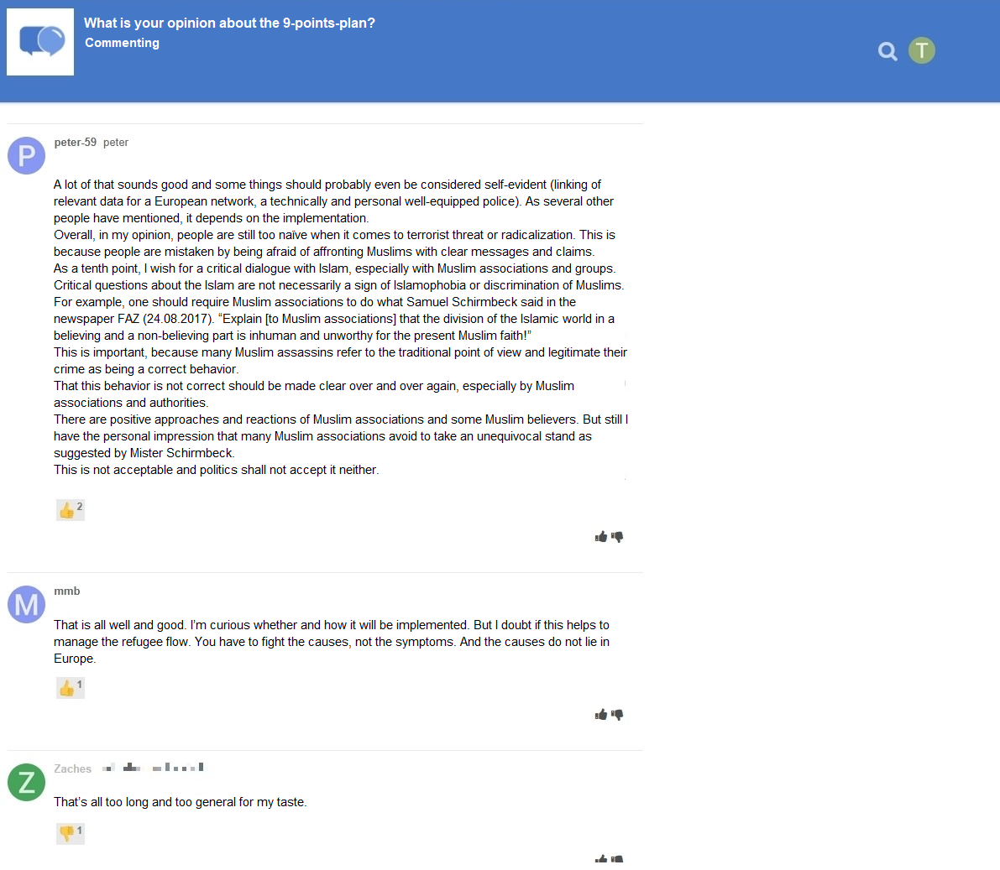

```{r include=F}
knitr::opts_chunk$set(cache=F)
```

```{r setup, include=F}
# load packages
pcks <- c("devtools", "jpeg", "knitr", "lavaan", "magrittr", "papaja", "png", "pwr", "semTools", "tidyverse")
invisible(lapply(pcks, library, character.only = TRUE))
# install_github("tdienlin/td@v.0.0.2.3")
library(td)

# create bib with r-packages
r_refs(file = "../bibliography/r-references.bib")

# load bib
r_citations <- cite_r("../bibliography/r-references.bib"
                      , footnote = FALSE
                      , withhold = FALSE
                      , pkgs = c("tidyverse", "lavaan", "papaja", "pwr", "quanteda", "semTools")
                      )
```

```{r load-data, cache=T, include=F}
load("../data/workspace.rData")
```

Understanding why people disclose personal information online remains a critical question for both society and research. 
Originally, it was claimed that self-disclosure is mostly erratic, and that self-disclosure cannot be predicted by assessing people's personal beliefs, concerns, or standpoints. 
Most prominently, the privacy paradox stated that people self-disclose vast amounts of personal information online *despite* having substantial concerns about their privacy [@barnesPrivacyParadoxSocial2006; @taddickenUsesPrivacyOnline2011].

Somewhat surprisingly, and despite its popularity in the media [@newyorkpublicradioPrivacyParadox2018], the privacy paradox has garnered little empirical support. 
A recent meta-analysis revealed that the correlation between privacy concerns and self-disclosure on SNS is *r* = -.13 [@baruhOnlinePrivacyConcerns2017], which shows that privacy concerns are indeed related to self-disclosure online. 

Hence, rather than further pursuing the privacy paradox, a large share of current day research builds on the so-called _privacy-calculus_ [@lauferPrivacyConceptSocial1977], which states that self-disclosure online can be explained---at least partly---by means of expected risks *and* expected benefits [@krasnovaOnlineSocialNetworks2010].
Specifically, by operationalizing expected risks as privacy concerns, several studies have shown that experiencing greater privacy concerns is related to disclosing less information online, whereas expecting benefits is related to disclosing more information online [@heirmanPredictingAdolescentsDisclosure2013; @koohikamaliInvestigationDynamicModel2019].

However, although the privacy calculus has gained some momentum in academic research, several important questions remain unanswered. 
First, we still know little about whether the privacy calculus can be replicated with behavioral data in an authentic long-term setting [@kokolakisPrivacyAttitudesPrivacy2017]. 
Thus far, most research supporting the privacy calculus has used either self-reports of behavior [e.g., @krasnovaOnlineSocialNetworks2010], vignette approaches [e.g., @bolUnderstandingEffectsPersonalization2018], or one-shot experiments in the lab [e.g., @treptePrivacyCalculusContextualized2020]. 
However, all three of these approaches have low external validity.
As a result, in this study we analyze actual information sharing behavior in an authentic online setting.

Second, current research on the privacy calculus is often criticized for not explicitly focusing on the deliberation process of self-disclosure. 
According to critics [e.g., @knijnenburgDeathPrivacyCalculus2017], showing that concerns and gratifications both correlate with self-disclosure is not evidence for an explicit weighing process of pros and cons. 
We agree.
In this study, we therefore explicitly focus on the privacy deliberation process. 
Related, and on a more general level, we explore the usefulness of further extending the privacy calculus model by adding new variables such as privacy deliberation, trust, and self-efficacy.

Finally, because the privacy calculus does not take place in a vacuum, and because it is often argued that self-disclosure can be easily triggered by external circumstances, we analyze whether the privacy calculus can be affected by the design of a website. 
Specifically, we investigate whether *popularity cues* such as like and dislike buttons have the power to affect the privacy calculus and to foster self-disclosure.

To test our research questions, drawing from a representative sample of the German population we conducted a preregistered online field experiment.
Participants were randomly distributed to one of three different websites, which either included a like button, both a like and a dislike button, or no buttons at all. 
Over the course of one week participants had the chance to discuss a topical issue (i.e., prevention of terrorist attacks in Germany). 
Afterward, they answered a follow-up questionnaire with items measuring the privacy calculus variables.

## The Privacy Calculus

Self-disclosure is a primary means of regulating privacy [e.g., @masurSituationalPrivacySelfdisclosure2018].
It is our key variable of interest.
There are two different understandings of self-disclosure in the literature: 
The first defines self-disclosure as _deliberate_ acts of sharing truthful information about the self with others [@jourardTransparentSelf1964]. 
The second considers _all_ acts of sharing information---be they active or passive, deliberate or unwitting---as self-disclosure, because each piece of information allows for meaningful inferences about a person [@watzlawickPragmaticsHumanCommunication2011]. 
In this paper we follow the latter approach, not least because the recent years have illustrated how easy it is to derive personal insights simply by analyzing exchanged communication [@kosinskiPrivateTraitsAttributes2013]. 
Moreover, independent from which position one adopts, it is possible to differentiate the content of self-disclosure into three different dimensions: breadth (i.e., number of topics covered), depth (i.e., intimacy of topics covered), and length (i.e., quantity of disclosure) [@omarzuDisclosureDecisionModel2000]. 
In this study we mainly focus on communication quantity, as we consider communication quantity to be a necessary precondition and hence valid proxy for self-disclosure.

Privacy concerns have been defined as follows: 
"Concerns about online privacy represent how much an individual is motivated to focus on his or her control over a voluntary withdrawal from other people or societal institutions on the Internet, accompanied by an uneasy feeling that his or her privacy might be threatened" [@dienlinLongitudinalAnalysisPrivacy2019, p. 6]. 
Previous research has found that people who are more concerned about their privacy than others are less likely to share personal information [@baruhOnlinePrivacyConcerns2017; @heirmanPredictingAdolescentsDisclosure2013; @koohikamaliInvestigationDynamicModel2019].

H1: People are more likely to self-disclose on a website when they are less concerned about their privacy.

Although privacy concerns are related to self-disclosure, one can argue that most studies report only small effects, and that there should be additional factors that also contribute to explaining self-disclosure. 
Most prominently, it has been argued that people trade a loss of privacy for a gain in gratifications such as social capital, entertainment, information, or self-presentation [@ellisonNegotiatingPrivacyConcerns2011; @taddickenUsesPrivacyOnline2011]. 
By now, a large body of research has found support for this hypothesis [e.g., @krasnovaOnlineSocialNetworks2010; @minHowArePeople2015; @trepteCrossculturalPerspectivePrivacy2017].

H2: People are more likely to self-disclose on a website when they obtain more gratifications from using the website.

As mentioned above, there is still a shortage of studies that explicitly analyze the decision process behind the disclosing of information---although this point of criticism has been leveled several times [@knijnenburgDeathPrivacyCalculus2017] and although other fields such as behavioral economics have long focused on the underlying problem [@zhuPrivacyCalculusIts2017]. 
This criticism is justified.
The observation that privacy concerns and expected gratifications are related to self-disclosure is by itself not sufficient evidence for an explicit weighing process.
Hence, research on the privacy calculus would benefit significantly from analyzing this decision process explicitly. 
Building on @omarzuDisclosureDecisionModel2000 and @altmanPrivacyConceptualAnalysis1976, we hence address a novel concept that might best be termed _privacy deliberation_, which captures the extent to which individual people explicitly compare positive and negative potential outcomes before communicating with others.

On the one hand, it seems plausible that deliberating about one's privacy would dampen subsequent self-disclosure, because refraining from regular communication---the primary means of connecting with others---requires at least a minimum of active and hence deliberate restraint. 
On the other hand, deliberating about one's privacy might also increase self-disclosure, because a person concerned about his or her privacy might arrive at the conclusion that in this situation self-disclosure is not only appropriate but expedient. 
In light of the lack of empirical studies and the plausibility of both effects, we formulate the following research question:

RQ1: Are people more or less likely to self-disclose on a website when they more actively deliberate about whether they should self-disclose?

Several attempts have already been made to expand the privacy calculus [@dinevExtendedPrivacyCalculus2006], introducing additional variables such as self-efficacy or trust. 
Self-efficacy in the context of the privacy calculus captures whether people believe in their own capability to implement particular privacy behaviors in the future [@dienlinExtendedPrivacyCalculus2016].
These privacy behaviors refer to either self-_disclosure_ (e.g., publishing a blog post) or self-_withdrawal_ (e.g., deleting inappropriate content).
People who report more privacy self-efficacy also engage in more self-withdrawal  [@chenRevisitingPrivacyParadox2018].
In light of our focus on active communication, in this study we investigate the influence of self-_disclosure_ self-efficacy.

H3: People are more likely to self-disclose on a website when their self-efficacy about self-disclosing on the website is higher.

Trust can be conceptualized in two different ways [@gefenTrustTAMOnline2003]: 
It either captures "_specific_ beliefs dealing primarily with the integrity, benevolence, and ability of another party" [@gefenTrustTAMOnline2003, p. 55, emphasis added] or a "_general_ belief that another party can be trusted" [@gefenTrustTAMOnline2003, p.55, emphasis added]. 
Whereas specific trust focuses on the causes of trust, general trust emphasized the experience of trust.
@gefenTrustTAMOnline2003 prioritize specific trust (p. 60). 
In the online context, it is also important to differentiate among several _targets_ of trust [@sollnerWhyDifferentTrust2016]. 
Potential targets include (a) the information system, (b) the provider, (c) the Internet, and (d) the community of other users [@sollnerWhyDifferentTrust2016]. 
Trust plays a key role in online communication [@metzgerPrivacyTrustDisclosure2004]. 
For example, people who put more trust in the providers of networks also disclose more personal information [@liEmpiricalStudiesOnline2011]. 

H4: People are more likely to self-disclose on a website when they have greater trust in the provider, the website, and the other users.

## The Effect of Popularity Cues

What is the effect of the communication context on the privacy calculus and on self-disclosure? 
First, it has often been noted that researchers should not exclusively focus on specific features of particular websites, for features are prone to change and quickly become obsolete [@foxDistinguishingTechnologiesSocial2017]. 
Instead, it has been suggested to prioritize underlying latent structures, for example by analyzing so-called affordances [@ellisonSocialNetworkSite2015; @foxDistinguishingTechnologiesSocial2017]. 
The concept of affordances was developed by @gibsonEcologicalApproachVisual2015, who argued that it is not the _objective features_ of objects that determine behavior.
Instead, more important are the _subjective perceptions_. 
Affordances are a mental representation of how a given entity might be used; as such, they are by definition subjective. 
There is an ongoing debate on what exactly defines an affordance [@evansExplicatingAffordancesConceptual2017]. 
For example, whereas @evansExplicatingAffordancesConceptual2017 propose three affordances for mediated communication (i.e., anonymity, persistence, and visibility), @foxDistinguishingTechnologiesSocial2017 suggest 10 affordances for SNSs alone (i.e., accessibility, bandwidth, social presence, privacy, network association, personalization, persistence, editability, conversation control, and anonymity). 

As the privacy calculus states that both benefits and costs determine behavior, we suggest that popularity cues such as like and dislike buttons, which are categorized as "paralinguistic digital affordances" [@carrPredictingThresholdPerceived2018, p. 142], perfectly capture potential benefits and costs. 
The like button is positive. 
It expresses an endorsement, a compliment, a reward [@carrPredictingThresholdPerceived2018; @sumnerFunctionalApproachFacebook2017]. 
However, communication online is also often characterized by negative and critical debates [@ziegeleDynamicsOnlineNews2017]. 
As the dislike button is a major means of downgrading content it is negative and represents the risk factor of the privacy calculus well. 
In fact, its stark negative effect might also explain why to date only a handful of major websites have implemented it (e.g., youtube, reddit, or stackexchange).

Paralinguistic digital affordances and specifically popularity cues have been shown to impact behavior [@kramerMasteringChallengeBalancing2020; @treptePrivacyCalculusContextualized2020].
For example, a large-scale field experiment in which 101,281 comments were analyzed found that comments with dislikes were more likely to receive further dislikes [@muchnikSocialInfluenceBias2013]. 
@stroudRecommendRespectAltering2017 demonstrated that when users disagreed with a post, they were more likely to click on a button labeled _respect_ compared to a button labeled _like_. 

In this vein, it seems plausible that popularity cues might also impact the privacy calculus [@kramerMasteringChallengeBalancing2020].
First, popularity cues could serve as a means of reward and punishment. 
Being complimented with a like should encourage future self-disclosure, while being punished with a dislike should inhibit disclosure. 
Similarly, like buttons imply being able to garner positive feedback, so implementing a like-button---similar to a compliment in the offline world---might leverage gratifications. 
Implementing popularity cues might also bring people to more actively deliberate about whether or not it is actually worthwhile to disclose information. 
If both like and dislike buttons are present, privacy deliberation should increase even further. 
Finally, because people who are more concerned about their privacy are also more shy and risk averse [@dienlinPsychologyPrivacyAnalyzing2017], implementation of the dislike button should both stir privacy concerns and stifle self-disclosure. 

H5.	Compared to people who use a website without like or dislike buttons, people who use a website with like buttons (a) self-disclose more, (b) obtain more gratifications, (c) are less concerned about their privacy, and (d) deliberate more about whether they should communicate online.

H6.	Compared to people who use a website without like or dislike buttons, people who use a website with like and dislike buttons (a) self-disclose more, (b) obtain more gratifications, and (c) deliberate more about whether they should communicate online.

H7.	Compared to people who use a website with only like buttons, people who use a website with like and dislike buttons (a) are more concerned about their privacy, and (b) deliberate more about whether they should communicate online.

For a simplified overview of our theoretical model, see Figure \@ref(fig:model).

```{r model, fig.cap="Overview of theoretical model.", fig.align='center', out.width=".8\\textwidth"}
knitr::include_graphics("../figures/design/model.pdf")
# knitr::include_graphics("figures/design/model.png")
```

# Methods
## Open Science

The online supplementary material (OSM) of this study includes the data, research materials, analyses scripts, and a reproducible version of this manuscript (see https://osf.io/hcqat/?view_only=5db35868738d40609b11e58cc343a9b0).
We preregistered the study using the registration form _OSF Prereg_, which includes the hypotheses, sample size, research materials, analyses, and exclusion criteria (see https://osf.io/a6tzc/?view_only=5d0ef9fe5e1745878cd1b19273cdf859). 
We needed to change our pre-defined plan in some cases. 
For a full account of all changes, see OSM. 
New analyses that were not preregistered appear in the section on exploratory analyses.

## Procedure

The study was designed as an online field experiment with three different groups. 
The first group used a website without like/dislike buttons, the second a website with only like buttons, and the third a website with both like and dislike buttons. 
Participants were randomly distributed to one of the three websites in a between-subject design.

We collaborated with a professional panel agency to recruit participants. 
As incentive, participants were awarded digital points, which they could use to get special offers from other companies. 
Participants were above the age of 18 and lived in Germany. 
In a first step, the agency sent its panel members an invitation to participate in the study (_invitation_). 
In this invitation, panel members were asked to participate in a study analyzing the current threat posed by terrorist attacks in Germany.[^1] 
Members who decided to take part were subsequently sent the first questionnaire (_T1_), in which we asked about their sociodemographics, provided more details about the study, and included a registration link for the website. 
Afterward, participants were randomly assigned to one of the three websites. 
After registration was completed, participants could discuss the topic of the terrorism threat in Germany over the course of one week (_field_). 
Subsequently, participants received a follow-up questionnaire in which the self-reported measures were collected (_T2_). 
Measures were collected after and not before the field phase in order not to prime participants or reveal our primary research interest.

[^1]: Although the terror attack was not of primary interest for this study, the data can and will also be used to analyze perceptions of the terrorism threat. Hence, no deception took place, and in the debriefing participants were informed about our additional research interest in privacy. 

We programmed an online website based on the open-source software _discourse_ (https://www.discourse.org/). 
We conducted several pretests with students from the local university to make sure the website had an authentic feel (see Figure \@ref(fig:website)). 
Participants used the website actively: Overall, they spent `r sum(d_raw$time_read, na.rm = TRUE) %>% "/"(60) %>% round(0) %>% format(big.mark = ",")` minutes online, wrote `r sum(d_raw$post_count, na.rm = TRUE) %>% format(big.mark = ",")` comments, and left `r sum(d_raw$reactions, na.rm = TRUE)` popularity cues. 
Notably, we did not find any instances of people providing meaningless text. 
For an example of communication that took place, see Figure \@ref(fig:comments).

```{r website, fig.cap="The website's homepage. (Translated to English; university logos pixelated for peer review.)", fig.align='center', out.width=".9\\textwidth"}

```

```{r comments, fig.align='center', fig.cap="Communication that took place on the website with like and dislike buttons. (Translated to English.)", out.width=".9\\textwidth"}

```

## Participants

We ran a priori power analyses to determine how many participants to recruit. The power analysis was based on a smallest effect size of interest [SESOI; @lakensEquivalenceTestingPsychological2018]. 
In other words, we defined a minimum effect size that we would consider sufficiently large enough to support our hypotheses. 
Because small effects should be expected when researching aspects of privacy online [e.g., @baruhOnlinePrivacyConcerns2017], with small effects beginning at an effect size of _r_ = .10 [@cohenPowerPrimer1992], we set our SESOI to be _r_ = `r r_sesoi %>% my_round("std")`. 
Our aim was to be able to detect this SESOI with a probability of at least 95%. Using the regular alpha level of 5%, this leads to a minimum sample size of _n_ = `r n_desired %>% format(big.mark = ",")`. 
In the end, we were able to include n = `r n_final` in our analyses (see below). 
This means that our study had a probability (power) of `r power_achieved * 100`% to find an effect at least as large as _r_ = `r r_sesoi %>% my_round("std")`. 
Put differently, we were able to make reliable inferences (i.e., power = 95%) about effects at least as big as _r_ = `r r_sensitive %>% my_round("std")`.

We collected a representative sample of the German population in terms of age, sex, and federal state. 
`r n_t1 %>% format(big.mark = ",")` participants completed the survey at T1, `r n_users` participants created a user account on the website,  and `r n_t2` participants completed the survey at T2. 
Using tokens and IP addresses, we connected the data from T1, participants' behavior on the platform, and T2 by means of objective and automated processes.
The data for _n_ = `r n_matched` participants could be matched successfully across all three platforms. 
We excluded _n_ = `r n_speeding` participants who finished the questionnaire at T2 in less then three minutes, which we considered to be unreasonably fast. 
To detect potentially corrupt data, we calculated Cook's distance.[^note]
We excluded `r n_resp_pattern` participants because they provided clear response patterns (i.e., straight-lining). 
The final sample included `r n_final` participants.
The sample characteristics at T1 and T2 were as follows: 
T1: Age = `r round(age_t1_m, 0)` years, sex = `r round(male_t1_m, 2)*100`% male, college degree = `r round(college_t1_m, 2)*100`%.
T2: Age = `r round(age_final_m, 0)` years, sex = `r round(male_final_m, 2)*100`% male, college degree = `r round(college_final_m * 100, 0)`%.
One participant did not report his or her sex.
<!-- Despite the dropout and although somewhat higher-educated, also T2 can hence be considered a largely representative sample of the German population. -->

[^note]: We preregistered to delete participants with less than 6 minutes answer time. However, this led to the exclusion of too many data points of high quality, which is why we relaxed this criterion. In the OSM, we report the results using all participants.

## Measures

In what follows, we present the materials we used to measure our variables. 
Wherever possible, we operationalized the variables using established measures.
Where impossible (for example, to date there exists no scale on privacy deliberation), we self-designed novel items, which we pretested concerning their legibility and understandability.
To assess factor validity we ran confirmatory factor analyses (CFA). 
If the CFAs revealed insufficient fit, we deleted malfunctioning items. 
All items were formulated as statements to which participants indicated their (dis-)agreement on a bipolar 7-point scale. 
Answer options were as follows: -3 (_strongly disagree_), -2 (_disagree_), -1 (_slightly disagree_), 0 (_neutral_), +1 (_slightly agree_), +2 (_agree_), +3 (_strongly agree_). 
In the questionnaire, all items measuring a variable were presented on the same page in randomized order.

For an overview of the means, standard deviations, factorial validity, and reliability, see Table \@ref(tab:CFA). 
For an overview of the variables' distributions, see Figure \@ref(fig:corrplot). 
For the exact wording of all items and their individual distributions, see OSM.

```{r CFA, results = "asis"}
apa_table(select(factor_val_tab, -alpha), font_size = "footnotesize",
          caption = "Psychometric Properties, Factorial Validity, and Reliability of Measures",
          note = "omega = Raykov's composite reliability coefficient omega; avevar = average variance extracted.")
```

```{r corrplot, fig.cap="Above diagonal: zero-order correlation matrix; diagonal: density plots for each variable; below diagonal: bivariate scatter plots for zero-order correlations. Solid regression lines represent linear regressions, dotted regression lines represent quadratic regressions. Calculated with the model predicted values for each variable (baseline model).", fig.height=8, fig.width=8, out.width=".9\\textwidth", fig.align='center', fig.pos = "!h", warning=F}
print(fig_fs_cor)
```

### Privacy concerns

Privacy concerns were measured with seven items based on @buchananDevelopmentMeasuresOnline2007.
One example item was "When using the participation platform, I had concerns about my privacy". 
One item had to be deleted due to poor psychometric properties.

### Gratifications

We differentiated between two separate types of gratification. 
_General gratifications_ were measured with five items based on @sunLocationInformationDisclosure2015.
One example item was "Using the participation platform has paid off for me". 
_Specific gratifications_ were measured with 15 items on five different subdimensions with three items each. 
The scaled was based on @schererGratifikationMinuteZeitnahe2002.
Example items were: "Using the participation platform made it possible for me to" ... "learn things I would not have noticed otherwise" (information), "react to a subject that is important to me" (relevance), "engage politically" (political participation), "try to improve society" (idealism), and "soothe my guilty consciences" (extrinsic benefits).

### Privacy deliberation

Privacy deliberation was measured with five self-designed items. One example item was "While using the participation platform I have weighed the advantages and disadvantages of writing a comment."

### Self-efficacy

Self-efficacy was captured with six self-designed items, which measured whether participants felt that they had sufficient self-efficacy to write a comment on the platform. 
For example, we asked "I felt technically competent enough to write a comment." 
Two inverted items were deleted due to poor psychometric properties.

### Trust

We differentiated between two types of trust. 
_General trust_ was operationalized based on @sollnerWhyDifferentTrust2016, addressing three targets (i.e., provider, website, and other users) with one item each. 
One example items was "The operators of the participation platform seemed trustworthy."
_Specific trust_ was operationalized for the same three targets with three subdimensions each (i.e., ability, benevolence/integrity, and reliability), which were measured with one item each. 
Example items were "The operators of the participation platform have done a good job" (ability), "The other users had good intentions" (benevolence/integrity), "The website worked well" (reliability). 
The results showed that the provider and website targets were not sufficiently distinct, as was evidenced by a Heywood case. 
We hence adapted the scale to combine these two targets. 
The updated scale exhibited adequate fit. 

### Self-disclosure

Self-disclosure was calculated by taking the log scale of the number of words each participant wrote in a comment, to which we added the number of likes and dislikes, which were multiplied by two. 
The number of likes and dislikes were multiplied by two because, rudimentarily, like buttons abbreviate the sentence “I like” and dislike buttons “I dislike”.
The sum of words and likes/dislikes was log-scaled because the relative amount of self-disclosure diminishes the more a person has already said.

## Data analysis

All hypotheses and research questions were tested using structural equation modeling with latent variables. 
The influence of the three websites was analyzed using contrast coding, which allows for testing the effects of experimental manipulations within a theoretical framework while using latent variables [@klinePrinciplesPracticeStructural2016]. 
Because the dependent variable self-disclosure was not normally distributed, we estimated the model using robust maximum likelihood [@klinePrinciplesPracticeStructural2016]. 
As recommended by @klinePrinciplesPracticeStructural2016, we report the following global fit indices: $\chi^2$, RMSEA (90% CI), CFI, and SRMR. 
Because sociodemographic variables are often related to self-disclosure and other privacy-related variables [@dindiaSexDifferencesSelfdisclosure1992], we controlled all variables for the influence of sex, age, and education.
Preregistered hypotheses were tested with a one-sided significance level of 5%. 
Research questions were tested with a two-sided 5% significance level using family-wise Bonferroni-Holm correction. 
Exploratory analyses were conducted from a descriptive perspective, which is why the reported p-values and confidence intervals should not be overinterpreted.

We used `r r_citations` for all our analyses.

# Results

## Descriptive Analyses

```{r PriDel}
# calc participants who actively deliberated
pridel_active <- select(d, starts_with("PD01")) %>% 
  as.data.frame %>% 
  mutate(m = apply(., 1, mean, na.rm = T) %>% round(0)) %>% 
  select(m) %$% 
  nrow(filter(., m > 4)) / n_final * 100
```

We first measured and plotted all bivariate relations between the study variables (see Figure \@ref(fig:corrplot)). 
The results did not reveal any relationships to be particularly curvilinear. 
Furthermore, all variables referring to the privacy calculus demonstrated the expected relationships with self-disclosure. 
For example, people who were more concerned about their privacy disclosed less information (_r_ `r parameterestimates(fit_baseline, standardized = TRUE) %>%  filter(op == "~~" & lhs == "pri_con" & rhs == "self_dis_lg") %>% select(std.all) %>%  my_round("std_txt")`). 
Worth noting, specific gratifications and general trust predicted self-disclosure better than general gratifications and specific trust (_r_ `r parameterestimates(fit_baseline, standardized = TRUE) %>%  filter(op == "~~" & lhs == "grats_gen" & rhs == "self_dis_lg") %>% select(std.all) %>%  my_round("std_txt")` vs. _r_ `r parameterestimates(fit_baseline, standardized = TRUE) %>%  filter(op == "~~" & lhs == "grats_spec" & rhs == "self_dis_lg") %>% select(std.all) %>%  my_round("std_txt")`).
The mean of privacy deliberation was _m_ = `r des_pridel$m %>% round(2)`. Altogether, `r pridel_active %>% round(0)`% of participants reported having actively deliberated about their privacy. 

It is important to note that the bivariate results showed three very large correlations: First, between specific trust and general gratifications (_r_ = `r d_fs %>% select("Specific\ntrust", "General\ngratifications") %>% cor %>% .[2, 1] %>% my_round("std")`); second, between privacy concerns and privacy deliberation (_r_ = `r d_fs %>% select("Privacy\nconcerns", "Privacy\ndeliberation") %>% cor %>% .[2, 1] %>% my_round("std")`); third, between specific gratifications and self-efficacy (_r_ = `r d_fs %>% select("Specific\ngratifications", "Self-\nefficacy") %>% cor %>% .[2, 1] %>% my_round("std")`). As all six variables were later analyzed within a single multiple regression, problems of multicollinearity might occur. 
 
## Privacy Calculus
### Preregistered analyses

First, we ran a model as specified in the preregistration. The model fit our data okay, `r fit_txt(fit_prereg, scaled = TRUE)`. 
Regarding H1, we did not find that general gratifications predicted self-disclosure (`r coeffs_txt(fit_prereg, "a1", one_sided=T)`; one-sided). 
With regard to H2, privacy concerns did not significantly predict self-disclosure (`r coeffs_txt(fit_prereg, "b1", one_sided=T)`; one-sided). 
RQ1 similarly revealed that privacy deliberation was not correlated with self-disclosure (`r coeffs_txt(fit_prereg, "c1")`; two-sided). 
Regarding H3, however, we found that experiencing self-efficacy predicted self-disclosure substantially (`r coeffs_txt(fit_prereg, "d1", one_sided=T)`; one-sided). 
Concerning H4, results showed that trust was not associated with self-disclosure (`r coeffs_txt(fit_prereg, "e1", one_sided=T)`; one-sided).

However, these results should be treated with caution, because they indeed exhibit problems typical of multicollinearity, such as "wrong" signs of the predictors [@grewalMulticollinearityMeasurementError2004]. 
For example, in the multiple regression trust had a _negative_ relation with self-disclosure, whereas in the bivariate analysis it was _positive_.


<!-- As a result, specific trust and general gratifications should not be analyzed within the same model, as the two concepts are empirically too close to one another. -->

### Exploratory analyses

Thus, we slightly adapted our preregistered model on the basis of the insights described above. 
First, instead of specific trust and general gratifications we now included _general_ trust and _specific_ gratifications, which were correlated slightly less strongly. 
The adapted model fit our data comparatively well, `r fit_txt(fit_adapted)`. 

In the adapted privacy calculus model, specific gratifications were positively related to self-disclosure online (`r coeffs_txt(fit_adapted, "b1")`). 
Furthermore, people who deliberated more about their privacy disclosed less information (`r coeffs_txt(fit_adapted, "c1")`; two-sided). 
Self-efficacy remained substantially correlated with self-disclosure (`r coeffs_txt(fit_adapted, "d1")`; two-sided). 
However, we again found a negative correlation between trust and self-disclosure (`r coeffs_txt(fit_adapted, "e1")`; two-sided), which again implies multicollinearity.

When confronted with multicollinearity, two responses are typically recommended [@grewalMulticollinearityMeasurementError2004]:
(a) combining collinear variables into a single measure, or (b) keeping only one of the collinear variables.
Combining variables was not an option in our case, because both trust and expected benefits are theoretically distinct constructs.
Because several variables were closely related to one another, we therefore decided to fit a simple privacy calculus model, which contains only privacy concerns and specific gratifications. 

The simple model fit our data well, `r fit_txt(fit_simple)`. 
First, we found that people who experienced more privacy concerns than others disclosed less information (`r coeffs_txt(fit_simple, "a1")`; two-sided). 
Second, people who reported more specific gratifications than others self-disclosed more information (`r coeffs_txt(fit_simple, "b1")`; two-sided). 
Both effect sizes were above our predefined SESOI of _r_ = `r r_sesoi %>% my_round("std")`, which implies that the they were large enough to be theoretically relevant. 

When comparing the three models with one another, the adapted model explained the most variance in self-disclosure (`r rsquare_fit_adapted * 100` %), followed by the preregistered model (`r rsquare_fit_prereg * 100` %), and the simple privacy calculus model (`r rsquare_fit_simple * 100` %).
At the same time, the simple privacy calculus model was the most parsimonious one (BIC = `r model_comp_tab["simple", "bic"] %>% round(0) %>% format(big.mark = ",")`, AIC = `r model_comp_tab["simple", "aic"] %>% round(0) %>% format(big.mark = ",")`), followed by the preregistered model (BIC = `r model_comp_tab["preregistered", "bic"] %>% round(0) %>% format(big.mark = ",")`, AIC = `r model_comp_tab["preregistered", "aic"] %>% round(0) %>% format(big.mark = ",")`), and the adapted model (BIC = `r model_comp_tab["adapted", "bic"] %>% round(0) %>% format(big.mark = ",")`, AIC = `r model_comp_tab["adapted", "aic"] %>% round(0) %>%  format(big.mark = ",")`).
For a visual overview of all results, see Figure \@ref(fig:plotpc).

```{r plotpc, fig.cap="Predictors of self-disclosure. Displayed are the 95\\% CIs of unstandardized effects.", out.width = "\\textwidth", fig.pos = "!h", fig.height=4}
print(fig_coeffs)
# print(fig_fs_m)
```

## Popularity Cues
### Preregistered analyses

In a next step, we analyzed the potential effects of the popularity cues. 
Somewhat surprisingly, we found no effects of the popularity cues on the privacy calculus variables. 
For an illustration, see Figure \@ref(fig:popularitycues), which displays the model-predicted values for each variable (using the baseline model) and shows that the confidence intervals of all preregistered variables overlap. 
For the results of the specific inference tests using contrasts, see the OSM.

### Exploratory analyses

The picture remained the same also when analyzing variables not included in the preregistration. 
Note that some differences missed statistical significance only marginally (e.g., specific gratifications for the comparison between the website with like buttons and the control website without like and dislike buttons). 
Nevertheless, we refrain from reading too much into these differences and conclude that the three websites were comparable regarding the privacy calculus variables and the amount of self-disclosure.

```{r popularitycues, fig.cap="Overview of the variables for the three websites. Control: Website without buttons. Like: Website with like buttons. Like \\& Dislike: Website with like and dislike buttons.", out.width = "\\textwidth", fig.pos = "!h"}
# knitr::include_graphics("figures/results/fig_pop.pdf")
print(fig_fs_m)
```

# Discussion

In this study, we analyzed the privacy calculus using actual observed behavior in a preregistered field experiment. 
We additionally asked whether the privacy calculus is affected by popularity cues such as like and dislike buttons. 
The data came from a representative sample of the German population and were analyzed using structural equation modeling with latent variables. 

In the bivariate analyses, all privacy calculus variables significantly predicted self-disclosure. 
In the preregistered analyses using multiple regression, however, only self-efficacy significantly predicted self-disclosure.
All other variables were not significant.
The preregistered extended privacy calculus model was therefore not supported by the data.
However, the model showed problems typical of multicollinearity, which is why we also explored (a) an adapted version of the preregistered model, in which we exchanged two variables, and (b) a more basal privacy calculus model, which included only privacy concerns and specific gratifications. 

The adapted model suggests that also when holding all other variables constant, people who deliberate more about their privacy disclose less, and that people who expect more specific gratifications and who feel more self-efficacious disclose more.
However, the model also suggests that if trust increases, while all other factors remain constant, self-disclosure decreases.
This is theoretically implausible. 
As a result, we also fit the above-mentioned simple privacy calculus model, which showed that both privacy concerns and obtained gratifications significantly and meaningfully predicted self-disclosure. 
Taken together, the results support the privacy calculus framework and suggest that self-disclosure online is not erratic and that it can be explained by several psychological variables.

Aligned with this observation, the results also suggest that in new communication contexts at least one third of all Internet users _actively deliberates_ about their privacy. 
Determining whether this figure is large or small is a normative question.
Because although the effect is substantial, one could argue that it should be higher and that we as society should still more actively deliberate about our self-disclosure practices online. 
Interestingly, results showed that privacy deliberation and privacy concerns were remarkably similar, which was evidenced by their strong correlation with one another and their comparable correlations with other variables. 
This either implies that thinking about one's privacy increases one's concern or, conversely, that being concerned about one's privacy leads one to think about one's options more actively. 
Future research might tell.

The next major implication is that popularity cues do not always seem to have a strong influence on the privacy calculus and self-disclosure.
Although some studies have found that popularity cues can substantially impact behavior [e.g., @muchnikSocialInfluenceBias2013], in our study we found the opposite.
Users still disclosed the same amount of personal information regardless of whether or not a website included like or dislike buttons, potentially highlighting the agency of users.

The results also have several more fine-grained implications. 
First, one can question the tendency to further increase the complexity of the privacy calculus model by adding additional variables [e.g., @dienlinExtendedPrivacyCalculus2016]. 
"Since all models are wrong the scientist cannot obtain a "correct" one by excessive elaboration. [...] Just as the ability to devise simple but evocative models is the signature of the great scientist so overelaboration and overparameterization is often the mark of mediocrity" [@boxScienceStatistics1976, p. 792]. 
Specifically, we have come to believe that adding self-efficacy to privacy calculus models is of limited value, because self-efficacy is often only a self-reported proxy of behavior offering little epistemic insight. 
Instead, it might be more interesting to find out _why_ some people feel sufficiently efficacious to self-disclose whereas others do not. 
In addition, although adding variables increases the amount of explained variance, it introduces further problems, for example spurious results due to multicollinearity.

Interestingly, multicollinearity might not even be a problem per se, but rather a helpful warning sign. 
Because from a _statistical_ perspective, strongly correlated predictors only mean that standard errors become larger [@vanhoveCollinearityIsnDisease2019]. 
In other words, when predictors are strongly correlated we can be less certain about the effects we obtain, because there is less unique variance [@vanhoveCollinearityIsnDisease2019]. 
As a remedy, researchers could simply collect larger samples, which would allow to achieve sufficient statistical power. 
Fortunately, using accessible statistical software it is now possible to run a priori power analyses that explicitly account for correlated/collinear predictors [@wangPowerAnalysisParameter2020].

From a _theoretical_ perspective, multicollinearity could also suggest that the underlying theoretical model is ill-configured.
It is our understanding that multiple regression is often used with the aim to isolate effects, to make sure that they are not simply caused by another third variable.
However, in cases of highly correlated measures this often does not make much sense theoretically.
For example, in our case combining trust and gratification asks how increasing benefits affects self-disclosure _while holding trust constant_.
Theoretically, however, it is more plausible to assume that increasing gratifications also fosters trust [@sollnerWhyDifferentTrust2016].
In the preregistered analysis we even went further and tested whether trust increases self-disclose while holding constant gratifications, privacy concerns, privacy deliberations, and self-efficacy, measures which are all strongly correlated. 
In short, the effects we found could even be correct, but the interpretation is much more difficult, artificial, and thereby of little theoretical and practical value.

<!-- Explaining self-disclosure online by means of a basal privacy calculus model instead has the charm of offering a more parsimonious model while still being capable of explaining a substantial part of self-disclosure online. -->

Furthermore, we found a remarkably strong correlation between specific trust and expected gratifications (i.e., _r_ = .79).
At first glance, this strong relation seemed somewhat peculiar to us. 
On closer inspection, however, we realized that the way trust is typically operationalized is remarkably close to expected gratifications. 
To illustrate, the trust subdimension _ability_ includes items such as “The comments of other users were useful”. 
In fact, in the literature trust is often operationalized as a formative construct that directly results from factors such as expected benefits [@sollnerWhyDifferentTrust2016]. 
In conclusion, our results suggest that _causes_ of trust should not be confused with _measures_ of trust, for this might introduce problems of both homogeneity and/or multicollinearity.
Instead, we recommend to use general and reflective measures of trust.
<!-- , which are less closely related to expected gratifications. -->

<!-- As suggested in literature (), we operationalized trust by measuring how much expertise, benevolence, and reliability participants associated with users, the website, and the providers. It seems that these three measures do not measure trust per se, but rather those aspects that cause trust. In other words, not trust but antecedents of trust. We hence recommend to use measures than focus on the actual psychological experience of trust.  -->

<!-- Finally, this study offers some implications on a meta-level. At a time when the social sciences are experiencing an excruciating replication crisis [e.g., @Camerer.2018; @Camerer.2016; @McEwan.2018], it has become increasingly important to further improve the way we go about doing science. In this preregistration, we have tried to implement several mechanisms proposed by @Munafo.2017. In doing so, we had the chance to learn several important aspects: For example, in the future we will be more hesitant to formulate concrete hypotheses when treading on novel ground. Moreover, instead of selling model adaptions as a priori rationales (a practice known as harking; i.e., hypothesizing after results are known), we reported them as additional analyses; we hope to have shown that this does not decrease a paper's value, but instead offers several interesting insights (e.g., that it might be expedient to formulate gratifications specifically rather than generally, or that gratifications and trust are highly correlated).  -->

## Limitations

The results do not allow for causal interpretation on the within-person level. 
First, all results are based on analyses of between-person variance. 
However, between-person relations often do not translate well to within-person effects [@hamakerCritiqueCrosslaggedPanel2015]. 
While some studies on privacy concerns online have begun to examine both sources of variance, finding that intrapersonal changes in privacy concerns are indeed related to intrapersonal changes in self-disclosure [@dietvorstAdolescentPerceptionsParental2017], similar analyses are still lacking for the privacy calculus. 

Second, the self-reported measures were collected _after_ the field phase in which the dependent variable was measured. 
As a result, the coefficients might overestimate the actual relations, because demand effects might have led participants to artificially align their theoretical answers with their practical behavior. 
Nevertheless, we deliberately decided to measure the self-reported variables afterward in order not to bias participants or prime our research interest. 

Third, the assumption of stable unit treatment states that in experiments we should manipulate only the experimental variable while holding all others constant [@klinePrinciplesPracticeStructural2016]. 
In this study, we explicitly manipulated the popularity cues. 
However, because the experiment was conducted in the field several other variables could not be held constant.
This includes the content of communication by other users, the unfolding communication dynamics, and the characteristics of other users.
As a result, the assumption of stable unit treatment was violated.

Although we did not find significant effects of like and dislike buttons in this study, this does not necessarily mean that they have no effect on self-disclosure and the privacy calculus in general.  
Null-findings pose the *Duhème-Quinn Problem* [@dienesUnderstandingPsychologyScience2008], which---put somewhat crudely---states that null findings can either result from an actual non-existence of effects or, instead, from a poor operationalization of the research question. 
In this case, we were not able send participants notifications when their comments were liked/disliked, which significantly decreases the popularity cues' salience.

<!-- One can make the case that gratifications should not be measured as reflective constructs but rather as formative constructs. However, we have not been able to specify a formative model with adequate fit as of yet.  -->

This paper analyzes self-disclosure in the context of political participation. 
Our focus was on understanding self-disclosure, which is why we deliberately excluded variables pertaining to political participation, such as informational self-efficacy [@loyPsychologicalPredictorsPolitical2018]. 
Moreover, operationalizing self-disclosure via communication quantity is, of course, only a proxy.
<!-- and, as mentioned above, in times of big data, every piece of communication allows for increasingly accurate inferences about one's personality. -->

## Conclusion

Whereas some scholars discuss whether we should wish "Death to the privacy calculus?" [@knijnenburgDeathPrivacyCalculus2017, p. 1], we think that the privacy calculus is alive and kicking. 
In this study, people who were more concerned about their privacy than others disclosed less information online, whereas people who received more gratifications from using a website than others disclosed more information online. 
In addition, the results suggest that a substantial share of internet users, approximately 30%, consciously engage in a privacy calculus by actively deliberating about whether or not to disclose information. 
Popularity cues such as like and dislike buttons seem to play only a minor role in this process, especially if no means are implemented to guarantee that users are notified about others liking or disliking their communication. 
In conclusion, the results thereby provide further evidence against the privacy paradox.
Internet users are at least somewhat proactive and reasonable---maybe no more or less proactive or reasonable than in other everyday situations.

\newpage

# References

\setlength{\parindent}{-0.5in}
\setlength{\leftskip}{0.5in}
