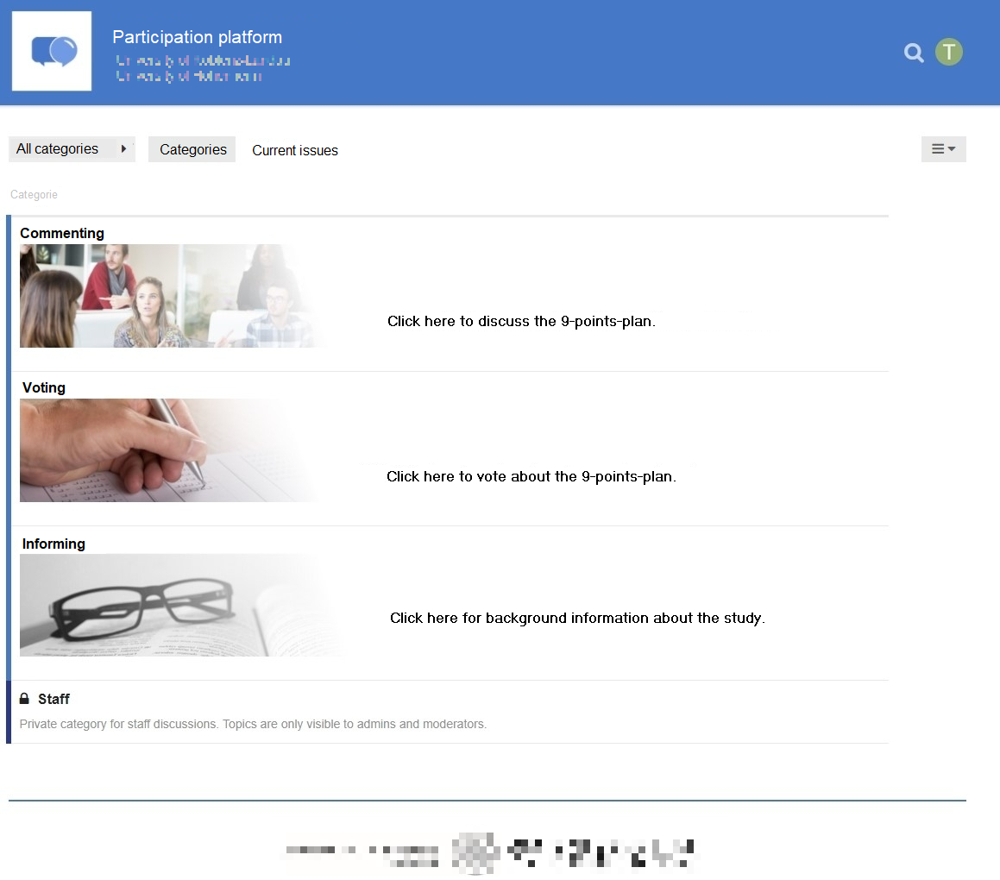

On this website, you can find the companion material for the paper _How Do Like and Dislike Buttons Affect Communication? Testing the Privacy Calculus in a Preregistered One-Week Field Experiment_. 

You can either read the paper [in your browser](manuscript.html) or download it as [pdf](manuscript.pdf). You can also find the detailed code and summaries of the [analyses](analyses.html) reported in the paper, as well as [additional analyses](analyses_additional.html) not reported in the paper. 

This website is produced directly from the project's [github repository](https://github.com/tdienlin/privacy_calc_exp). You can download the material and the data, file an issue, or submit a pull request.

