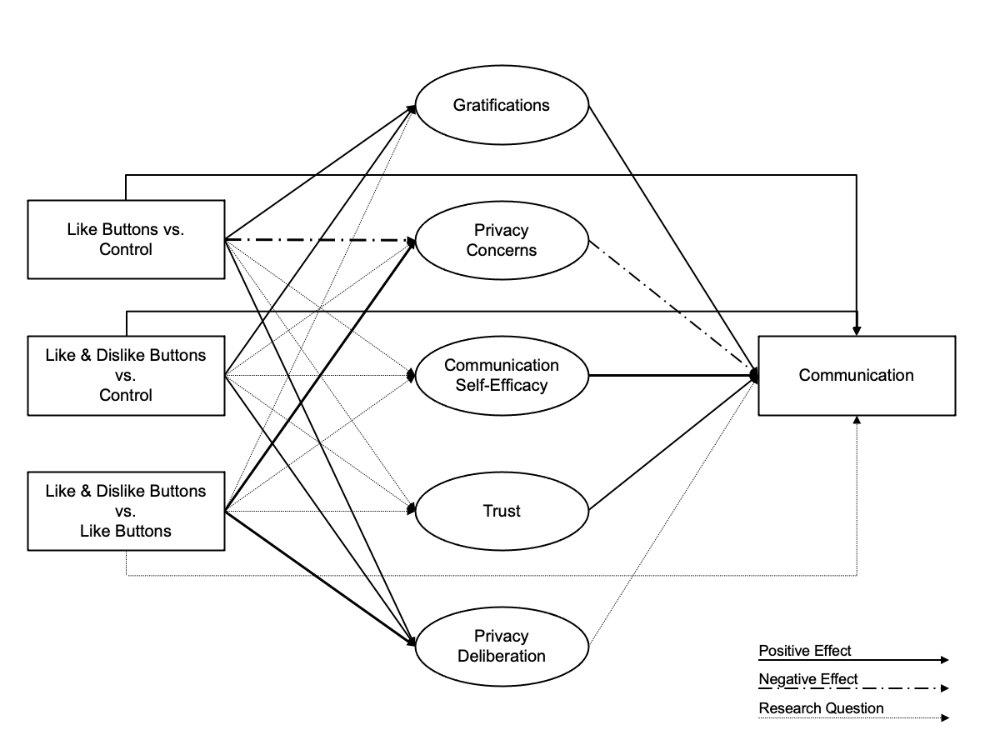

```{r include=F}
knitr::opts_chunk$set(cache=F, echo=F, warning=F, message=F)
```

```{r setup, include=F}
# install github packages
# devtools::install_github("tdienlin/td@v.0.0.2.3")

# load packages
pcks <- c("devtools", "jpeg", "knitr", "lavaan", "magrittr", "papaja", "png", "pwr", "semTools", "td", "tidyverse")
invisible(lapply(pcks, library, character.only = TRUE))

# create bib with r-packages
r_refs(file = "bibliography/r-references.bib")

# load bib
r_citations <- cite_r("bibliography/r-references.bib"
                      , footnote = FALSE
                      , withhold = FALSE
                      , pkgs = c("tidyverse", "lavaan", "papaja", "pwr", "quanteda", "semTools")
                      )
```

```{r load-data, cache=T, include=F}
load("data/workspace.rData")
```

# Introduction

Understanding why people share personal information online is a critical question for society and research. 
Originally, it was assumed that the online sharing of information is erratic and that it cannot be predicted by people's personal beliefs, concerns, or attitudes. 
Most prominently, the privacy paradox stated that people communicate vast amounts of personal information online *despite* having substantial concerns about their privacy [@barnesPrivacyParadoxSocial2006; @taddickenUsesPrivacyOnline2011].

Somewhat surprisingly, and despite its popularity in the media [@newyorkpublicradioPrivacyParadox2018], empirical support for the privacy paradox is ambivalent.  
A recent meta-analysis reported a correlation between privacy concerns and self-disclosure on SNS of *r* = -.13 [@baruhOnlinePrivacyConcerns2017], which shows that privacy concerns are indeed related to communication online. 

Rather than further pursuing the privacy paradox, a large share of current day research builds on the so-called _privacy-calculus_ [@lauferPrivacyConceptSocial1977].
The privacy calculus states that communication online can be explained---at least partly---by means of expected risks *and* expected benefits [@krasnovaOnlineSocialNetworks2010].
By operationalizing expected risks as privacy concerns, several studies have shown that experiencing privacy concerns is related to sharing less information online, whereas expecting benefits is related to sharing more information online [@heirmanPredictingAdolescentsDisclosure2013; @koohikamaliInvestigationDynamicModel2019].

However, although the privacy calculus has gained momentum in academic research, several important questions remain unanswered. 

First, current research on the privacy calculus is often criticized for not explicitly focusing on the _deliberation process_ when communicating online. 
According to critics [e.g., @knijnenburgDeathPrivacyCalculus2017], showing that both concerns and gratifications correlate with communication behavior online is not sufficient evidence for an explicit weighing process. 
This study, therefore, explicitly focuses on the privacy deliberation process. 

Second, in this study I approach the privacy calculus from a theoretical perspective of _bounded rationality_. 
It is likely that other factors next to risks and benefits also determine behavior.
I therefore extend the privacy calculus model theoretically by investigating the role and interplay of trust and self-efficacy.

Third, the privacy calculus does not take place in a vacuum. 
It is often argued that communication online can be easily triggered by external circumstances.
I therefore analyze whether the privacy calculus is affected by the affordances of a website. 
Specifically, I investigate whether *popularity cues* such as like and dislike buttons affect the privacy calculus and whether they foster communication online.

Fourth, it is still largely unknown whether the privacy calculus can be replicated with _behavioral data_ in an authentic long-term setting [@kokolakisPrivacyAttitudesPrivacy2017]. 
Thus far, much research on the privacy calculus used self-reports of behavior [@krasnovaOnlineSocialNetworks2010], vignette approaches [@bolUnderstandingEffectsPersonalization2018], or one-shot experiments in the lab [@treptePrivacyCalculusContextualized2020]. 
A long-term field study observing actual behavior in an authentic context is still missing.

To test the research questions, a representative sample of the German population was collected in a preregistered online field experiment.
Participants were randomly distributed to one of three different websites, which either included a like button, both a like and a dislike button, or no buttons at all. 
Over the course of one week, participants had the chance to discuss a topical issue (i.e., prevention of terrorist attacks in Germany). 
Afterward, they answered a follow-up questionnaire with items measuring the privacy calculus variables.

## The Privacy Calculus

The key variable of interest for this study is (verbal) communication online.
Are people willing to engage in a conversation?
Do they express their opinion? 
In communicating online, people share much information about themselves.
Communication is, hence, closely related to self-disclosure, and it is a primary means of regulating privacy [e.g., @dienlinPrivacyProcessModel2014].
<!-- Almost all types of communication allow for meaningful inferences about a person, even when we _don't_ communicate [@watzlawickPragmaticsHumanCommunication2011].  -->
<!-- However, the recent years have illustrated vividly how much additional insights we can get about a person, simply by analyzing their digital traces of communication or their meta-data [@kosinskiPrivateTraitsAttributes2013].  -->
<!-- The more we communicate, the more we self-disclose. -->

Privacy concerns were defined as follows.
"Taken together, concerns about online privacy represent how much an individual is motivated to focus on their control over a voluntary withdrawal from other people or societal institutions on the Internet, accompanied by an uneasy feeling that their privacy might be threatened" [@dienlinLongitudinalAnalysisPrivacy2021, p. 4].

In this study I adopt the theoretical perspective of the privacy calculus [@lauferPrivacyConceptSocial1977].
The privacy calculus assumes that when communicating online people engage in a rational weighing of risks and benefits.
Notably, I don't assume that this weighing process is flawless or that humans are perfect rational agents.
Instead, I understand the privacy calculus from the perspective of _bounded rationality_ [@simonBoundedRationality1990].
Bounded rationality has three tenets: 
"(1) humans are cognitively constrained; 
(2) these constraints impact decision making; 
and (3) difficult problems reveal the constraints and highlight their significance." [@bendorBoundedRationality2015, p. 1303]
Crucially, although bounded rationally upholds that human behavior is not perfectly logical, this does not meant that it is irrational [@gigerenzerBoundedRationalityAdaptive2002].
Instead, it is a continuum.
Humans are still trying to optimize the outcomes of their behavior according to their own best interests or values.
It is only that their capacity to do so is bounded.

Transferred to the context of online privacy, it is by now well known that several irregularities and inconsistencies between concerns and communication behavior exist.
These differences stem from, for example, information asymmetries, present bias, intangibility, illusory control, or herding [@acquistiSecretsLikesDrive2020].
At the same time, _on average_ people do behave according to their interests, respond to incentives, or actively manage their privacy [@baruhOnlinePrivacyConcerns2017; @dienlinExtendedPrivacyCalculus2016; @soloveMythPrivacyParadox2020].

I therefore hypothesize that people who experience more privacy concerns engage in less communication online.
In light of bounded rationality and the existence of other competing factors that also influence online-communication (see below), the effect is likely small.

In turn, the most relevant factor driving online communication is _expected gratifications_.
People accept a loss of privacy if they can gain something in return [e.g., @lauferPrivacyConceptSocial1977].
The most prominent gratifications of online communication include social support [@krasnovaOnlineSocialNetworks2010], social capital [@ellisonNegotiatingPrivacyConcerns2011], entertainment [@dhirUnderstandingRelationshipIntensity2017], information-seeking [@whitingWhyPeopleUse2013], and self-presentation [@minHowArePeople2015].
Several studies have shown, that gratifications outweigh concerns [@dienlinExtendedPrivacyCalculus2016; @bolUnderstandingEffectsPersonalization2018].
As a result, we expect a moderate relationship.

H1: People who are more concerned about their privacy than others are less likely to communicate actively on a website.

H2: People who obtain more gratifications from using a website are more likely to communicate actively on a website.

Privacy calculus implies that people _explicitly_ compare benefits and disadvantages before communicating online.
Research on the privacy calculus has often ignored this aspect [@knijnenburgDeathPrivacyCalculus2017].
Only observing that privacy concerns or expected gratifications and communication online are _related_ is insufficient to prove an explicit weighing process.
Hence, we here analyze how much people actively deliberate about their privacy and how that might influence the privacy calculus.

We can understand the privacy calculus from two perspectives (Table \@ref(tab:PC)):
First, is the communication behavior aligned with people's privacy concerns and expected benefits? 
Second, is the communication process implicit or explicit?

Here, I suggest that the privacy calculus should be discussed in light of dual process theories, which state that people either deliberately, explicitly, and centrally take decisions, or instead do so automatically, implicitly, and peripherally [@kahnemanThinkingFastSlow2011; @pettyCommunicationPersuasionCentral1986]. 
Accordingly, privacy calculus would assume that people, when it comes to disclosing, engage in a central processing. 
Building on @omarzuDisclosureDecisionModel2000 and @altmanPrivacyConceptualAnalysis1976, I hence introduce and investigate a novel concept termed _privacy deliberation_.
Privacy deliberation captures the extent to which individual people explicitly compare potential positive and negative outcomes before communicating with others.

On the one hand, deliberating about privacy could _reduce_ subsequent communication.
Refraining from communication---the primary means of connecting with others---likely requires some active and deliberate restraint. 
This is especially true for social media, which are designed to elicit communication and participation.
Actively thinking about whether communicating is really worthwhile might be the first step not to participate.
On the other hand, deliberating about privacy might also _increase_ communication.
A person concerned about their privacy might conclude that in this situation communication is actually beneficial. 
Deliberation could represent some kind of inner consent, providing additional affirmation.

Alternatively, it could be that deliberation functions as a moderator.
For example, if people actively deliberate about whether or not to disclose, this might reinforce the effect of concerns or gratifications.
Reflecting about the pros and cons of communication might concerns and gratifications more salient. 
Alternatively, it could also be that deliberating decreases the effects, for example because apparent gratifications are considered more critically, and maybe loose their appeal.

I therefore formulate the following two research questions:

RQ1: Do people who deliberate more actively whether they should communicate, communicate more or less online?

RQ2: Do people who deliberate more actively whether they should communicate, show larger or smaller relations between concerns, gratifications and communication behavior?

Bounded rationality implies that additional factors should also explain communication.
Communication online often takes place in situations where information is limited or obscure.
The more familiar users are with a context, the more experience, knowledge, and literacy they possess, the more likely they should be to navigate online contexts successfully.
In other words, if users possess more _self-efficacy_ to participate, they should also communicate more.
Related, people who report more privacy self-efficacy also engage in more self-withdrawal [@chenRevisitingPrivacyParadox2018; @dienlinExtendedPrivacyCalculus2016].

H3: People are more likely to communicate on a website when their self-efficacy about self-disclosing on the website is higher.

In situations where people lack experience or competence, the most relevant variable explaining behavior is, arguably, _trust_.
Online, users often cannot control the context or the way their information is handled.
Trust therefore plays a key role in online communication [@metzgerPrivacyTrustDisclosure2004]. 
People who put more trust in the providers of networks, for example, disclose more personal information [@liEmpiricalStudiesOnline2011]. 

Trust can be conceptualized in two different ways [@gefenTrustTAMOnline2003]. 
It either captures "_specific_ beliefs dealing primarily with the integrity, benevolence, and ability of another party" [@gefenTrustTAMOnline2003, p. 55, emphasis added].
Alternatively, it refers to a "_general_ belief that another party can be trusted" [@gefenTrustTAMOnline2003, p.55, emphasis added]. 
Whereas specific trust focuses on the causes of trust, general trust emphasizes the experience of trust.
<!-- @gefenTrustTAMOnline2003 prioritize specific trust (p. 60).  -->
In the online context, there exist several different _targets_ of trust, including (a) the information system, (b) the provider, (c) the Internet, and (d) the community of other users [@sollnerWhyDifferentTrust2016]. 
Because the targets can be largely different, it is often recommended to analyze them individually.

H4: People are more likely to communicate on a website when they have greater trust in the provider, the website, and the other users.

## The Effect of Popularity Cues

So far I analyzed user-oriented factors that explain communication online.
But how does the context, the digital infrastructure, affect the privacy calculus and communication? 
In what follows I do not focus on specific _features_ of particular websites, which can change and quickly become obsolete [@foxDistinguishingTechnologiesSocial2017]. 
Instead, I address the underlying latent structures by analyzing so-called _affordances_ [@ellisonSocialNetworkSite2015; @foxDistinguishingTechnologiesSocial2017]. 
Developed by @gibsonEcologicalApproachVisual2015, affordances emphasize that it is not the _objective features_ of objects that determine behavior, but rather our _subjective perceptions_. 
Affordances are mental representations of how objects might be used.
<!-- ; as such, they are by definition subjective.  -->
There is an ongoing debate on what exactly defines an affordance [@evansExplicatingAffordancesConceptual2017].
For example, whereas @evansExplicatingAffordancesConceptual2017 propose three affordances for mediated communication (i.e., anonymity, persistence, and visibility), @foxDistinguishingTechnologiesSocial2017 suggest 10 affordances for SNSs alone (i.e., accessibility, bandwidth, social presence, privacy, network association, personalization, persistence, editability, conversation control, and anonymity).

The privacy calculus states that both benefits and costs determine behavior.
Popularity cues such as like and dislike buttons, which are categorized as "paralinguistic digital affordances" [@carrPredictingThresholdPerceived2018, p. 142], can be linked to the two sides of the privacy calculus. 
The like button is positive and a potential benefit:
It expresses an endorsement, a compliment, a reward [@carrPredictingThresholdPerceived2018; @sumnerFunctionalApproachFacebook2017]. 
The dislike button is negative and a potential cost: 
It expresses criticism and a way to downgrade content. 

Paralinguistic digital affordances and specifically popularity cues can affect behavior [@kramerMasteringChallengeBalancing2020; @treptePrivacyCalculusContextualized2020].
Online comments that already have several dislikes are much more likely to receive further dislikes [@muchnikSocialInfluenceBias2013]. 
When users disagree with a post, they are more likely to click on a button labeled _respect_ compared to a button labeled _like_ [@stroudRecommendRespectAltering2017].
The potentially stark negative effect of the dislike button might also explain why to date only a handful of major websites have implemented it (e.g., youtube, reddit, or stackexchange).
In this vein, popularity cues likely also impact the privacy calculus [@kramerMasteringChallengeBalancing2020].

Specifically, _likes_ are positive and represent the positivity bias typical of social media [@reineckeAuthenticityWellbeingSocial2014]. 
Receiving a like online is similar to receiving a compliment offline. 
Introducing like-buttons mighty afford and emphasize a _gain frame_ [@rosoffHeuristicsBiasesCyber2013].
These gains can be garnered only through participation. 
Because like buttons emphasize positive outcomes, it is likely that concerns decrease. 
In situations where there is more to win, people should also more actively deliberate about whether or not to disclose information. 

Receiving a _dislike_ should feel more like a punishment.
Dislikes introduce a _loss frame_. 
<!-- Although most communication emphasizes positive aspects, the Internet is also replete with spite, envy, and arguments. -->
As a result, websites featuring both like _and_ dislike buttons should be more ambivalent compared to websites without any popularity cues.
In online contexts, gains often outweigh losses.
Having both types of popularity cues might still lead to more gratifications and communication.
However, privacy concerns should not be reduced anymore:
People who are more concerned about their privacy are also more shy and risk averse [@dienlinPsychologyPrivacyAnalyzing2017].
Implementing the dislike button might therefore increase privacy concerns, thereby canceling out the positive effects of the like button. 
And because there is more at stake, participants should deliberate even more whether or not to disclose. 

There are two potential underlying theoretical pathways:
The _mere presence_ of popularity cues might affect whether people are willing to disclose; being able to attract likes might motivate users to communicate, while the mere option to receive dislikes might intimidate others.
On the other hand, _actually receiving_ likes or dislikes might then affect subsequent behavior, potentially reinforcing the process.

H5.	Compared to people who use a website without like or dislike buttons, people who use a website with like buttons (a) communicate more, (b) obtain more gratifications, (c) are less concerned about their privacy, and (d) deliberate more about whether they should communicate online.

H6.	Compared to people who use a website without like or dislike buttons, people who use a website with like _and_ dislike buttons (a) communicate more, (b) obtain more gratifications, and (c) deliberate more about whether they should communicate online.

<!-- When directly comparing websites including both like and dislike buttons with websites including only like buttons, building on the rationales presented above, it is likely that websites including both buttons should increase privacy concerns and privacy deliberation. -->

H7.	Compared to people who use a website with only like buttons, people who use a website with like and dislike buttons (a) are more concerned about their privacy, and (b) deliberate more about whether they should communicate online.

For a simplified overview of the analyzed model, see Figure \@ref(fig:model).

```{r model, fig.cap="Overview of analyzed model.", fig.align='center', out.width=".8\\textwidth"}

```

# Methods
## Open Science

The online supplementary material (OSM) of this study includes the data, research materials, analyses scripts, and a reproducible version of this manuscript, which can be found on the manuscript's companion website (https://XMtRa.github.io/privacy_calc_exp_anon).
I preregistered the study using the registration form _OSF Prereg_, which includes the hypotheses, sample size, research materials, analyses, and exclusion criteria (see https://osf.io/a6tzc/?view_only=5d0ef9fe5e1745878cd1b19273cdf859). 
I needed to change the pre-defined plan in some cases. 
For a full account of all changes, see OSM. 
New analyses that were not preregistered appear in the section Exploratory Analyses.

## Procedure

The study was designed as an online field experiment with three different groups. 
The first group used a website without like or dislike buttons, the second the same website but with only like buttons, and the third the same website but with both like and dislike buttons. 
Participants were randomly distributed to one of the three websites in a between-subject design.

I collaborated with a market research company to recruit participants. 
As incentive, participants were awarded digital points, which they could use to get special offers from other online commerce services. 
Participants were above the age of 18 and lived in Germany. 
In a first step, the company sent its panel members an invitation to participate in the study (_invitation_). 
In this invitation, panel members were asked to participate in a study analyzing the current threat posed by terrorist attacks in Germany.[^1] 
Members who decided to take part were subsequently sent the first questionnaire (_T1_), in which I (a) asked about their sociodemographics, (b) provided more details about the study, and (c) included a registration link for the website, which was described as "participation platform".
Afterward, participants were randomly assigned to one of the three websites. 
After registration was completed, participants were invited (but not obliged) to discuss the topic of the terrorism threat in Germany over the course of one week (_field_). 
Subsequently, participants received a follow-up questionnaire in which the self-reported measures were collected (_T2_). 
Measures were collected after and not before the field phase in order not to prime participants or reveal the primary research interest.

[^1]: Although the terror attack was not of primary interest for this study, the data can and will also be used to analyze perceptions of the terrorism threat. Hence, no deception took place, and in the debriefing participants were informed about the additional research interest in privacy. 

The online website was programmed based on the open-source software _discourse_ (https://www.discourse.org/). 
I conducted several pretests with students from the local university to make sure the website had an authentic feel (see Figure \@ref(fig:website)). 
`r n_users %>% english::english() %>% str_to_sentence` participants created a user account on the website (see below) and used the website actively. 
Overall, they spent `r sum(d_raw$time_read, na.rm = TRUE) %>% "/"(3600) %>% round(0) %>% format(big.mark = ",")` hours online, wrote `r sum(d_raw$post_count, na.rm = TRUE) %>% format(big.mark = ",")` comments, and clicked on `r sum(d_raw$reactions, na.rm = TRUE)` popularity cues. 
Notably, there were no instances of people providing meaningless text. 
For an example of communication that took place, see Figure \@ref(fig:comments).

```{r website, fig.cap="The website's homepage. (Translated to English.)", fig.align='center', out.width=".9\\textwidth"}
knitr::include_graphics("figures/website/website_translated.png")
```

```{r comments, fig.align='center', fig.cap="Communication that took place on the website with like and dislike buttons. (Translated to English.)", out.width=".9\\textwidth"}
knitr::include_graphics("figures/website/comments_translated.png")
```

## Participants

I ran a priori power analyses to determine sample size. 
The power analysis was based on a smallest effect size of interest [SESOI; @lakensEquivalenceTestingPsychological2018]. 
Namely, I defined a minimum effect size considered sufficiently large to support the hypotheses. 
Because small effects should be expected when researching aspects of privacy online [e.g., @baruhOnlinePrivacyConcerns2017], with standardized small effects beginning at an effect size of _r_ = .10 [@cohenPowerPrimer1992], I set the SESOI to be _r_ = `r r_sesoi %>% my_round("std")`. 
The aim was to be able to detect this SESOI with a probability of at least 95%. Using the regular alpha level of 5%, basic power analyses revealed a minimum sample size of _N_ = `r n_desired %>% format(big.mark = ",")`. 
In the end, I was able to include _N_ = `r n_final` in the analyses (see below). 
This means that the study had a probability (power) of `r power_achieved * 100`% to find an effect at least as large as _r_ = `r r_sesoi %>% my_round("std")`. 
Put differently, I was able to make reliable inferences (i.e., power = 95%) about effects at least as big as _r_ = `r r_sensitive %>% my_round("std")`.

A representative sample of the German population in terms of age, sex, and federal state was collected. 
In sum, `r n_t1 %>% format(big.mark = ",")` participants completed the survey at T1, `r n_users` participants created a user account on the website,  and `r n_t2` participants completed the survey at T2. 
Using tokens and IP addresses, I connected the data from T1, participants' behavior on the website, and T2 by means of objective and automated processes.
The data of several participants could not be matched for technical reasons, for example because they used different devices for the respective steps.
In the end, the data of `r n_matched` participants could be matched successfully.
I excluded `r n_speeding` participants who finished the questionnaire at T2 in less than three minutes, which were considered to be unreasonably fast.[^note] 
To detect atypical data, I calculated Cook's distance.
I excluded `r english::english(n_resp_pattern)` participants who provided clear response patterns (i.e., straight-lining). 
The final sample included _N_ = `r n_final` participants.
The sample characteristics at T1 and T2 were as follows: 
T1: age = `r round(age_t1_m, 0)` years, sex = `r round(male_t1_m, 2)*100`% male, college degree = `r round(college_t1_m, 2)*100`%.
T2: age = `r round(age_final_m, 0)` years, sex = `r round(male_final_m, 2)*100`% male, college degree = `r round(college_final_m * 100, 0)`%.
One participant did not report their sex.

[^note]: I preregistered to delete participants with less than 6 minutes answer time. However, this led to the exclusion of too many data points of high quality, which is why I relaxed this criterion. In the OSM, I report also the results using all participants.

## Measures

Wherever possible, I operationalized the variables using established measures.
Where impossible (for example, to date there exists no scale on privacy deliberation), I self-designed novel items, which were pretested concerning legibility and understandability.
To assess factor validity I ran confirmatory factor analyses (CFA). 
If the CFAs revealed insufficient fit, I deleted malfunctioning items. 
All items were formulated as statements to which participants indicated their (dis-)agreement on a bipolar 7-point scale. 
Answer options were visualized as follows: -3 (_strongly disagree_), -2 (_disagree_), -1 (_slightly disagree_), 0 (_neutral_), +1 (_slightly agree_), +2 (_agree_), +3 (_strongly agree_). 
For the analyses, answers were coded from 1 to 7.
In the questionnaire, all items measuring a variable were presented on the same page in randomized order.

For an overview of the means, standard deviations, factorial validity, and reliability, see Table \@ref(tab:CFA). 
For an overview of the variables' distributions, see Figure \@ref(fig:corrplot). 
For the exact wording of all items and their individual distributions, see OSM.

```{r CFA, results = "asis"}
apa_table(select(factor_val_tab, -alpha), font_size = "footnotesize",
          caption = "Psychometric Properties, Factorial Validity, and Reliability of Measures",
          note = "omega = Raykov's composite reliability coefficient omega; avevar = average variance extracted.")
```

```{r corrplot, fig.cap="Above diagonal: zero-order correlation matrix; diagonal: density plots for each variable; below diagonal: bivariate scatter plots for zero-order correlations. Solid regression lines represent linear regressions, dotted regression lines represent quadratic regressions. Calculated with the model predicted values for each variable (baseline model).", fig.height=8, fig.width=8, out.width=".9\\textwidth", fig.align='center', fig.pos = "!h", warning=F}

```

### Privacy concerns

Privacy concerns were measured with seven items based on @buchananDevelopmentMeasuresOnline2007.
One example item was "When using the participation platform, I had concerns about my privacy". 
One item was deleted due to poor psychometric properties.

### Gratifications

I differentiated between two separate types of gratifications. 
_General gratifications_ were measured with five items based on @sunLocationInformationDisclosure2015.
One example item was "Using the participation platform has paid off for me". 
_Specific gratifications_ were measured with 15 items on five different subdimensions with three items each. 
The scale was based on @schererGratifikationMinuteZeitnahe2002.
Example items were: "Using the participation platform made it possible for me to" ... "learn things I would not have noticed otherwise" (information), "react to a subject that is important to me" (relevance), "engage politically" (political participation), "try to improve society" (idealism), and "soothe my guilty consciences" (extrinsic benefits).

### Privacy deliberation

Privacy deliberation was measured with five self-designed items. One example item was "While using the participation platform I have weighed the advantages and disadvantages of writing a comment."

### Self-efficacy

Self-efficacy was captured with six self-designed items, which measured whether participants felt that they had sufficient self-efficacy to write a comment on the website. 
For example, "I felt technically competent enough to write a comment." 
Two inverted items were deleted due to poor psychometric properties.

### Trust

I differentiated between two types of trust. 
_General trust_ was operationalized based on @sollnerWhyDifferentTrust2016, addressing three targets (i.e., provider, website, and other users) with one item each. 
One example item was "The operators of the participation platform seemed trustworthy."
_Specific trust_ was operationalized for the same three targets with three subdimensions each (i.e., ability, benevolence/integrity, and reliability), which were measured with one item each. 
Example items were "The operators of the participation platform have done a good job" (ability), "The other users had good intentions" (benevolence/integrity), "The website worked well" (reliability). 
The results showed that the provider and website targets were not sufficiently distinct, as was evidenced by a Heywood case (i.e., standardized coefficient greater than 1). 
I hence adapted the scale to combine these two targets. 
The updated scale showed adequate fit. 

### Communication

Communication was calculated by counting the number of words each participant wrote in a comment.
Communication was heavily skewed.
Many people did communicate not at all, while some communicated a lot.
Hence, the sum of words was log-scaled.

## Data analysis

All hypotheses and research questions were tested using structural equation modeling with latent variables. 
The influence of the three websites was analyzed using contrast coding.
I could therefore test the effects of experimental manipulations within a theoretical framework while using latent variables [@klinePrinciplesPracticeStructural2016]. 
Because the dependent variable communication was not normally distributed, I estimated the model using robust maximum likelihood [@klinePrinciplesPracticeStructural2016]. 
As recommended by @klinePrinciplesPracticeStructural2016, to assess global fit I report the model's $\chi^2$, RMSEA (90% CI), CFI, and SRMR. 
Because sociodemographic variables are often related to communication and other privacy-related concepts [@tifferetGenderDifferencesPrivacy2019], I controlled all variables for the influence of sex, age, and education.
Preregistered hypotheses were tested with a one-sided significance level of 5%. 
Research questions were tested with a two-sided 5% significance level using family-wise Bonferroni-Holm correction. 
Exploratory analyses were conducted from a descriptive perspective.
The reported p-values and confidence intervals should thus not be overinterpreted.

I used `r r_citations` for all analyses.

# Results

## Descriptive Analyses

```{r PriDel}
# calc participants who actively deliberated
pridel_active <- select(d, starts_with("PD01")) %>% 
  as.data.frame %>% 
  mutate(m = apply(., 1, mean, na.rm = T) %>% round(0)) %>% 
  select(m) %$% 
  nrow(filter(., m > 4)) / n_final * 100
```

I first measured and plotted all bivariate relations between the study variables (see Figure \@ref(fig:corrplot)). 
No relationship was particularly curvilinear. 
Furthermore, all variables referring to the privacy calculus demonstrated the expected relationships with communication. 
For example, people who were more concerned about their privacy disclosed less information (_r_ `r parameterestimates(fit_baseline, standardized = TRUE) %>%  filter(op == "~~" & lhs == "pri_con" & rhs == "self_dis_lg") %>% select(std.all) %>%  my_round("std_txt")`). 
Worth noting, specific gratifications predicted communication better than general gratifications (_r_ `r parameterestimates(fit_baseline, standardized = TRUE) %>%  filter(op == "~~" & lhs == "grats_spec" & rhs == "self_dis_lg") %>% select(std.all) %>%  my_round("std_txt")` vs. _r_ `r parameterestimates(fit_baseline, standardized = TRUE) %>%  filter(op == "~~" & lhs == "grats_gen" & rhs == "self_dis_lg") %>% select(std.all) %>%  my_round("std_txt")`).
The mean of privacy deliberation was _m_ = `r des_pridel$m %>% round(2)`. Altogether, `r pridel_active %>% round(0)`% of participants reported having actively deliberated about their privacy. 

Note that the bivariate results showed three large correlations: 
specific trust and general gratifications (_r_ = `r d_fs %>% select("Specific\ntrust", "General\ngratifications") %>% cor %>% .[2, 1] %>% my_round("std")`), 
privacy concerns and privacy deliberation (_r_ = `r d_fs %>% select("Privacy\nconcerns", "Privacy\ndeliberation") %>% cor %>% .[2, 1] %>% my_round("std")`),
and specific gratifications and self-efficacy (_r_ = `r d_fs %>% select("Specific\ngratifications", "Self-\nefficacy") %>% cor %>% .[2, 1] %>% my_round("std")`). As all six variables were later analyzed within a single multiple regression, problems of multicollinearity might occur. 
 
## Privacy Calculus
### Preregistered analyses

First, I ran a model as specified in the preregistration. The model fit the data okay, `r fit_txt(fit_prereg, scaled = TRUE)`. 
Regarding H1, I did not find that general gratifications predicted communication (`r coeffs_txt(fit_prereg, "a1", one_sided=T)`; one-sided). 
With regard to H2, privacy concerns did not significantly predict communication (`r coeffs_txt(fit_prereg, "b1", one_sided=T)`; one-sided). 
RQ1 similarly revealed that privacy deliberation was not correlated with communication (`r coeffs_txt(fit_prereg, "c1")`; two-sided). 
Regarding H3, however, I found that experiencing self-efficacy predicted communication substantially (`r coeffs_txt(fit_prereg, "d1", one_sided=T)`; one-sided). 
Concerning H4, results showed that trust was not associated with communication (`r coeffs_txt(fit_prereg, "e1", one_sided=T)`; one-sided).

However, these results should be treated with caution.
I found several signs of multicollinearity, such as large standard errors or "wrong" signs of predictors [@grewalMulticollinearityMeasurementError2004]. 
In the multiple regression trust had a _negative_ relation with communication, whereas in the bivariate analysis it was _positive_.

### Exploratory analyses

I slightly adapted the preregistered model on the basis of the insights described above. 
First, instead of specific trust and general gratifications I included _general_ trust and _specific_ gratifications, which were correlated slightly less strongly. 
The adapted model fit the data comparatively well, `r fit_txt(fit_adapted)`. 

In the adapted privacy calculus model, specific gratifications were positively related to communication online (`r coeffs_txt(fit_adapted, "b1")`; two-sided). 
People who deliberated more about their privacy disclosed less information (`r coeffs_txt(fit_adapted, "c1")`; two-sided). 
Self-efficacy remained substantially correlated with communication (`r coeffs_txt(fit_adapted, "d1")`; two-sided). 
Notably, I found a negative correlation between trust and communication (`r coeffs_txt(fit_adapted, "e1")`; two-sided), which again implies multicollinearity.

When confronted with multicollinearity, two responses are typically recommended [@grewalMulticollinearityMeasurementError2004]:
(a) combining collinear variables into a single measure, or (b) keeping only one of the collinear variables.
Combining variables was not an option in this case, because both trust and expected benefits are theoretically distinct constructs.
And because _several_ variables were closely related to one another, I therefore decided to fit a simple privacy calculus model containing only privacy concerns and specific gratifications. 

The simple model fit the data well, `r fit_txt(fit_simple)`. 
First, I found that people who experienced more privacy concerns than others disclosed less information (`r coeffs_txt(fit_simple, "a1")`; two-sided). 
Second, people who reported more specific gratifications than others communicated more information (`r coeffs_txt(fit_simple, "b1")`; two-sided). 
Both effect sizes were above the predefined SESOI of _r_ = `r r_sesoi %>% my_round("std")`, which implies that the they were large enough to be theoretically relevant. 

When comparing the three models with one another, the adapted model explained the most variance in communication (`r round(rsquare_fit_adapted * 100, 2)` %), followed by the preregistered model (`r round(rsquare_fit_prereg * 100, 2)` %), and the simple privacy calculus model (`r round(rsquare_fit_simple * 100, 2)` %).
At the same time, the simple privacy calculus model was the most parsimonious one (BIC = `r model_comp_tab["simple", "bic"] %>% round(0) %>% format(big.mark = ",")`, AIC = `r model_comp_tab["simple", "aic"] %>% round(0) %>% format(big.mark = ",")`), followed by the preregistered model (BIC = `r model_comp_tab["preregistered", "bic"] %>% round(0) %>% format(big.mark = ",")`, AIC = `r model_comp_tab["preregistered", "aic"] %>% round(0) %>% format(big.mark = ",")`), and the adapted model (BIC = `r model_comp_tab["adapted", "bic"] %>% round(0) %>% format(big.mark = ",")`, AIC = `r model_comp_tab["adapted", "aic"] %>% round(0) %>%  format(big.mark = ",")`).
For a visual overview of all results, see Figure \@ref(fig:plotpc).

```{r plotpc, fig.cap="Predictors of communication. Displayed are the 95\\% CIs of unstandardized effects.", out.width = "\\textwidth", fig.pos = "!h", fig.height=4}

```

## Popularity Cues
### Preregistered analyses

In a next step, I analyzed the potential effects of the popularity cues. 
I for example expected that websites with like buttons would lead to more communication, gratifications, and privacy deliberation and to less privacy concerns.
Somewhat surprisingly, I found no effects of the popularity cues on the privacy calculus variables.
For an illustration, see Figure \@ref(fig:popularitycues), which displays the model-predicted values for each variable (using the baseline model).
The results show that the confidence intervals of all preregistered variables overlap, illustrating that there were no statistically significant differences across websites.
For the detailed results of the specific inference tests using contrasts, see the OSM.

### Exploratory analyses

The picture remained the same also when analyzing variables not included in the preregistration. 
Note that some differences missed statistical significance only marginally (e.g., specific gratifications for the comparison between the website with like buttons and the control website without like and dislike buttons). 
Nevertheless, I refrain from reading too much into these subtle differences.
I conclude that the three websites were comparable regarding the privacy calculus variables and the amount of communication.

```{r popularitycues, fig.cap="Overview of the model-predicted values for each variable, separated for the three websites. Control: Website without buttons. Like: Website with like buttons. Like \\& Dislike: Website with like and dislike buttons.", out.width = "\\textwidth", fig.pos = "!h"}

```

# Discussion

This is the first study to analyze the privacy calculus using actual observed behavior in a preregistered field experiment. 
The data stem from a representative sample of the German population.
I extended the theoretical privacy calculus model by explicitly testing privacy deliberation processes.
I included self-efficacy and trust as additional variables, to better represent the theoretical premise of bounded rationality.
I further asked whether the privacy calculus is affected by popularity cues such as like and dislike buttons.

In the bivariate analyses, all privacy calculus variables significantly predicted communication activity. 
Thus, all variables likely play an important role when it comes to understanding online-communication.
In the preregistered analyses using multiple regression, however, only self-efficacy significantly predicted communication.
All other variables were not significant.
There seems to be a relevant overlap between variables, and their mutual relation is still not clear.
The preregistered extended privacy calculus model was therefore not supported by the data.
However, the model showed problems typical of multicollinearity, which is why I also explored (a) an adapted version of the preregistered model, in which I exchanged two variables, and (b) a simple privacy calculus model, which included only privacy concerns and specific gratifications. 

The adapted model suggests that also when holding all other variables constant, people who deliberate more about their privacy disclose less.
People who expect more specific gratifications and who feel more self-efficacious disclose more.
However, the model also suggests that if trust increases, while all other factors remain constant, communication decreases, which seems theoretically implausible. 
As a result, I also fit a simple privacy calculus model, which showed that both privacy concerns and obtained gratifications significantly and meaningfully predicted communication. 
Taken together, the results support the privacy calculus framework and suggest that in specific contexts communication online is not erratic and that it can be explained by several psychological variables.
At the same time, variables such as trust and efficacy seem to play an important role, which further supports the underlying premise of bounded rationality.

The results suggest that in new communication contexts at least one third of all Internet users _actively deliberates_ about their privacy. 
Determining whether this figure is large or small is difficult.
Although the effect seems substantial to us, one could argue that it should be higher and that more people should actively deliberate about their online communication.
Interestingly, results showed that privacy deliberation and privacy concerns were remarkably similar.
Both variables were strongly correlated and showed comparable correlations with other variables. 
This either implies that thinking about privacy increases concerns or, conversely, that being concerned about privacy encourages us to ponder our options more carefully. 
Future research might tell.

Popularity cues do not always seem to have a strong influence on the privacy calculus and communication.
Although some studies reported that popularity cues can substantially impact behavior [@muchnikSocialInfluenceBias2013], in this study I found the opposite.
Users disclosed the same amount of personal information regardless of whether or not a website included like or dislike buttons.
<!-- potentially highlighting the agency of users. -->
The results do not imply that popularity cues have no impact on the privacy calculus in general. 
Instead, they suggest that there exist certain contexts in which the influence of popularity cues is negligible.

The results also have methodological implications. 
First, one can question the tendency to further increase the complexity of the privacy calculus model by adding additional variables [e.g., @dienlinExtendedPrivacyCalculus2016]. 
"Since all models are wrong the scientist cannot obtain a "correct" one by excessive elaboration. [...] Just as the ability to devise simple but evocative models is the signature of the great scientist so overelaboration and overparameterization is often the mark of mediocrity" [@boxScienceStatistics1976, p. 792]. 
For example, it seems that adding self-efficacy to privacy calculus models is of limited theoretical value.
Self-efficacy is often only a self-reported proxy of behavior and offers little incremental insight. 
Instead, it might be more interesting to find out _why_ some people feel sufficiently efficacious to communicate whereas others do not. 

In addition, although adding variables increases explained variance, it can also introduce multicollinearity.
Multicollinearity is not a problem per se, but rather a helpful warning sign [@vanhoveCollinearityIsnDisease2019].
From a _statistical_ perspective, strongly correlated predictors mean that standard errors become larger [@vanhoveCollinearityIsnDisease2019]. 
We can be less certain about the effects, because there is less unique variance [@vanhoveCollinearityIsnDisease2019]. 
As a remedy, researchers could collect larger samples, which would increase statistical power and precision.
Using accessible statistical software it is now possible to run a priori power analyses that explicitly account for correlated or collinear predictors [@wangPowerAnalysisParameter2020].

From a _theoretical_ perspective, multicollinearity could also suggest that the underlying theoretical model is ill-configured.
It is my understanding that multiple regression is often used to isolate effects, to make sure that they are not caused by other third variables.
However, in cases of highly correlated variables this often does not make much sense theoretically.
Combining trust and gratification in a multiple regression asks how increasing benefits affects communication _while holding trust constant_.
However, it seems more plausible to assume that increasing gratifications also automatically increases trust [@sollnerWhyDifferentTrust2016].
In the preregistered analysis I even went further and tested whether trust increases communication while holding constant gratifications, privacy concerns, privacy deliberations, and self-efficacy---an unlikely scenario. 
In short, the effects I found could be correct, but the interpretation is more difficult, potentially artificial, and thereby of little theoretical and practical value.

Finally, I found a surprisingly strong correlation between specific trust and expected gratifications (i.e., _r_ = .79).
Operationalizations of trust are remarkably close to expected gratifications. 
To illustrate, the trust subdimension _ability_ includes items such as The comments of other users were useful. 
Trust is often operationalized as a formative construct that directly results from factors such as expected benefits [@sollnerWhyDifferentTrust2016]. 
In conclusion, it is important not to confuse _causes_ of trust with _measures_ of trust.
<!-- Doing so can introduce problems of homogeneity and multicollinearity. -->
I thus recommend using general and reflective measures of trust.

## Limitations

Although I did not find significant effects of like and dislike buttons in this study, they could still affect the privacy calculus in other contexts and settings.
All findings are limited to the context I analyzed and should not be overly generalized.
Null-findings pose the *Duhme-Quinn Problem* [@dienesUnderstandingPsychologyScience2008].
They can either result from an actual non-existence of effects or, instead, from a poor operationalization of the research question. 
In this case, it was not possible to send participants notifications when their comments were liked or disliked, which significantly decreased the popularity cues' salience.

The results do not allow for causal interpretation. 
First, all results are based on analyses of between-person variance.
However, between-person relations often do not translate to within-person effects [@hamakerCritiqueCrosslaggedPanel2015]. 
<!-- While some studies on privacy concerns online have begun to examine both sources of variance [@dietvorstAdolescentPerceptionsParental2017], similar analyses are still lacking for the privacy calculus.  -->
Likewise, the mediation model is only suggestive, as I did not experimentally manipulate the mediating variables and also did not use a longitudinal design.

The self-reported measures were collected _after_ the field phase in which the dependent variable was measured. 
As a result, the coefficients might overestimate the actual relations, because demand effects might have led participants to artificially align their theoretical answers with their practical behavior. 

The assumption of stable unit treatment states that in experiments only the experimental variable should be manipulated, while all others should be held constant [@klinePrinciplesPracticeStructural2016]. 
In this study, I explicitly manipulated the popularity cues. 
However, because the experiment was conducted in the field several other variables could not be held constant, such as the content of communication by other users, the unfolding communication dynamics, and the characteristics of other users.
As a result, the assumption of stable unit treatment was violated.

## Conclusion

In this study I have found some support for the privacy calculus approach.
People who were more concerned about their privacy disclosed less information online, whereas people who received more gratifications from using a website disclosed more information online. 
A substantial share of internet users, approximately 30%, engaged in a privacy calculus by actively deliberating about whether or not to disclose information. 
Popularity cues such as like and dislike buttons played only a minor role in this process. 
In conclusion, the results provide further evidence against the privacy paradox.
Internet users are at least somewhat proactive and reasonable---maybe no more or less proactive or reasonable than in other everyday situations.

\newpage

# References

\setlength{\parindent}{-0.5in}
\setlength{\leftskip}{0.5in}
