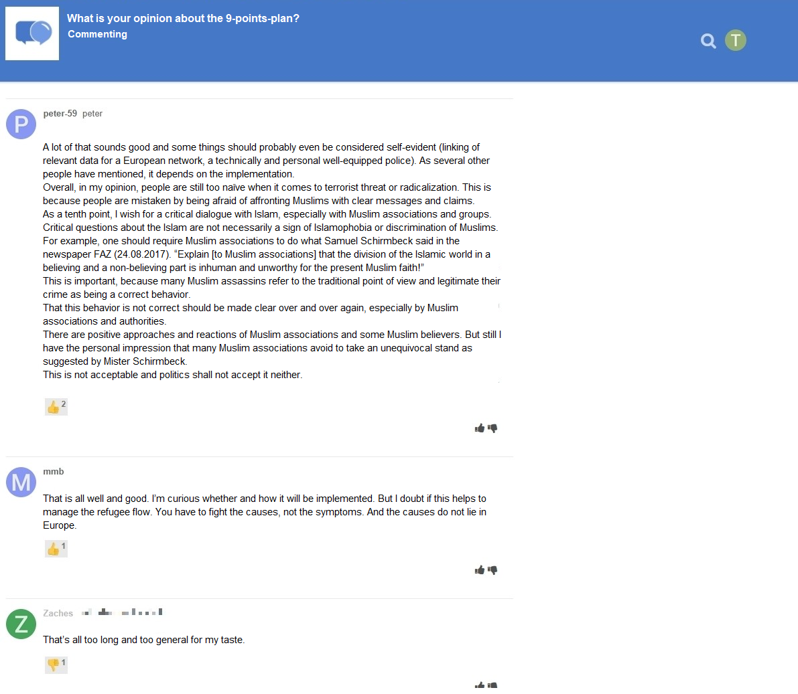

```{r include=F}
# knitr::opts_knit$set(root.dir = "../")
knitr::opts_chunk$set(cache=F)
```

```{r setup, include=F}
# load packages
pcks <- c("devtools", "jpeg", "knitr", "lavaan", "magrittr", "papaja", "png", "pwr", "semTools", "tidyverse")
invisible(lapply(pcks, library, character.only = TRUE))
# install_github("tdienlin/td@v.0.0.2.3")
library(td)

# create bib with r-packages
r_refs(file = "../bibliography/r-references.bib")

# load bib
r_citations <- cite_r("../bibliography/r-references.bib"
                      , footnote = FALSE
                      , withhold = FALSE
                      , pkgs = c("tidyverse", "lavaan", "papaja", "pwr", "quanteda", "semTools")
                      )
load("../data/workspace.RData")
```

Understanding why people disclose personal information online remains a critical question for both society and academic research. Originally, self-disclosure online was thought to be mostly erratic---for example, it was assumed that self-disclosure cannot be predicted by assessing people's personal beliefs, concerns, or standpoints. Most prominently, the privacy paradox stated that people self-disclose vast amounts of personal information online *despite* having substantial concerns about their privacy [@barnesPrivacyParadoxSocial2006; @taddickenUsesPrivacyOnline2011].

Somewhat surprisingly, despite its popularity in the media [@newyorkpublicradioPrivacyParadox2018] the privacy paradox has garnered little empirical support. A recent meta-analysis revealed that the correlation between privacy concerns and self-disclosure on SNS is *r* = -.13 [@baruhOnlinePrivacyConcerns2017], indicating that privacy concerns are indeed related to self-disclosure online. 

Rather than further pursuing the privacy paradox, a large share of current day research posits that self-disclosure online can be explained---at least partly---by means of the so-called _privacy-calculus_ [@krasnovaOnlineSocialNetworks2010]. The privacy calculus builds on the work of @lauferPrivacyConceptSocial1977 and claims that both expected risks *and* expected benefits explain self-disclosure. Specifically, by operationalizing expected risks as privacy concerns, several studies have shown that experiencing greater privacy concerns is related to disclosing less information [e.g., @heirmanPredictingAdolescentsDisclosure2013].

However, although the privacy calculus has gained some momentum several important questions remain unanswered. First, we still know comparatively little about whether the privacy calculus can be replicated with actual behavioral data in an authentic long-term setting [@kokolakisPrivacyAttitudesPrivacy2017]. Thus far, most research supporting the privacy calculus has used either self-reports of behavior [e.g., @krasnovaOnlineSocialNetworks2010], vignette approaches [e.g., @bolUnderstandingEffectsPersonalization2018], or one-shot experiments in the lab [e.g., @treptePrivacyCalculusContextualized2020]. However, all three of these approaches significantly hamper external validity.

Second, current research on the privacy calculus is often criticized for not explicitly focusing on the deliberation process of self-disclosure. According to critics [e.g., @knijnenburgDeathPrivacyCalculus2017], showing that concerns and gratifications both correlate with self-disclosure is not evidence for any substantial or explicit weighing of pros and cons. We agree and consider it necessary to now explicitly focus on the privacy deliberation process itself. Moreover, and on a more general level, we aim to gauge the usefulness of further extending the privacy calculus model by adding new variables such as privacy deliberation, trust, and self-disclosure self-efficacy.

Finally, we want to determine whether the privacy calculus can be affected by the design of a website. Specifically, we analyze whether *popularity cues* such as like and dislike buttons affect self-disclosure and the privacy calculus.

To test our research questions, we conducted a preregistered online field experiment, drawing from a representative sample of the German population. Participants were randomly distributed to one of three different websites, which either featured only a like button, both a like and a dislike button, or no buttons at all. Over the course of one week participants had the chance to discuss a topical issue (i.e., prevention of terrorist attacks in Germany). Afterward, they answered our follow-up questionnaire with items pertaining to the privacy calculus variables.

## The Privacy Calculus

Being a primary means of regulating privacy [e.g., @masurSituationalPrivacySelfdisclosure2018], self-disclosure is our key variable of interest. There are two different understandings of self-disclosure in the literature: The first defines self-disclosure as _deliberate_ acts of sharing truthful information about the self with others [@jourardTransparentSelf1964]. The second considers _all_ acts of sharing information---whether active or passive, deliberate or unwitting---as self-disclosure, because each piece of information shared allows meaningful inferences to be made about a person [e.g., @watzlawickPragmaticsHumanCommunication2011]. In this paper we follow the latter approach, not least because recent years have vividly illustrated how it is possible to derive a plethora of insights about a person simply by analyzing his or her written communication [e.g., @kosinskiPrivateTraitsAttributes2013]. Moreover, independently from which position one chooses to adopt, it is possible to differentiate the content of self-disclosure into three different dimensions: breadth (i.e., number of topics covered), depth (i.e., intimacy of topics covered), and length (i.e., quantity of disclosure) [e.g., @omarzuDisclosureDecisionModel2000]. In this study we mainly focus on communication quantity, as we consider communication quantity to be a necessary precondition and hence valid proxy for self-disclosure.

Privacy concerns have been defined as follows: "Concerns about online privacy represent how much an individual is motivated to focus on his or her control over a voluntary withdrawal from other people or societal institutions on the Internet, accompanied by an uneasy feeling that his or her privacy might be threatened" [AUTHOR]. Previous research has found that people who are more concerned about their privacy than others are less inclined to share personal information [e.g., @baruhOnlinePrivacyConcerns2017; @dienlinPrivacyParadoxRelic2015; @heirmanPredictingAdolescentsDisclosure2013].

H1: People are more likely to self-disclose on a website when they are less concerned about their privacy.

Although privacy concerns are related to self-disclosure, one can make the case that since most studies in the literature report only small effects, there should also be additional meaningful factors that contribute to explaining self-disclosure. Most prominently, it has been argued that people trade a loss of privacy for a gain in gratifications such as social capital, entertainment, information, or self-presentation [@ellisonNegotiatingPrivacyConcerns2011; @taddickenUsesPrivacyOnline2011]. By now, a large body of research has found support for this hypothesis [e.g., @krasnovaOnlineSocialNetworks2010; @minHowArePeople2015; @trepteCrossculturalPerspectivePrivacy2017].

H2: People are more likely to self-disclose on a website when they obtain more gratifications from using the website.

In the current literature on the privacy calculus there still seems to be a shortage of studies that explicitly analyze the process of actively comparing the pros and cons of disclosing information, even though this point of criticism has been levelled several times [e.g., @knijnenburgDeathPrivacyCalculus2017] and even though other fields such as behavioral economics have long focused on the underlying problem [e.g., @zhuPrivacyCalculusIts2017]. The criticism is justified, because showing that experiencing privacy concerns and expecting gratifications are related to self-disclosure does not necessarily imply that an explicit weighing took place. Hence, we argue that research on the privacy calculus would benefit significantly from addressing a novel concept that might best be termed _privacy deliberation_, which we define as the extent to which individual people explicitly compare positive and negative potential outcomes before communicating with others.

On the one hand, it seems plausible to suggest that deliberating about one's privacy would dampen subsequent self-disclosure, because refraining from regular communication---the primary means of connecting with others---requires at least a minimum of active and hence deliberate restraint. On the other hand, deliberating about one's privacy might also increase self-disclosure, as after having actively deliberated about the potential consequences, a person concerned about his or her privacy might arrive at the conclusion that in this situation self-disclosure is not only appropriate but expedient. In light of the paucity of studies and the plausibility of both effects, we formulate the following research question:

RQ1: Are people more or less likely to self-disclose on a website when they more actively deliberate about whether they should self-disclose?

Several attempts have already been made to expand the privacy calculus [e.g., @dinevExtendedPrivacyCalculus2006]. Additional variables such as privacy self-efficacy or trust have been introduced. Building on @dienlinExtendedPrivacyCalculus2016, self-efficacy in the context of the privacy calculus captures whether people believe in their own capability to implement particular privacy behaviors in the future that foster either self-withdrawal (e.g., deleting inappropriate content) or self-disclosure (e.g., publishing a blog post). Thus far, several studies have found that people who report more privacy self-efficacy also self-withdraw more online than others [e.g., @chenRevisitingPrivacyParadox2018].

Trust can be conceptualized in two different ways [@gefenTrustTAMOnline2003]: It either captures "specific beliefs dealing primarily with the integrity, benevolence, and ability of another party" [@gefenTrustTAMOnline2003, p. 55] or a "general belief that another party can be trusted" [@gefenTrustTAMOnline2003, p.55]. @gefenTrustTAMOnline2003 prioritize specific trust beliefs (p. 60). In the online context, it is important to differentiate among several targets of trust [@sollnerWhyDifferentTrust2016]. For example, one can differentiate between (a) the information system, (b) the provider, (c) the Internet, and (d) the community of other users [@sollnerWhyDifferentTrust2016]. Trust plays a key role in online communication [e.g., @metzgerPrivacyTrustDisclosure2004]. For example, it has been demonstrated that people who put more trust in the providers of networks also disclose more personal information [see, e.g., @liEmpiricalStudiesOnline2011]. 

In conclusion, while we expect to find these relations as well, we would also like to determine whether the inclusion of all the other variables mentioned above, including the not yet researched concept of privacy deliberation, might potentially attenuate or even obviate the predictive capacity of self-efficacy and trust.

H3: People are more likely to self-disclose on a website when their self-efficacy about self-disclosing on the website is higher.

H4: People are more likely to self-disclose on a website when they have greater trust in the provider, the website, and the other users.

## The Effect of Popularity Cues

What is the effect of the communication context on the privacy calculus and on self-disclosure? First, it has often been noted that researchers should not exclusively focus on specific features of particular websites, for features are prone to change and quickly become obsolete [@foxDistinguishingTechnologiesSocial2017]. Instead, it has been suggested that researchers prioritize underlying latent structures, for example by analyzing what are know as affordances [e.g., @ellisonSocialNetworkSite2015; @foxDistinguishingTechnologiesSocial2017]. The concept of affordances was developed by @gibsonEcologicalApproachVisual2015, who argued that it is not the objective features of objects that determine behavior but rather subjective perceptions. Affordances are a mental representation of how a given entity might be used; as such, they are by definition subjective. There is much debate in the literature concerning what exactly defines an affordance [@evansExplicatingAffordancesConceptual2017]. For example, whereas @evansExplicatingAffordancesConceptual2017 propose three affordances for mediated communication (i.e., anonymity, persistence, and visibility), @foxDistinguishingTechnologiesSocial2017 suggest 10 affordances for SNSs alone (i.e., accessibility, bandwidth, social presence, privacy, network association, personalization, persistence, editability, conversation control, and anonymity). 

As the privacy calculus states that both benefits and costs determine behavior, we suggest that popularity cues such as like and dislike buttons, which are categorized as "paralinguistic digital affordances" [@carrPredictingThresholdPerceived2018, p. 142], perfectly epitomize benefits and costs. The like button is positive; it expresses an endorsement, a compliment, a reward [e.g., @sumnerFunctionalApproachFacebook2017]. However, communication online is also often characterized by negative and critical debates [e.g., @ziegeleDynamicsOnlineNews2017]. As the dislike button is a major means of downgrading content it represents the cost and risk factor of the privacy calculus well---in fact, its stark negative effect might also explain why only a handful of major websites have implemented a dislike button (e.g., reddit.com or stackexchange.com).

Popularity cues have been shown to impact behavior. For example, a large-scale field experiment in which 101,281 comments were analyzed found that comments with dislikes were more likely to receive further dislikes [@muchnikSocialInfluenceBias2013]. @stroudRecommendRespectAltering2017 demonstrated that when users had a different opinion than the one that was communicated in a post, they were more likely to click on a button labelled _respect_ compared to a button labelled _like_. 

In this vein it seems plausible to suggest that popularity cues might also impact the privacy calculus. First, on a very primordial level, popularity cues should serve as a means of reward and punishment, as a mechanism of instrumental conditioning [@skinnerScienceHumanBehavior2014]. Specifically, we argue that being complimented with a like should encourage future self-disclosure, while being punished with a dislike should inhibit future disclosure. Similarly, like buttons should be associated with being able to garner positive feedback, so implementing a like-button---similar to a compliment in the offline world---might leverage gratifications. Implementing a like or a dislike button might also bring people to more actively deliberate about whether or not it is actually worthwhile to disclose information. If both like and dislike buttons are present, privacy deliberation should increase even further. Finally, because people who are more concerned about their privacy are also more shy and risk averse [@dienlinPsychologyPrivacyAnalyzing2017], implementation of the dislike button should both stir privacy concerns and stifle self-disclosure. For a simplified overview of our theoretical model, see Figure \@ref(fig:model).

H5.	Compared to people who use a website without like or dislike buttons, people who use a website with like buttons (a) self-disclose more, (b) obtain more gratifications, (c) are less concerned about their privacy, and (d) deliberate more about whether they should communicate online.

H6.	Compared to people who use a website without like or dislike buttons, people who use a website with like and dislike buttons (a) self-disclose more, (b) obtain more gratifications, and (c) deliberate more about whether they should communicate online.

H7.	Compared to people who use a website with only like buttons, people who use a website with like and dislike buttons (a) are more concerned about their privacy, and (b) deliberate more about whether they should communicate online.

```{r model, fig.cap="Overview of theoretical model.", fig.align='center', out.width=".8\\textwidth"}
knitr::include_graphics("../figures/design/model.pdf")
# knitr::include_graphics("figures/design/model.png")
```

# Methods
## Open Science

We preregistered the study's hypotheses, sample size, materials, analyses, and exclusion criteria (https://osf.io/a6tzc/?view_only=5d0ef9fe5e1745878cd1b19273cdf859 [^prereg]). We needed to change our pre-defined plan in some cases. For a full account of all changes, see online supplementary material (OSM), https://osf.io/hcqat/?view_only=5db35868738d40609b11e58cc343a9b0. New analyses that were not preregistered appear in the section on exploratory analyses. For example, we also measured additional variables that were not included in the preregistration (e.g., specific gratifications and general trust; see below), whose results we report as exploratory analyses. 

[^prereg]: To find the actual preregistration on the website, click _View Registration Form_ (blue button on the right hand side).

## Procedure

The study was designed as an online field experiment with three different groups. The first group interacted with a website without like/dislike buttons, the second with a website with only like buttons, and the third with a website with both like and dislike buttons. Participants were randomly distributed to one of the three websites in a between-subject design.

We collaborated with a professional panel agency to recruit participants. As an incentive, participants were awarded digital points, which they could use to get special offers from other companies. In order to be able to take part, participants needed to be above the age of 18 and had to live in Germany. In a first step, the agency sent their panel members an invitation to participate in the study (_invitation_). In this invitation, panel members were asked whether they would be interested in taking part in a study analyzing the threat posed by current terrorist attacks in Germany.[^1] If panel members decided to take part, they were subsequently sent the first questionnaire (_T1_) in which we asked about the participants’ sociodemographics, provided more details about the study, and included a registration link for the website. Afterward, the participants were randomly assigned to one of the three websites. After registration participants had the chance to discuss the topic of the terrorism threat in Germany over the course of one week (_field_). Afterward, participants received a follow-up questionnaire in which we collected the self-reported measures (_T2_). Measures were collected after and not before the field phase in order not to prime participants or reveal our primary research interest.

[^1]: Although the terror attack was not of primary interest for this study, the data can and will also be used to analyze perceptions of the terrorism threat. Hence, no deception took place, and in the debriefing participants were informed about our additional research interest in privacy. 

We programmed an online website based on the open-source software discourse (https://www.discourse.org/). We conducted several pretests with students from the local university to make sure the website had an authentic feel (see Figure \@ref(fig:website)). Participants used the website actively: Overall, users spent `r sum(d$time_read/60) %>% round(digit = 0)` minutes online and wrote `r sum(d$post_count)` comments (for an example of communication that took place, see Figure \@ref(fig:comments)).

```{r website, fig.cap="The website's homepage. (Translated to English; university logos pixelated for peer review.)", fig.align='center', out.width=".9\\textwidth"}
knitr::include_graphics("../figures/website/website_translated.jpg")
```

```{r comments, fig.align='center', fig.cap="Communication that took place on the website with like and dislike buttons. (Translated to English.)", out.width=".9\\textwidth"}

```

## Participants

We ran a priori power analyses to determine how many participants to recruit. The power analysis was based on the smallest effect size of interest [SESOI; @lakensEquivalenceTestingPsychological2018]. Thus, we defined an effect size that we would consider enough to support our hypotheses. Because small effects should be expected when researching aspects of privacy online [e.g., @baruhOnlinePrivacyConcerns2017], with small effects beginning at an effect size of _r_ = .10 [@cohenPowerPrimer1992], we set our SESOI to be r = `r r_sesoi`. Our aim was to be able to detect this SESOI with a probability of at least 95%. Using the regular alpha level of 5%, this leads to a minimum sample size of _n_ = `r n_desired`. In the end, we were able to include n = `r n_final` in our analyses (see below). This means that our study had a probability (power) of `r power_achieved * 100`% of finding an effect at least as large as _r_ = `r r_sesoi`. Put differently, we were able to make reliable inferences about effects at least as big as _r_ = `r r_sensitive`.

We collected a representative sample of the German population in terms of age, sex, and federal state. T1 was completed by _N_ = `r n_t1` participants and T2 by _n_ = `r n_t2` participants. We connected the data from T1, participants' behavior on the platform, and T2 by means of objective and automated processes (e.g., participants were matched via tokens or IP addresses). So far, we have been able to match the data for _n_ = `r n_final` participants. The matching process is not yet finished, and we will try to match the remaining cases manually. We excluded _n_ = `r n_speeding` participants who finished the questionnaire at T2 in less then three minutes, which we considered to be unreasonably fast. The sample characteristics at T1 were as follows: 
Age = `r round(age_t1_m, 0)` years, sex = `r round(male_t1_m, 2)*100`% male, college degree = `r round(college_t1_m, 2)*100`%.
The characteristics of the final sample were as follows: 
Age = `r round(age_final_m, 0)` years, sex = `r round(male_final_m, 2)*100`% male, college degree = `r round(college_final_m, 2)*100`%.
Hence, despite dropout, T2 can also be considered a largely representative sample of the German population.

## Measures

In what follows, we present the materials we used to measure our variables. To gauge the variables' factor validity, we ran confirmatory factor analyses (CFA). If the CFAs revealed insufficient fit, we deleted individual items. All items were formulated as statements to which participants indicated their (dis-)agreement on a bipolar 7-point scale. Answer options were as follows: -3 (_strongly disagree_), -2 (_disagree_), -1 (_slightly disagree_), 0 (_neutral_), +1 (_slightly agree_), +2 (_agree_), +3 (_strongly agree_). In the questionnaire, all items measuring a variable were presented on the same page in a randomized order.

For an overview of the means, standard deviations, factorial validity, and reliability, see Table \@ref(tab:CFA). For an overview of the variables' distributions, see Figure \@ref(fig:corrplot). For the exact wording of all items and their individual distributions, see the OSM.

```{r CFA, results = "asis"}
apa_table(select(factor_val_tab, -alpha), font_size = "footnotesize",
          caption = "Psychometric Properties, Factorial Validity, and Reliability of Measures",
          note = "omega = Raykov's composite reliability coefficient omega; avevar = average variance extracted.")
```

```{r corrplot, fig.cap="Above diagonal: zero-order correlation matrix; diagonal: density plots for each variable; below diagonal: bivariate scatter plots for zero-order correlations. Solid regression lines represent linear regressions, dotted regression lines represent quadratic regressions. Calculated with the model predicted values for each variable (baseline model).", fig.height=8, fig.width=8, out.width=".9\\textwidth", fig.align='center', fig.pos = "!h", warning=F}
print(plot_fs_cor)
```

### Privacy concerns

Privacy concerns were measured with seven items based on @buchananDevelopmentMeasuresOnline2007 One example item was "When using the participation platform, I had concerns about my privacy". One item had to be deleted due to poor psychometric properties.

### Gratifications

Next, we differentiated between two separate types of gratification. _General gratifications_ were measured with five items based on @sunLocationInformationDisclosure2015 One example item was "Using the participation platform has paid off for me". _Specific gratifications_ were measured with 15 items on five different subdimensions with three items each. The scaled was loosely based on @schererGratifikationMinuteZeitnahe2002 Example items were: "Using the participation platform made it possible for me to" ... "learn things I would not otherwise have noticed" (information), "react to a subject that is important to me" (relevance), "engage politically" (political participation), "try to improve society" (idealism), and "soothe my guilty consciences" (extrinsic benefits).

### Self-disclosure self-efficacy

Self-disclosure self-efficacy was captured with six self-designed items, which captured whether participants felt that they had sufficient self-efficacy to write a comment on the platform. For example, we asked "I felt technically competent enough to write a comment." Two items, which were inverted, had to be deleted due to poor psychometric properties.

### Trust

Next, we differentiated between two separate types of trust. _General trust_ was operationalized based on @sollnerWhyDifferentTrust2016 for three targets (i.e., provider, website, and other users) with one item each. One example items was "The operators of the participation platform seemed trustworthy."
_Specific trust_ was operationalized for the same three targets with three subdimensions each (i.e., ability, benevolence/integrity, and reliability), which were measured with one item each. Example items were "The operators of the participation platform have done a good job" (ability), "The other users had good intentions" (benevolence/integrity), "The website worked well" (reliability). The results showed that the provider and website targets were not sufficiently distinctive, as was evidenced by the existence of a Heywood case. We hence adapted the scale to combine these two targets. The updated scale exhibited adequate fit. 

### Privacy deliberation

Privacy deliberation was measured with 5 self-designed items. One example item was "While using the participation platform I have weighed the advantages and disadvantages of writing a comment."

### Self-disclosure

Self-disclosure was calculated by taking the natural logarithm of the number of comments each participant posted.

## Data analysis

We tested all hypotheses and research questions using structural equation modeling (SEM). We tested the influence of the three websites using contrast coding, which allows for testing the effects of experimental manipulations within a theoretical framework using latent variables [e.g., @klinePrinciplesPracticeStructural2016]. As the dependent variable (self-disclosure) was not normally distributed, we estimated the model using robust maximum likelihood [@klinePrinciplesPracticeStructural2016]. As recommended by @klinePrinciplesPracticeStructural2016, we report the following global fit indices: $\chi^2$, RMSEA (90% CI), CFI, and SRMR. As sociodemagraphic variables are often related to self-disclosure and other privacy-related variables [e.g., @dindiaSexDifferencesSelfdisclosure1992], we controlled all variables for the influence of sex and age. Preregistered hypotheses were tested with a one-sided significance level of 5%. Research questions and exploratory analyses were tested with a two-sided 5% significance level using family-wise Bonferroni-Holm correction. We used `r r_citations` for all our analyses.

# Results

## Descriptive Analyses

```{r PriDel}
# calc participants who actively deliberated
pridel_active <- select(d, starts_with("PD01")) %>% 
  as.data.frame %>% 
  mutate(m = apply(., 1, mean, na.rm = T) %>% round(0)) %>% 
  select(m) %$% 
  nrow(filter(., m > 4)) / n_final * 100
```

First, we measured and plotted all bivariate relations between the study variables (see Figure \@ref(fig:corrplot)). The results did not reveal any relationships to be particularly curvilinear. Furthermore, all variables making up the privacy calculus demonstrated the expected relationships with self-disclosure. For example, people who were more concerned about their privacy had written fewer posts (_r_ `r parameterestimates(fit_baseline, standardized = TRUE) %>%  filter(op == "~~" & lhs == "pri_con" & rhs == "self_dis_lg") %>% select(std.all) %>%  my_round("std_txt")`). Worth noting is that specific gratifications and general trust predicted self-disclosure better than general gratifications and specific trust. The mean of privacy deliberation was _m_ = `r des_pridel$m %>% round(2)`. Altogether, `r pridel_active %>% round(0)`% of participants reported having actively deliberated about their privacy. 

It is important to note that the bivariate results showed three very large correlations: First, between specific trust and general gratifications (_r_ = `r d_fs %>% select("Specific\ntrust", "General\ngratifications") %>% cor %>% round(2) %>% .[2, 1]`); second, between privacy concerns and privacy deliberation (_r_ = `r d_fs %>% select("Privacy\nconcerns", "Privacy\ndeliberation") %>% cor %>% round(2) %>% .[2, 1]`); third, between specific gratifications and self-efficacy (_r_ = `r d_fs %>% select("Specific\ngratifications", "Self-\nefficacy") %>% cor %>% round(2) %>% .[2, 1]`). As all six variables were later analyzed within a single multiple regression, problems of multicollinearity might occur. 
 
## Privacy Calculus
### Preregistered analyses

First, we ran a model as specified in the preregistration. The model fit our data comparatively well, `r fit_txt(fit_prereg, scaled = TRUE)`. Regarding H1, we did not find that general gratifications predicted self-disclosure (`r coeffs_txt(fit_prereg, "a1", one_sided=T)`). Regarding H2, neither did we find that privacy concerns predicted self-disclosure (`r coeffs_txt(fit_prereg, "b1", one_sided=T)`). The analyses for RQ1 similarly revealed that privacy deliberation was not correlated with self-disclosure (`r coeffs_txt(fit_prereg, "c1")`). With regard to H3, however, we found that experiencing self-efficacy substantially predicted self-disclosure (`r coeffs_txt(fit_prereg, "d1", one_sided=T)`). Concerning H4, the results showed that trust was not associated with self-disclosure (`r coeffs_txt(fit_prereg, "e1", one_sided=T)`).

However, these results should be treated with utmost caution. As mentioned above, we indeed detected problems suggesting multicollinearity. Most prominently, in this multiple regression trust had a negative relation with self-disclosure, even though when analyzed bivariately the relation was positive---which is a sign of multicollinearity [@klinePrinciplesPracticeStructural2016]. As a result, specific trust and general gratifications should not be analyzed within the same model, as the two concepts are empirically too close to one another.

### Exploratory analyses

Thus, we slightly adapted our preregistered model on the basis of the insights described above. First, instead of specific trust and general gratifications we now included general trust and specific gratifications (which were also correlated slightly less strongly with one another). The adapted model fit our data comparatively well, `r fit_txt(fit_adapted)`. 

In the adapted privacy calculus model, we found two additional significant effects. For example, specific gratifications predicted self-disclosure online (`r coeffs_txt(fit_adapted, "b1")`). Furthermore, in this model people who engaged in more privacy deliberation did not disclose less information (`r coeffs_txt(fit_adapted, "c1")`). However, note that the effect was only marginally not significant. Self-efficacy remained substantially correlated with self-disclosure (`r coeffs_txt(fit_adapted, "d1")`). We again found a negative correlation between trust and self-disclosure (`r coeffs_txt(fit_adapted, "e1")`), which, as a sign of multicollinearity, suggests that also general trust and specific gratifications should not be analyzed within the same model either.

Given that we observed several instances of multicollinearity, we also fitted a simple privacy calculus model containing only privacy concerns and specific gratifications. The simple model fit our data well, `r fit_txt(fit_simple)`. First, we found that people who experienced more privacy concerns than others also disclosed less information (`r coeffs_txt(fit_simple, "a1")`). Second, people who reported more specific gratifications than others also self-disclosed more information (`r coeffs_txt(fit_simple, "b1")`). Both effect sizes were above our predefined SESOI of _r_ = `r r_sesoi`, implying that the effects were sufficiently large to qualify as support our the hypotheses. All effects labelled as significant were below their individual Bonferroni-Holm corrected significance level. For a visual overview of all results, see Figure \@ref(fig:plot-pc).

```{r plot-pc, fig.cap="Predictors of self-disclosure. Black lines indicate 90\\% CIs (for one-sided hypotheses), grey lines 95\\% CIs (for two-sided hypotheses). Displayed are unstandardized effects.", out.width = "\\textwidth", fig.pos = "!h", fig.height=3}
print(plot_pc)
```

When comparing the three models with one another, the simple privacy calculus model was the most parsimonious one (BIC = `r model_comp_tab["simple", "bic"]`, AIC = `r model_comp_tab["simple", "aic"]`), followed by the preregistered model (BIC = `r model_comp_tab["preregistered", "bic"]`, AIC = `r model_comp_tab["preregistered", "aic"]`) and the adapted model (BIC = `r model_comp_tab["adapted", "bic"]`, AIC = `r model_comp_tab["adapted", "aic"]`).

## Popularity Cues
### Preregistered analyses

Somewhat surprisingly, we found no effects of the popularity cues on the privacy calculus variables. For an illustration, see Figure \@ref(fig:popularitycues), which displays the model-predicted values for each variable (using the baseline model) and shows that the confidence intervals of all preregistered variables overlap. For the results of the specific inference tests using contrasts, see the OSM.

### Exploratory analyses

The picture remained mostly the same also when analyzing variables that we did not include in the preregistration. Note that some differences missed statistical significance only marginally (e.g., specific gratifications for the comparison between the website with like buttons and the control website without like and dislike buttons). Nevertheless, we refrain from reading too much into the differences between the three websites and conclude that they were mostly similar with regard to the privacy calculus variables and the amount of self-disclosure.

```{r popularitycues, fig.cap="Overview of the variables for the three websites. Control: Website without buttons. Like: Website with like buttons. Like \\& Dislike: Website with like and dislike buttons.", out.width = "\\textwidth", fig.pos = "!h"}
# knitr::include_graphics("figures/results/plot_pop.pdf")
print(plot_fs_m)
```

# Discussion

In this study, we analyzed theg e privacy calculus using actual observed behavior in a preregistered field experiment with data from a representative sample of the German population. We additionally sought to determine whether the privacy calculus is dependent on popularity cues such as like and dislike buttons. The data were analyzed using structural equation modeling. In the bivariate analyses, all privacy calculus variables were shown to significantly predict self-disclosure. In the preregistered analyses using multiple regression, in which several variables were analyzed together, self-efficacy turned out to be the strongest predictor of self-disclosure. However, this preregistered model exhibited significant problems with regard to multicollinearity, which is why we also computed a more basal privacy calculus model consisting of only privacy concerns and specific gratifications. In this model, both variables significantly and meaningfully predicted self-disclosure. Taken together, the results add further support to the privacy calculus framework, suggesting that self-disclosure online is not erratic (as for example posited by the privacy paradox, for example) but---at least somewhat---considered. 

Our results suggest that in new communication contexts roughly one third of all Internet users actively deliberates about their privacy. Determining whether this figure is large or small is a normative question---for example, one can convincingly argue that this number sould be higher and that we as society should still more actively deliberate about our self-disclosure practices online. Interestingly, results showed that privacy deliberation and privacy concerns were remarkably similar---evidenced by their strong correlation with one another and their similar correlations with other variables. This either implies that thinking about one's privacy increases one's concern or, conversely, that being concerned about one's privacy leads one to think about one's options more actively. Future research might tell.

The next major implication is that popularity cues do not seem to have an overly strong influence on the privacy calculus and self-disclosure. Although some studies have found that popularity cues substantially impact behavior [e.g., @muchnikSocialInfluenceBias2013], our results suggest the opposite: Users still disclose the same amount of personal information regardless of whether a website includes like or dislike buttons, potentially highlighting the agency of users.

The results also have several more fine-grained implications. First, we question the tendency to further increase the complexity of the privacy calculus model by adding additional variables [e.g., @dienlinExtendedPrivacyCalculus2016]. "Since all models are wrong the scientist cannot obtain a "correct"it one by excessive elaboration. [...] Just as the ability to devise simple but evocative models is the signature of the great scientist so overelaboration and overparameterization is often the mark of mediocrity" [@boxScienceStatistics1976, p. 792]. Although adding variables can increase the amount of explained variance, it might also introduce spurious results due to multicollinearity---a problem that we think deserves more attention in general. Specifically, we have come to believe that adding self-efficacy to privacy calculus models is of limited value, for self-efficacy is mostly a proxy of behavior and does not offer much epistemic insight. Instead, it might be more interesting to find out _why_ some people feel sufficiently efficacious to self-disclose whereas others do not. 

<!-- Explaining self-disclosure online by means of a basal privacy calculus model instead has the charm of offering a more parsimonious model while still being capable of explaining a substantial part of self-disclosure online. -->

Furthermore, we found a remarkably strong correlation between trust and expected gratifications (i.e., _r_ = .77), which at first glance seemed somewhat peculiar to us. On closer inspection, however, we realized that the way trust is routinely operationalized in the literature is very close to expected gratifications. To illustrate, one subdimension explicitly measures _ability_ via items such as “The comments of other users were useful”. In fact, the literature often operationalizes trust as a formative construct that directly results from factors such as expected benefits [@sollnerWhyDifferentTrust2016]. In conclusion, our results suggest that we should not confuse _causes_ of trust with _measures_ of trust, for this might introduce problems of both homogeneity and/or multicollinearity.

<!-- As suggested in literature (), we operationalized trust by measuring how much expertise, benevolence, and reliability participants associated with users, the website, and the providers. It seems that these three measures do not measure trust per se, but rather those aspects that cause trust. In other words, not trust but antecedents of trust. We hence recommend to use measures than focus on the actual psychological experience of trust.  -->

<!-- Finally, this study offers some implications on a meta-level. At a time when the social sciences are experiencing an excruciating replication crisis [e.g., @Camerer.2018; @Camerer.2016; @McEwan.2018], it has become increasingly important to further improve the way we go about doing science. In this preregistration, we have tried to implement several mechanisms proposed by @Munafo.2017. In doing so, we had the chance to learn several important aspects: For example, in the future we will be more hesitant to formulate concrete hypotheses when treading on novel ground. Moreover, instead of selling model adaptions as a priori rationales (a practice known as harking; i.e., hypothesizing after results are known), we reported them as additional analyses; we hope to have shown that this does not decrease a paper's value, but instead offers several interesting insights (e.g., that it might be expedient to formulate gratifications specifically rather than generally, or that gratifications and trust are highly correlated).  -->

## Limitations

The results do not allow for causal interpretation on the within-person level. First, all results are based on analyses of between-person variance. However, between-person relations often do not translate well to within-person effects [e.g. @hamakerCritiqueCrosslaggedPanel2015]. While some studies on privacy concerns online have begun to examine both sources of variance [e.g., @dietvorstAdolescentPerceptionsParental2017], finding that intrapersonal changes in privacy concerns are indeed related to intrapersonal changes in self-disclosure, similar analyses are still lacking for the privacy calculus. Second, the self-reported measures were collected _after_ the field phase in which the dependent variable was measured. As a result, the coefficients might overestimate the actual relations, because demand effects might have led participants to artificially align their theoretical answers with their practical behavior to reduce dissonance. Nevertheless, we deliberately decided to measure the self-reported variables afterward in order to not bias participants and not prime our specific research interest. Third, experiments should only manipulate the experimental variable while holding all others constant. In this study, we explicitly manipulated the popularity cues. However, as the experiment was conducted in the field, several other variables could not be held constant; for example, the content of communication by other users, the unfolding communication dynamics, or the characteristics of other users.

It is important to note that our not having found significant effects of like and dislike buttons does not necessarily mean that like and dislike buttons do indeed have no effect on self-disclosure and the privacy calculus. As always, with null-findings one is confronted with the *Duhème-Quinn Problem* [@dienesUnderstandingPsychologyScience2008], which---put somewhat crudely--- states that null findings can either be due to the actual non-existence of effects or, instead, a poor operationalization of the research question. In this case, we were not able send participants notifications when their comments were liked/disliked, significantly decreasing the popularity cues' salience.

<!-- One can make the case that gratifications should not be measured as reflective constructs but rather as formative constructs. However, we have not been able to specify a formative model with adequate fit as of yet.  -->

This paper analyzes self-disclosure in the context of political participation. Our focus was on understanding self-disclosure, which is why we deliberately excluded variables pertaining to political participation, such as informational self-efficacy [@loyPsychologicalPredictorsPolitical2018]. Moreover, operationalizing self-disclosure via communication quantity is, of course, only a proxy.[^3] It is worth noting that we did not find any instances of people providing meaningless text and, as mentioned above, in times of big data, every piece of communication allows increasingly accurate inferences about one's personality to be made.

[^3]: Somewhat fittingly, in the German language there is a saying: 'He spoke a lot but didn't say a thing'.

Finally, there are several interesting research questions that one could address with the data. Most prominently, one could analyze the actual content of the posts to detect whether the three websites might have differed with regard to communication quality. In addition, one can make the case that privacy deliberation rather as a moderator---such that deliberating more actively about one's privacy strengthens the relation between privacy concerns or gratifications and self-disclosure. Upon publication, the data will be made publicly available and we invite researchers from all disciplines to investigate the aforementioned and other interesting research questions.

## Conclusion

While some scholars discuss whether we should wish "Death to the privacy calculus?" [@knijnenburgDeathPrivacyCalculus2017, p. 1], in our opinion the privacy calculus is alive and kicking. This study adds to the growing confirmation of observation that people who are more concerned about their privacy than others disclose less information online, whereas people who receive more gratifications from using a website than others disclose more information online. The results of this study suggest that a substantial share of internet users, approximately 30%, consciously engage in a privacy calculus by actively deliberating about whether or not to disclose information. Popularity cues seem to play a minor role in this process, especially if no means are implemented to guarantee that users are notified about others liking or disliking their communication. In conclusion, our results indicate that internet users are at least somewhat proactive and reasonable---probably no more or less proactive or reasonable than in any other regular everyday situation.

\newpage

# References

\setlength{\parindent}{-0.5in}
\setlength{\leftskip}{0.5in}
